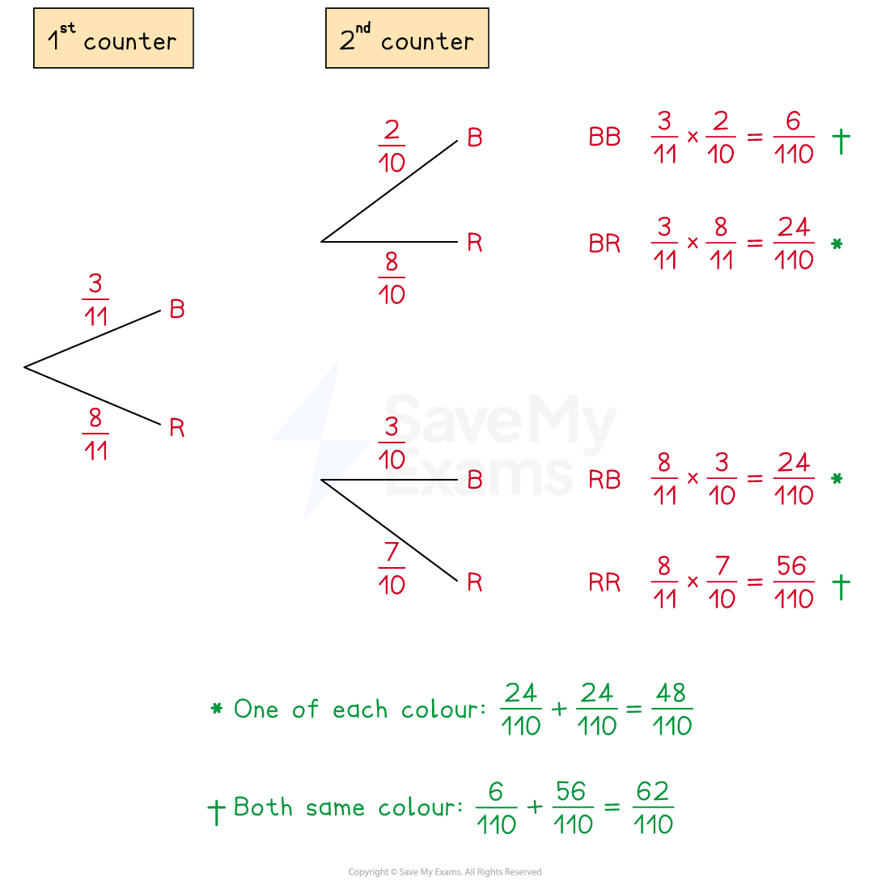

# Combined Conditional Probabilities

## Combined Conditional Probabilities

> **Spec point** — `spcpt_9cJGVGKRhP9JYgjF`

## Combined conditional probabilities

### What is a combined conditional probability?

- This is when you have two (or more) **successive events**, one after the other, and the **second** event **depends on** (is conditional on) the **first**

### How do I calculate combined conditional probabilities?

- You need to** adjust **the number of outcomes as you go along

  - For example, selecting two cards from a pack of 52 playing cards **without replacing **the first card:
  
    - P(red 1st card) is 26 reds out of 52 cards
    - If the 1st card is not replaced, there are only 25 reds left out the remaining 51 cards
    - P(red 2nd card) is 25 reds out of 51 cards
    - P(red then red) = $\frac{26}{52}\times\frac{25}{51}$

> **Exam Hint**
> If a question says "two cards are drawn" then you may **assume** that** **they draw 1 card followed by another card **without replacement** (the maths is the same).

### Can I draw a tree diagram for combined conditional probabilities?

- Yes, a **tree diagram** is a useful way to show combined conditional probabilities

  - For example, two counters are drawn at random from a bag of 3 blue and 8 red counters without replacement
  
    - The probabilities are shown below

### What if there are multiple possibilities within one question?

- You may need a **listing strategy** (e.g.* AAB*, *ABA*, *BAA*)
- You will need the **or** rule for multiple possibilities

  - P(*AB* **or** *BA* **or*** AA ***or***...*) = P(*AB*) + P(*BA*) + P(*AA*) +...
  
    - **Add** the cases together
- Remember that *AB* and *BA* are **not the same**

  - *AB* means *A* happened first, then *B*
  - *BA* means *B* happened first, then *A*

> **Exam Hint**
> Try not to simplify your probabilities too early as it is easier to add probabilities together when they all have the same denominator!

> **Worked Example**
> A bag contains 10 yellow beads, 6 blue beads and 4 green beads.
> 
> A bead is taken at random from the bag and not replaced.
> 
> A second bead is then taken at random from the bag.
> 
> (a)  Find the probability that both beads are different colours.
> 
> **Answer:**
> 
> > *Let Y, B and G represent choosing a yellow, blue and green bead*
> 
> **Method 1**
> 
> > *The probability of the beads being different colours is equal to 1 minus the probability that the beads are the same colour*
> 
> > *Find the probability of both beads being the same colour*
> 
> *P(same colours) = P(YY) +  P(BB) + P(GG)*
> 
> > *Calculate each conditional probability separately, remembering the number of beads changes after one is drawn and not replaced*
> 
> > *For example, P(YY) = *$\frac{10}{20}\times\frac{9}{19}$
> 
> $\frac{10}{20}\times\frac{9}{19}+\frac{6}{20}\times\frac{5}{19}+\frac{4}{20}\times\frac{3}{19}$
> 
> > *Multiply the pairs of fractions together and add their results*
> 
> $\frac{132}{380}=\frac{33}{95}$
> 
> > *Subtract this from 1*
> 
> $1-\frac{132}{380}=\frac{248}{380}$
> 
> > *Simplify the answer*
> 
> $\frac{62}{95}$
> 
> **Method 2**
> 
> > *List all the possibilities of different colours*
> 
> > *Remember that YB (yellow first, then blue) is different to BY (blue first, then yellow)*
> 
> *YB, BY, YG, GY, BG, GB*
> 
> > *Use the "or" rule to add the cases together*
> 
> *P(different colours) = P(YB) +  P(BY) + P(YG) + P(GY) + P(BG) + P(GB)*
> 
> > *Calculate each conditional probability separately, remembering the number of beads changes after one is drawn and not replaced*
> 
> > *For example, P(YB) = *$\frac{10}{20}\times\frac{6}{19}$
> 
> $\frac{10}{20}\times\frac{6}{19}+\frac{6}{20}\times\frac{10}{19}+\frac{10}{20}\times\frac{4}{19}+\frac{4}{20}\times\frac{10}{19}+\frac{6}{20}\times\frac{4}{19}+\frac{4}{20}\times\frac{6}{19}\,$
> 
> > *Multiply the pairs of fractions together and add their results*
> 
> $\frac{248}{380}$
> 
> > *Simplify the answer*
> 
> $\frac{62}{95}$
> 
> (b) The  second bead is not replaced and a third bead is taken at random from the bag.
> 
> Find the probability that all three beads are the same colour.
> 
> **Answer:**
> 
> > *List the possibilities*
> 
> *YYY, BBB, GGG*
> 
> > *Use the "or" rule to add between cases*
> 
> *P(all the same colour) = P(YYY) + P(BBB) + P(GGG)*
> 
> > *Use conditional probabilities in each separate case, remembering the number of beads changes after each one is drawn and not replaced*
> 
> $\frac{10}{20}\times\frac{9}{19}\times\frac{8}{18}+\frac{6}{20}\times\frac{5}{19}\times\frac{4}{18}+\frac{4}{20}\times\frac{3}{19}\times\frac{2}{18}$
> 
> > *Multiply the triplets of fractions together then add their results*
> 
> $\frac{720}{6840}+\frac{120}{6840}+\frac{24}{6840}=\frac{864}{6840}$
> 
> > *Simplify the answer*
> 
> $\frac{12}{95}$

> **Worked Example**
> A bag contains only red and blue marbles. There are 3 more red marbles than blue marbles.
> 
> Kai takes 2 marbles from the bag at random.
> 
> The probability that Kai takes 2 blue marbles is $\frac{1}{7}$.
> 
> Work out the number of blue marbles there were in the bag initially.
> 
> Show clear algebraic working.
> 
> **Answer**:
> 
> > *Write expressions for the number of each colour*
> 
> *Let *$x$* be the number of blue marbles*
> 
> *Then there are *$x+3$* red marbles*
> 
> *And there are *$x+x+3=2x+3$* marbles in total*
> 
> > *Find the probability that the first marble is blue*
> 
> $\frac{x}{2x+3}$
> 
> > *Given that the first marble is blue, find the probability that the second marble is blue*
> 
> - * After one blue marble is taken, there are *$x-1$* blue marbles left out of *$2x+2$* marbles in total*
> 
> $\frac{x-1}{2x+2}$
> 
> > *Find the probability that both marbles are blue by multiplying the probabilities together*
> 
> - *Set this equal to *$\frac{1}{7}$
> 
> $\frac{x}{2x+3}\times\frac{x-1}{2x+2}=\frac{1}{7}$
> 
> > *Multiply through by *`7 open parentheses 2 x plus 3 close parentheses open parentheses 2 x plus 2 close parentheses`* to get rid of the fractions*
> 
> `7 x open parentheses x minus 1 close parentheses equals open parentheses 2 x plus 3 close parentheses open parentheses 2 x plus 2 close parentheses`
> 
> > *Expand and simplify both sides*
> 
> $7x^{2}-7x=4x^{2}+4x+6x+6\,7x^{2}-7x=4x^{2}+10x+6$
> 
> > *Rearrange to make one side equal to zero*
> 
> $3x^{2}-17x-6=0$
> 
> > *Factorise the quadratic*
> 
> - *Find two numbers that multiply to give 3×-6=-18 and add to give -17*
> - *1 and -18*
> 
> `3 x squared plus x minus 18 x minus 6
> x open parentheses 3 x plus 1 close parentheses minus 6 open parentheses 3 x plus 1 close parentheses
> open parentheses 3 x plus 1 close parentheses open parentheses x minus 6 close parentheses`
> 
> > *Solve the quadratic equation*
> 
> `open parentheses 3 x plus 1 close parentheses open parentheses x minus 6 close parentheses equals 0
> x equals negative 1 third comma space x equals 6`
> 
> > $x$* needs to be a positive whole number*
> 
> **Final answer:** $x=6$** blue marbles initially**
