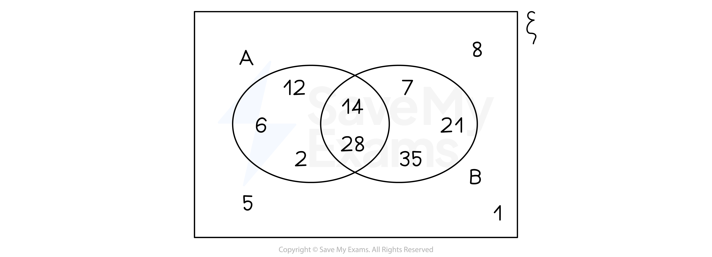

# Probabilities from Venn Diagrams

## Probability & Venn Diagrams

> **Spec point** — `spcpt_Rv3DcsGBkxSkb8Ms`

## Probability & Venn diagrams

### How do I find probabilities from Venn diagrams?

- If the Venn diagram shows **frequencies **in the region

  - **Add **together the frequencies in the regions you want
  - **Divide **by the total frequency
- If the Venn diagram shows the **individual elements**

  - **Count **the **number **of elements you** **want
  - **Divide** by the** **total number of elements
- For the Venn diagram shown below,

  - The probability of being** in *****A*****  **is $\frac{5}{11}$
  
    - There are 5 elements in *A* out of 11 in total
  - The probability of being in **both** *A*  **and** *B*  is $\frac{2}{11}$
  
    - There are 2 elements in *A*  and *B*  (the intersection)
  - The probability of being** in *****A***, but **not *****B***, is $\frac{3}{11}$
  
    - 3 elements are in *A*  but not *B*
- Some harder questions are **not** out of the **total **number, but out of a **restricted** number

  - The probability of being in *B*, **given that **you are already in *A*, is $\frac{2}{5}$
  
    - You are only interested in elements in *A*
    - There are 5 elements in *A*, out of which only 2 are also in *B*

> **Exam Hint**
> - Be careful when filling in numbers for a Venn diagram
> 
>   - Some of the given numbers may need to be split between two sections of the Venn diagram
> - Suppose 10 people have a cat, 8 people have a dog and 6 people have both a cat and a dog
> 
>   - Out of the 10 people who have a cat
>   
>     - 6 also have a dog
>     - 4 do not have a dog
>   - Out of the 8 people who have a dog
>   
>     - 6 also have a cat
>     - 2 do not have a cat

> **Worked Example**
> In a class of 30 students, 15 students study Spanish and 3 of the Spanish students also study German.
> 7 students study neither Spanish nor German.
> 
> (a) Draw a Venn diagram to show this information.
> 
> **Answer:**
> 
> > *Draw the Venn diagram with its rectangular box and two (labelled) overlapping circles*
> *3 students study both Spanish and German, so start here and work outwards*
> *12 must study Spanish but not German (to get 15 in total for Spanish)*
> *7 study neither, so this goes outside of the circles*
> *To get 30 in total, 8 must study German but not Spanish*
> 
> 
> 
> (b) Use your Venn diagram to find the probability that a student, selected at random from the class, studies Spanish but not German.
> 
> **Answer:**
> 
> > *This Venn diagram shows the frequencies in each region*
> 
> > *It helps to highlight Spanish but not German*
> 
> 
> 
> > *Divide the number of students studying Spanish but not German by the total number of students*
> 
> *Students studying Spanish but not German = 12*
> *Total number of students = 30*
> 
> **Final answer:** **P(Spanish but not German) **$=\frac{12}{30}(=\frac{2}{5})$** **
