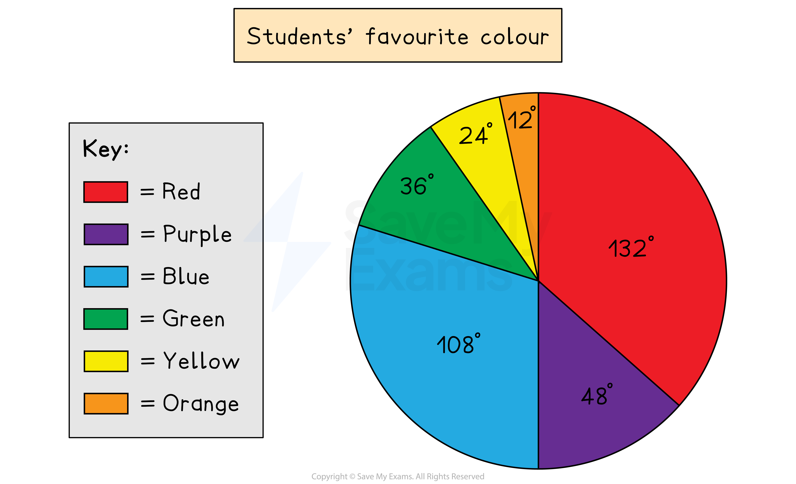

# Pie Charts

## Pie Charts

> **Spec point** — `spcpt_rxmWrBrc2s2q45wF`

## Pie charts

### What is a pie chart?

- A** pie chart** is a circle divided into sectors which is used to **present data**
- The **sectors** represent different **categories**

  - They show the relative **proportions** of the categories
  - They do** not** show the actual **frequencies **of each category

### How do I draw a pie chart?

- This is easiest explained through an example
- The following data shows the favourite colours of a class of students

| Colour | Red | Purple | Blue | Green | Yellow | Orange |
|---|---|---|---|---|---|---|
| Students | 11 | 4 | 9 | 3 | 2 | 1 |

- Write the frequencies as **fractions** of the **total number** of students, 30

| Colour | Red | Purple | Blue | Green | Yellow | Orange |
|---|---|---|---|---|---|---|
| Students | 11 | 4 | 9 | 3 | 2 | 1 |
| Fractions | $\frac{11}{30}$ | $\frac{4}{30}$ | $\frac{9}{30}$ | $\frac{3}{30}$ | $\frac{2}{30}$ | $\frac{1}{30}$ |

- Find the **angles** of the sectors by **multiplying each fraction **by** 360°**

  - Then check all angles add up to 360°

| Colour | Red | Purple | Blue | Green | Yellow | Orange |
|---|---|---|---|---|---|---|
| Students | 11 | 4 | 9 | 3 | 2 | 1 |
| Fractions | $\frac{11}{30}$ | $\frac{4}{30}$ | $\frac{9}{30}$ | $\frac{3}{30}$ | $\frac{2}{30}$ | $\frac{1}{30}$ |
| Angles | 132° | 48° | 108° | 36° | 24° | 12° |

- Draw a vertical line from the circle's centre to the top, then use a **protractor** to mark off the first angle

  - Draw a line from the centre to this first mark
  
    - Then, from this line, mark off the next angle (and so on)

*Example of a pie chart*

### How do I solve problems with pie charts?

- Use the following facts

  - **angles** are **proportional **to the **frequencies** of each category
  - **360° **represents the** total frequency **
- For harder problems, it helps to work out

  - **what frequency** is represented **by 1°**
  - **what angle** is represented by** 1 unit **of **frequency**
- For example, if a sector of 30° represents 15 people, then

  - 1° = 0.5 people (dividing by 30)
  - 2° = 1 person (multiplying by 2)
- These relationships can then be scaled** up** or **down** accordingly

  - If 1° = 0.5 people
  
    - then 360° = 180 people (multiplying by 360)

> **Exam Hint**
> If the pie chart says 'not to scale', then examiners want you to use ratio and proportion methods to answer the questions. Don't measure angles using a protractor!

> **Worked Example**
> The following pie chart represents the values of items stocked in a sports shop.
> 
> The diagram is not to scale.
> 
> 
> 
> (a) Given that the shop stocks £12 000 of golf items, find the total value of the shop’s stock.
> 
> **Answer:**
> 
> > *Find a relationship between an angle and a value*
> 
> *90° = £12 000*
> 
> > *The total value is represented by 360°*
> *Multiply by 4 to get from 90° to 360°*
> 
> *360° = 4 ×12 000*
> 
> **Final answer:** **Total value is £48 000**
> 
> > *You can also do this question by finding 1° first *
> 
> (b) If the angle on the pie chart for tennis is 72°, find the value of tennis items that are stocked by the shop.
> 
> **Answer:**
> 
> > *It is quickest to find the fraction *$\frac{72}{360}$* of the total value, found in part (a)*
> 
> $\frac{72}{360}\times48000=9600$
> 
> **Final answer:** **The value of tennis items is £9 600**
