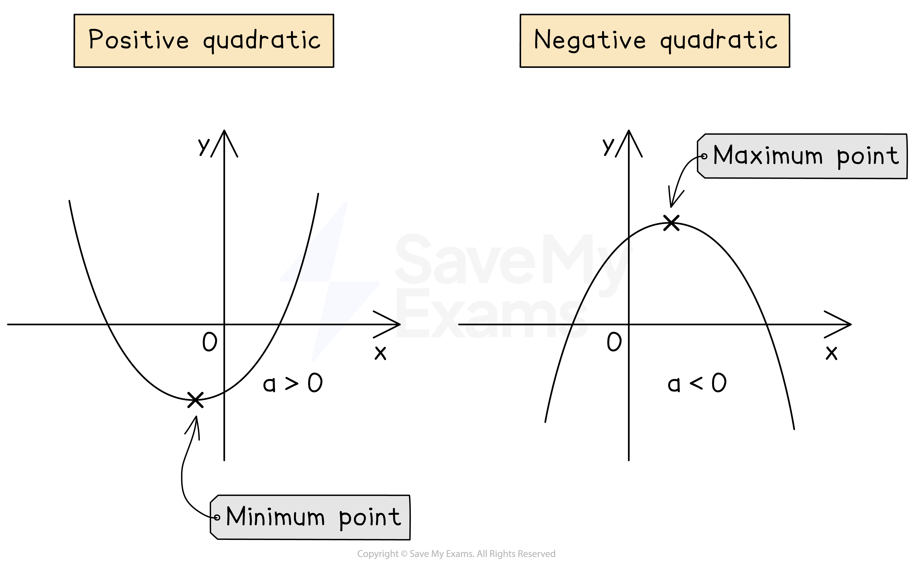

# Quadratic Graphs

## Quadratic Graphs

> **Spec point** — `spcpt_m3VmsyK57Gh3TZwj`

## Quadratic graphs

### What are the key features of a quadratic graph?

- The point where the graph turns is called the **vertex**

  - **Positive **quadratics have a **minimum** point
  
    - The bottom of the u-shape
  - **Negative** quadratics have a **maximum point**
  
    - The top of the n-shape
- Quadratic graphs always have a **vertical line of symmetry** down the **middle**

  - The **equation** of the vertical line of** **symmetry is**  *****x***** = *****k***
  
    - *k* is the *x*-coordinate of the minimum or maximum point
- Quadratic graphs do** not** have to cross the *x*-axis

  - If they do, **two** ***x*****-intercepts** are created, called **roots**
  
    - If the curve just** touches** the *x*-axis, only **1 root** is created
  - **Roots** are **symmetric** about the **vertical line of symmetry**
- Quadratic graphs **always** have one ***y*****-intercept**

> **Worked Example**
> The graph of the equation $y=x^{2}-5x+6$ is shown below.
> 
> 
> 
> (a) Write down the coordinates of the roots of the equation.
> 
> **Answer:**
> 
> > *The roots of the equation are the **x**-intercepts of the graph*
> 
> > *The graph crosses at **x**  = 2 and **x**  = 3*
> 
> **Final answer:** **The roots of the graph are at (2, 0) and (3, 0)**
> 
> (b) Write down the equation of the line of symmetry.
> 
> **Answer:**
> 
> > *The line of symmetry is a vertical line that occurs halfway between the **x**-intercepts*
> 
> > *Find the **x**-value that is halfway between the roots*
> 
> *The ***x***-intercepts are ***x***  = 2 and ***x***  = 3*
> *Halfway between is ***x***  = 2.5*
> 
> > *Write down the equation of the line of symmetry*
> 
> **Final answer:** **x****  = 2.5**
