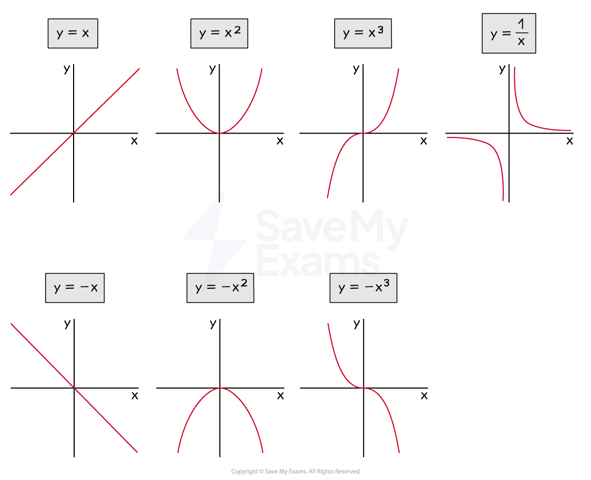
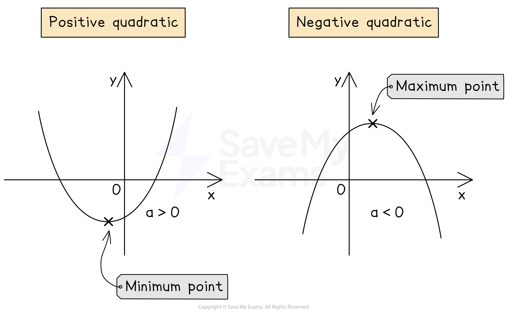
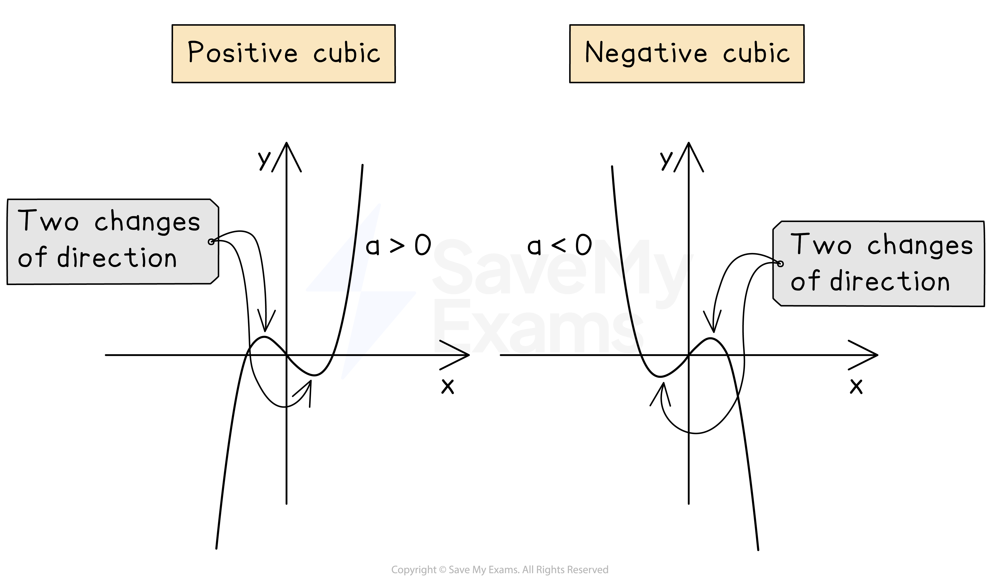
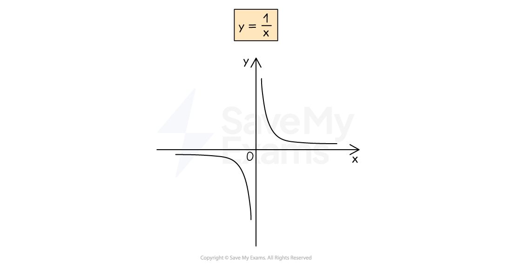

# Types of Graphs

## Types of Graphs

> **Spec point** — `spcpt_3TW56tDvq59B8KvH`

## Types of graphs

### What graphs do I need to know?

- You need to be able to **recognise** the following **lines**:

  - **Straight lines**
  
    - *y*  = *mx*  + *c*
    - Such as *y*  = 3*x * + 2, *y*  = 5*x * - 1, ...
    - Two** important** ones are *y* =  *x*  and *y* =  -*x*
  - **Horizontal lines**
  
    - *y*  = *c*
    - Such as *y*  = 4, *y*  = -10, ...
  - **Vertical lines**
  
    - *x*  = *k*
    - Such as *x*  = 2, *x*  = -1, ...
- You need to be able to recognise **quadratic **graphs

  - *y*  = *x*2
  - *y*  = -*x*2
  - *y*  = *ax*2  + *bx*  + *c*
- You need to be able to recognise simple **cubic **graphs

  - *y*  = *x*3
  - *y*  = -*x*3
  - *y*  = *ax*3  + *bx*2 + *x* + *c*
- You also need to be able to recognise **reciprocal** graphs

  - $y=\frac{1}{x}$, where $x\neq0$

### What does a quadratic graph look like?

- The **equation** of a **quadratic graph** is *y*  = *ax*2  + *bx*  + *c*
- A quadratic graph has either a **u-shape** or an **n-shape**

  - This type of shape is called a **parabola**
- **u-shapes **are called **positive **quadratics

  - because the number in front of *x*2 is positive
  
    - For example, *y*  = 2*x*2  + 3*x*  + 4
- **n-shapes **are called **negative **quadratics

  - because the number in front of *x*2 is negative
  
    - For example, *y*  = -3*x*2  + 2*x*  + 4
- You can plot quadratic graphs using a **table of values**

### What does a cubic graph look like?

- The **equation** of a **cubic graph** is *y*  = *ax*3 + *bx**2* + *cx + d*
- A **cubic** graph can have two points where it **changes direction** (turning points)
- A **positive cubic** goes **uphill **(from the bottom left to the top right)

  - The number in front of *x*3 is positive
  
    - For example, *y*  = *x*3 - 3*x*2 + 2x  + 1
- A **negative cubic** goes **downhill** (from the top left to the bottom right)

  - The number in front of *x*3 is negative
  
    - For example, *y*  = -*x*3  + 2*x*2 - *x* + 5
- You can plot cubic graphs using a **table of values**

### What does a reciprocal graph look like?

- The **equation** of the basic **reciprocal graph** is $y=\frac{1}{x}$

  - You **cannot **substitute in *x*  = 0 (**division by zero** is **not **allowed)
  
    - $x\neq0$
  - You should** not include** *x*  = 0 in a **table of values**
- The **shape** of $y=\frac{1}{x}$ is shown below

  - It has **two curved branches**
  - The branches **never connect**!** **

> **Worked Example**
> In each of the cases below, state the letter of the graph that corresponds to the equation given.
> 
> 
> 
> (a) $y=x+5$
> 
> **Answer:  **
> 
> > *This is a straight-line graph, **y**  = **mx**  + **c*
> *The graph is a straight line going uphill and crosses the **x**-axis above (0,0)*
> * *
> 
> **Final answer:** **Graph D**
> 
> (b) $y=-x^{2}+3x+2$
> 
> ** Answer:**
> 
> > *This is a quadratic graph, **y**  = **ax**2**  + **bx**  + **c ** (**a**  = -1, **b**  = 3, **c**  = 2)*
> 
> > *The number in front of **x**2** is negative so it has an n-shape *
> 
> **Final answer:** **Graph C**
> 
> (c)`table row blank row blank end table` $y=\frac{1}{x}$
> **Answer:**
>  *This is the reciprocal graph, *$y=\frac{1}{x}$
> *It has two  curved shaped branches and no **y**-value when **x**  = 0*
> 
> > * *
> 
> **Final answer:** **Graph B**
