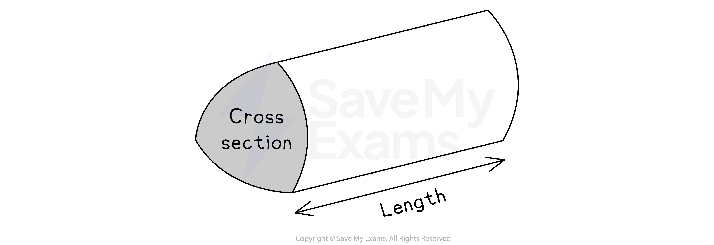
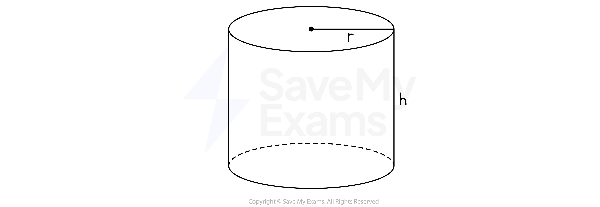
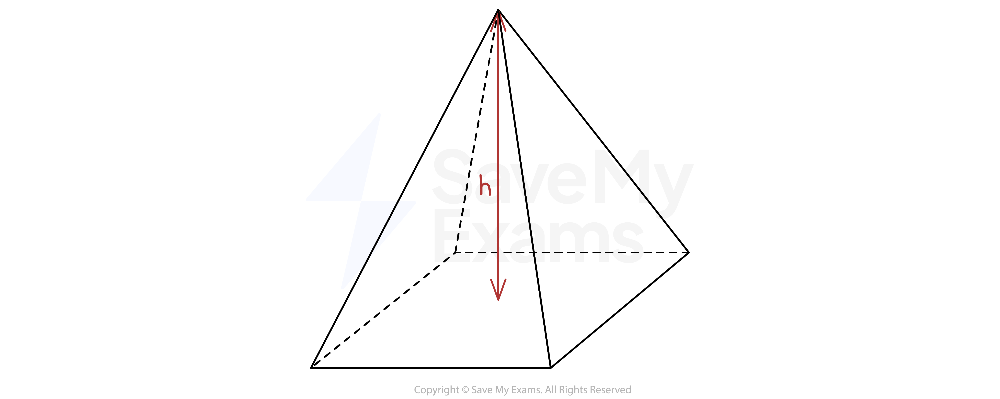
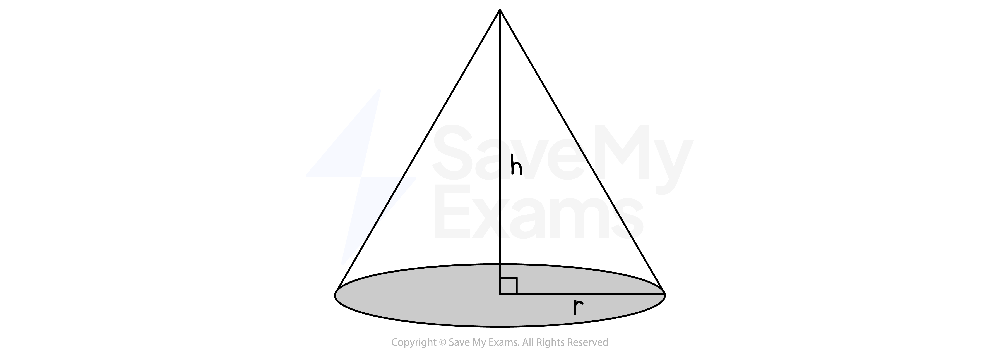
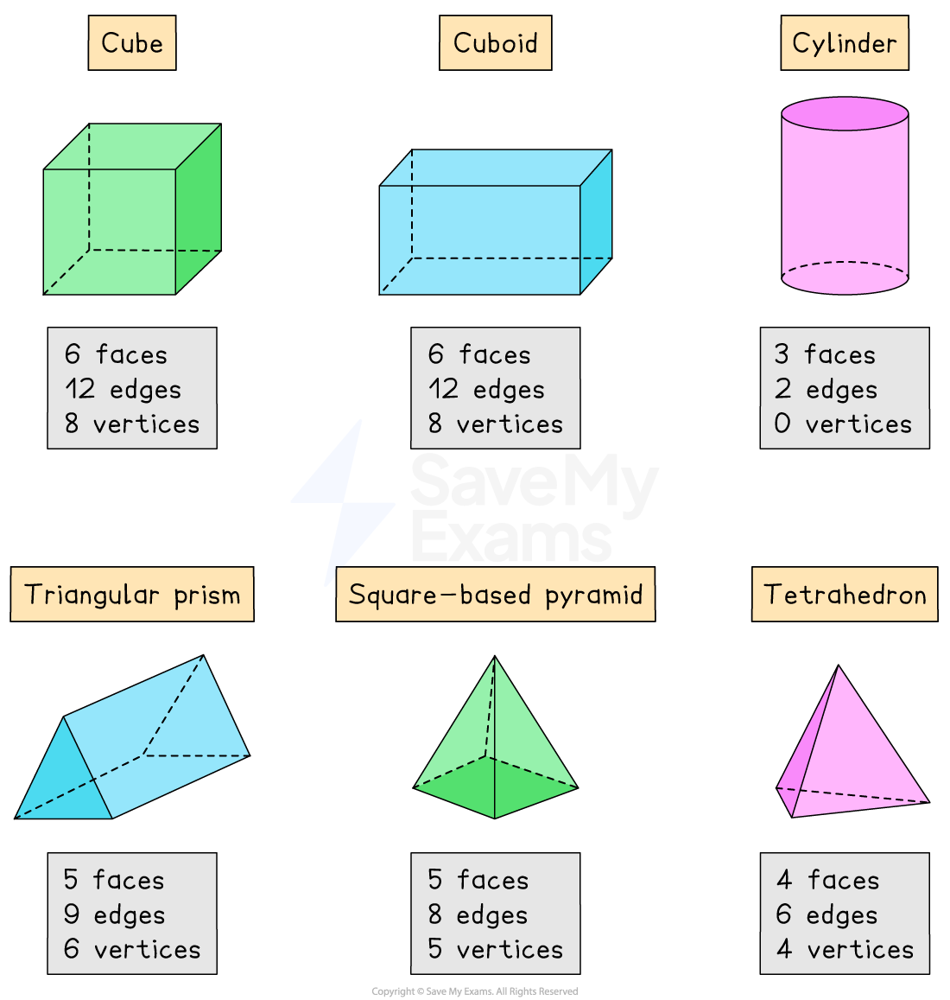

# Properties of 3D Shapes

## Properties of 3D Shapes

> **Spec point** — `spcpt_jz65jxQN2CdJsYT5`

## Properties of 3D shapes

### What are the names of common 3D shapes?

- You should know the general names of **prisms**

  - A **prism **is a 3D shape with the same **cross-section **throughout
  
    - The cross-section of a **cube** is a **square**
    - The cross-section of a **cuboid** is a **rectangle**
  - You will also have to work with **other prisms**, such as **triangular prisms** or **hexagonal prisms**
  
    - In these cases the exam question will make sure the shape of the cross-section is clear

- A **cylinder** is similar to a prism

  - The cross-section of a **cylinder** is a **circle**

- You should know the names and properties of the different types of **pyramids**

  - A **pyramid** has a flat base with sloping sides that meet at a point at the top
  - A **square–based pyramid** has a square as its base
  - Some pyramids have special names you should know
  
    - A triangular-based pyramid is called a **tetrahedron**

- A **cone** is similar to a pyramid

  - A **cone **has a circular base

- You should know the name and properties of a **sphere**

### What are the properties of 3D shapes?

- 3D shapes have a number of **faces**, **vertices **and **edges**

  - A **face** is a single surface of the 3D shape
  - A **vertex** (plural, **vertices**) is a corner of the 3D shape
  - An **edge** joins one vertex to another
- You should know the number and shape of the faces for the common 3D shapes

  - A **cube **has 6 equal, square faces
  - A **cuboid **has 3 pairs of rectangular faces
  - A **cylinder** has 2 equal circular faces and 1 rectangular face (its curved surface)
  - A **triangular prism** has 2 equal triangular faces and 3 rectangular faces
  
    - If the triangular faces are **equilateral** then **all **of the **rectangles will be equal**
    - If the triangular faces are **isosceles** then **two** of the **rectangles will be equal**
  - A **square-based pyramid** has 1 square face and 4 equal triangular faces
  - A **tetrahedron** has 4 triangular faces
  - A **sphere **has 1 face; it is a ball-shape

> **Exam Hint**
> Remembering the properties of 3D shapes will help in particular with questions involving surface area.
