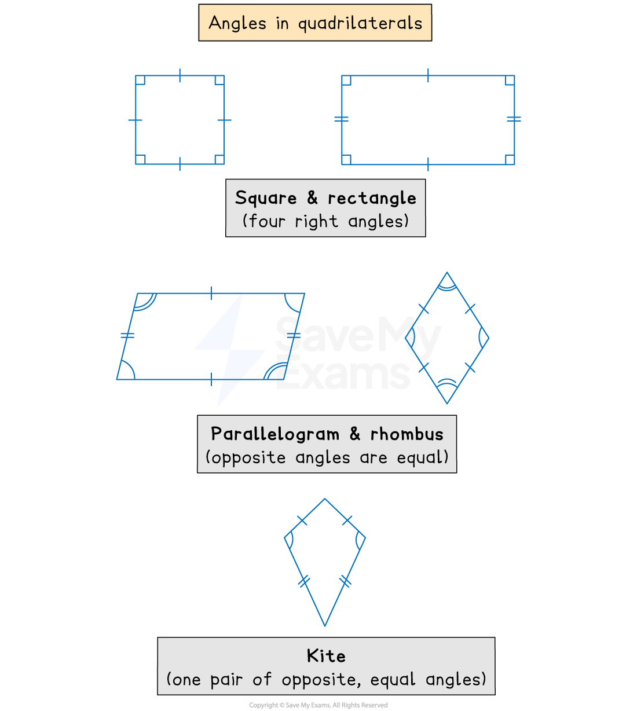

# Angles in Quadrilaterals

## Angles in Quadrilaterals

> **Spec point** — `spcpt_QTbSSjMfdVzY3kb3`

## Angles in quadrilaterals

### What are the angle properties of quadrilaterals?

- The **four** interior angles inside any quadrilateral **add up to 360°**
- If the quadrilateral is a **square** or a **rectangle** then all the angles are equal to **90°**
- You can use any **symmetries** of the quadrilateral to identify other equal angles

  - For a **parallelogram** or **rhombus**, **opposite angles** are **equal**
  - For a **kite,** **one pair** of **opposite angles** are **equal**

> **Exam Hint**
> Find all the missing angles that you can using the angles that are given to you in a question
> 
> - They might not seem to help you straight away but having more angles will lead you to find the angle you need

> **Worked Example**
> The diagram below shows an irregular quadrilateral. Find the value of $y$.
> 
> 
> 
> **Answer:**
> 
> > *First, add together the three given angles*
> 
> $97+115+85=297$
> 
> > *Subtract the answer from 360°*
> 
> `table row cell 360 space minus space 297 space end cell equals cell space 63 space end cell end table`
> 
> > *Add this to the diagram*
> 
> 
> 
> > *Angles on a straight line add up to 180°, so subtract the answer from 180°*
> 
> `table row cell y plus 63 end cell equals 180 row y equals cell 180 minus 63 end cell row y equals 117 end table`
> 
> $y=117$
