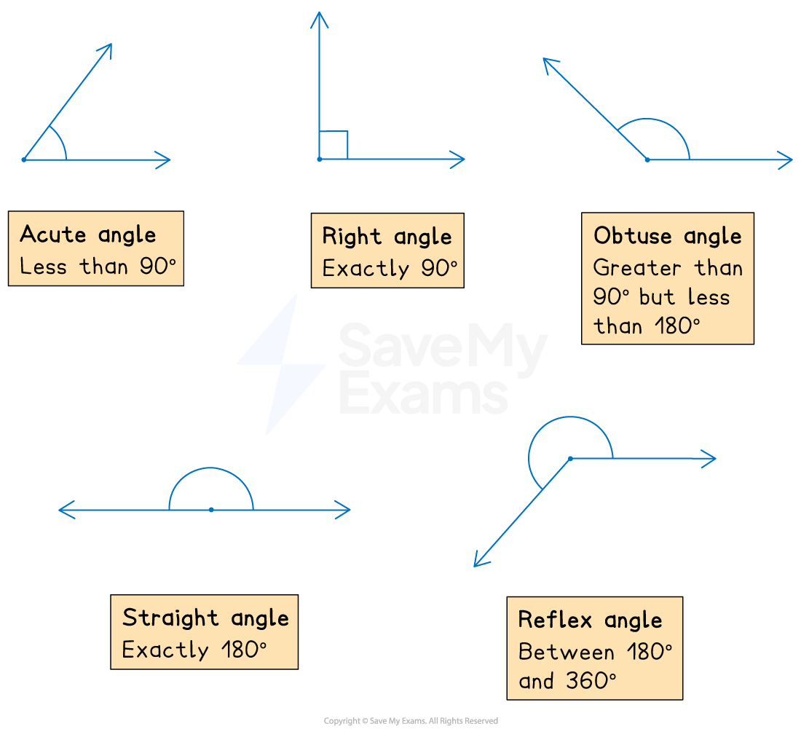

# Introduction to Lines & Angles

## Properties of Lines & Angles

> **Spec point** — `spcpt_K8Fq9F3GXSkCRN75`

## Properties of lines & angles

### What properties do I need to know about lines?

- A **line **is a straight, one dimensional path that extends forever

  - A **line** **segment **is a part of a line, it has a start and an end point
  - A line segment that starts at the point *A* and ends at the point *B* is usually labelled *AB *
  - Two lines with single marks are of equal length
  
    - Two other lines with double marks are of (a different) equal length
- Two lines are **parallel** if they continue in the **same direction as each other** forever

  - Parallel lines never **intersect **(meet)
  - Parallel lines should be marked with arrows
  
    - If there is more than one pair (or set) of parallel lines in a diagram then multiple arrows will be used 
- Two lines are **perpendicular **if they intersect at right-angles (90°)

### What properties do I need to know about angles?

- When two lines **intersect **(meet) they will form an angle
- There are different **types of angles  **

  - An angle that is less than 90° is called an **acute angle**
  - An angle that is exactly 90° is called a **right angle**
  - An angle that is greater than 90° and less than 180° is called an **obtuse angle**
  - An angle that is exactly 180° is called a **straight angle**
  - An angle that is greater than 180° but less than 360° is called a **reflex angle**

- Angles at a point add up to 360°
- Angles on a straight line add up to 180°

  - Angles that add up to 180° are called **supplementary angles**
  
    - e.g. 30 and 150 degrees are supplementary angles

> **Exam Hint**
> - Do not assume two lines are parallel or perpendicular just because they look it, always look out for the arrows or right angle in a diagram, or read the question to look for clues

> **Worked Example**
> Write down the mathematical name for an angle which is greater than 90° but less than 180°.
> 
> **Answer:**
> 
> **Final answer:** **An obtuse angle**
