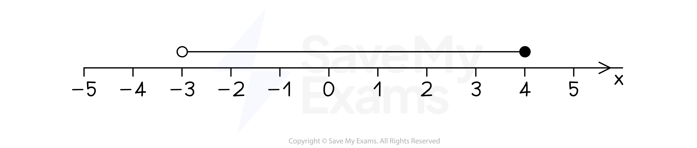

# Representing Inequalities on a Number Line

## Representing Inequalities on a Number Line

> **Spec point** — `spcpt_n3KGFPzGtJgJkRpQ`

## Representing inequalities on a number line

### How do I represent an inequality on a number line?

- The inequality -3 < *x* ≤ 4 is shown on a **number line** below

- Draw** circles** above the** end points **and connect them with a **horizontal line**

  - Leave an **open circle** for end points with **strict** inequalities, **< or >**
  
    - These end points **are not** included
  - Fill in a **solid circle** for end points with **≤ or ≥** inequalities
  
    - These end points** are **included 
- Use a **horizontal arrow** for inequalities with **one end point**

  - *x* > 5 is an open circle at 5 with a horizontal arrow pointing to the right

> **Worked Example**
> Represent the following inequalities on a number line.
> 
> (a) $-2\leqx<1$
> 
> **Answer:**
> 
> > *-2 is included so use a closed circle*
> 
> > *1 is not included so use an open circle*
> 
> 
> 
> (b) $t<3$
> 
> **Answer:**
> 
> > *3 is not included so use an open circle*
> 
> > *There is no second end point*
> *Any value less than three is accepted, so draw a horizontal arrow to the left*
> 
> 
