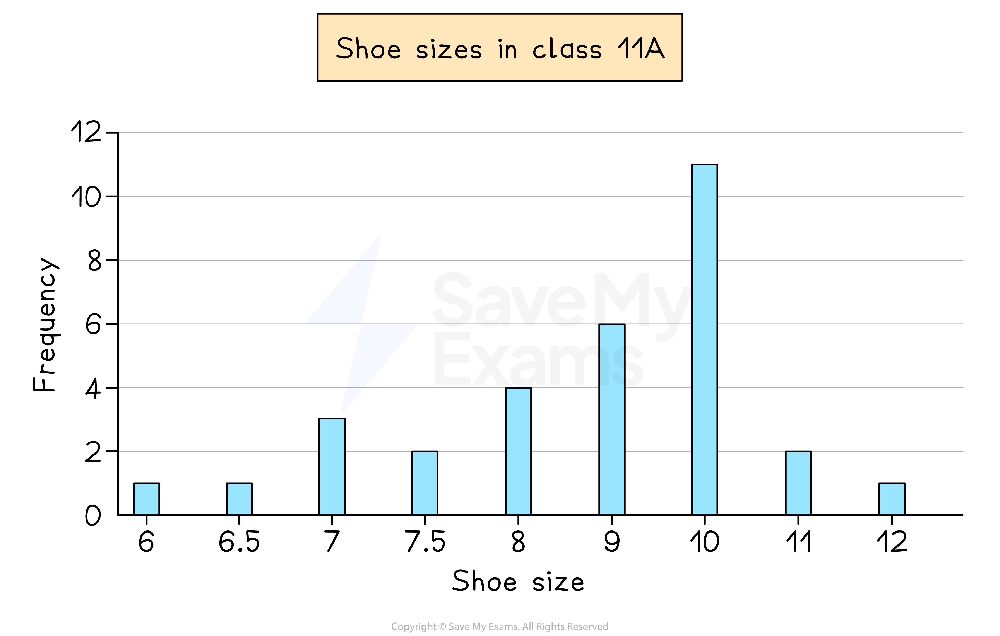
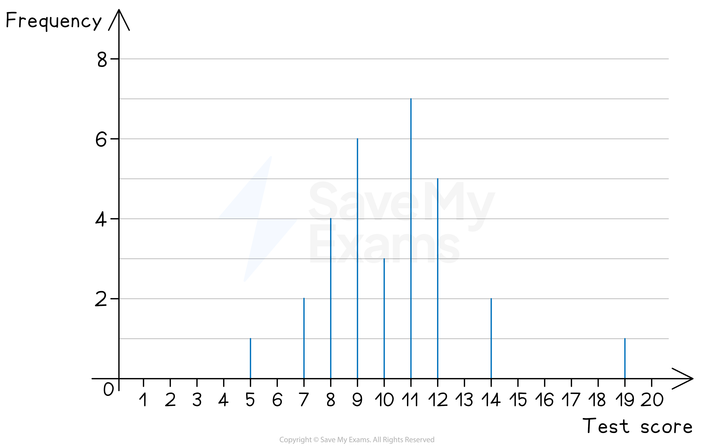
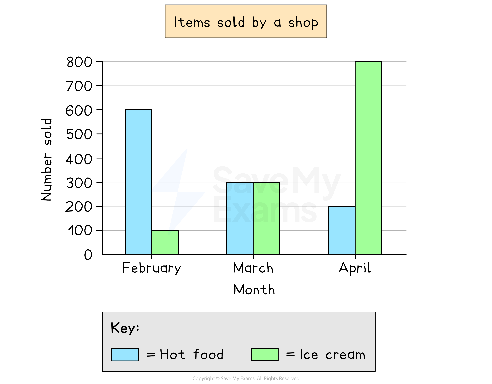
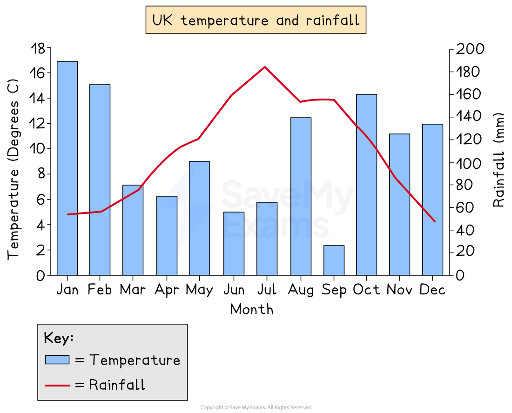
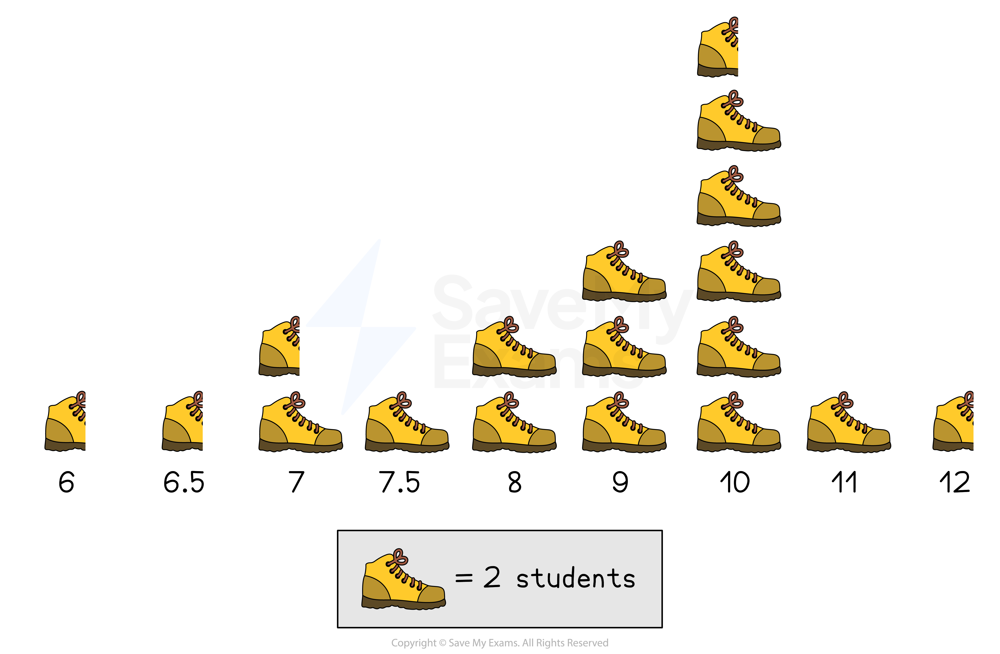
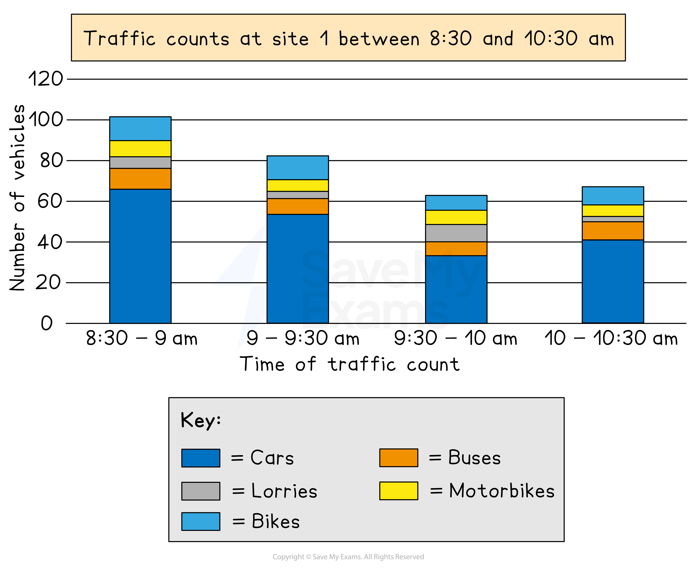

# Bar Charts & Pictograms

## Bar Charts

> **Spec point** — `spcpt_rmCQRR2rnpCRPzRf`

## Bar charts

### What is a bar chart?

- A **bar chart** is a visual way to represent **discrete** data

  - Discrete data is data that can be **counted**
  
    - This can be **numerical **like** **shoe sizes in a class
    - Or **non-numerical **(categorical) like colours of cars down a road
- The **horizontal axis** shows the different **outcomes**
- The **vertical axis** shows the **frequency**
- The **heights** of the **bars **show the frequency

  - Bars should be **separated** by gaps
  - Bars should have **equal widths**

*Example of a bar chart*

### What is a line chart?

- A **line chart**, or **vertical line chart** is a visual way to represent **discrete** data

  - **Line charts** are used for **numerical** data (rather than categorical data)
  
    - They are particularly useful when there are lots of different options to show
    e.g.  Results of a test where scores are given as percentages
  - They are different to **line graphs,** which are used for **time-series graphs**
- The **vertical axis** shows the **frequency**
- The **horizontal axis** shows the different **outcomes**

*Example of a vertical line chart*

- You can easily identify the **mode **(most common value) using a line chart

  - This will be the **outcome** with the **highest** (tallest/longest) line
  - e.g.  In the line chart above, 11 was the **modal** test score, with a frequency of 7
- You can quickly see how the data is **spread** using a line chart

  - Lines may be crowded around a particular group of options
  - This may help identify anomalies or outliers in the data
  - e.g.  In the line chart above you can see
  
    - the majority of the test scores, out of 20, were between 7 and 12
    - one pupil scored 19 out of 20, much higher than anyone else in the class

### What is a dual (comparative) bar chart?

- **Dual **(or comparative)** bar charts** compare two data sets on one bar chart

  - The data sets measure the **same variable**, so use the same scale
  - The bars are in **pairs** (side-by-side) for each outcome
  - e.g. For comparing different items sold by a shop

*Example of a comparative bar chart*

### What is a bar-line chart?

- A **bar-line chart** also shows two data sets on one chart

  - However one data set is represented by a **line**, and the other by **bars**
  - This allows two **different variables** to be shown, with a **different scale** for each
  - e.g. For showing the monthly temperature (as a line) and the monthly rainfall (as bars) across the year for a location
  
    - One scale would be in °C, and the other would be in mm

- There are also **composite bar charts**, which are covered in their own section below

*Example of a bar line chart*

> **Exam Hint**
> - If asked to draw a bar chart, find the largest frequency and select a scale which allows it to fit in the space provided

> **Worked Example**
> Mr Barr teaches students in Year 7 and Year 8.
> He records the number of pets that students in each year have.
> His results are shown in the dual bar chart below.
> 
> 
> 
> (a) Write down the modal number of pets for his Year 7 students.
> 
> **Answer:**
> 
> *The modal number (mode) is the number of pets that occurs the most*
> *Visually, this will be the highest bar for Year 7s*
> 
> **Final answer:** **The mode for Year 7 is 1 pet**
> 
> (b) How many Year 8 students does he teach?
> 
> **Answer:**
> 
> *Add up all the heights (frequencies) of the Year 8 bars*
> 
> *4 + 8 + 4 + 3 + 0 + 2*
> 
> **Final answer:** **He teaches 21 Year 8 students**

## Pictograms

> **Spec point** — `spcpt_F8Q9C8q3m8bPHCz8`

## Pictograms

### What is a pictogram?

- A **pictogram** is an **alternative **to a bar chart

  - It is used in the same situations
- There are **no axes**

  - **Frequency** is represented by **symbols**
  - A** key **shows the value of 1 symbol
  
    - For example, 1 symbol represents a frequency of 2
  - Half and quarter symbols are often used

*Example of a pictogram*

- The pictogram above shows the shoe sizes of students in a class

  - As 1 picture of a shoe represents 2 students
  
    - Half a shoe represents 1 student
  - The number of students with a shoe size of 7, is 3

## Composite Bar Charts

> **Spec point** — `spcpt_njsPXbQ7WwcNH4DH`

## Composite bar charts

### What is a composite bar chart?

- A **composite bar chart** shows the total **frequency **for a category as well as the **proportions **in each category
- For example, the chart below shows the total number of vehicles passing a location at different times

  - The **overall height** of each bar shows the **total number** of vehicles
  - The **sections within each** bar show the **proportion **of vehicles by type
  
    - Be careful - it is just the height of each coloured section which shows the frequency, not the whole bar
    - e.g. For 9-9:30 am, there are around 10 bikes, **not **80
- Composite bar charts can reveal more information that a regular bar chart

  - e.g. The below chart shows the least traffic in total is between 9:30-10 am, but it is also during this time that the greatest number of lorries are present

*Example of a composite bar chart*

> **Exam Hint**
> - It can be useful to annotate each section of the bar with its frequency when working

> **Worked Example**
> The composite bar chart below shows the number of ice creams and hot food items sold by a shop each month, for three months.
> 
> 
> 
> (a) Write down the month in which the most items were sold in total.
> 
> **Answer:**
> 
> > *The total number of items sold (both ice creams and hot food) is represented by the overall height of the bars*
> 
> **Final answer:** **Most items were sold in total in ****April **
> 
> (b) Write down the number of ice creams sold in February.
> 
> **Answer:**
> 
> > *Ice creams are shown by the striped part of the bar*
> *In February, this part of the bar spans from 600 to 700*
> 
> *700 - 600 = 100*
> 
> **In February ****100 ****ice creams were sold**
> 
> (c) Calculate how many more ice creams were sold in March than in February.
> 
> **Answer:**
> 
> > *We know that in February 100 ice creams were sold*
> *In March, the striped part of the bar spans from 300 to 600*
> 
> *600 - 300 = 300 ice creams sold in March*
> 
> > *Find the difference*
> 
> *300 - 100 = 200*
> 
> **Final answer:** **In March ****200 more**** ice creams were sold than in February **
> 
> (d) Find the total percentage of items sold that were ice cream, across the three months. Give your answer to 1 decimal place.
> 
> **Answer:**
> 
> > *We need to find the total number of ice creams sold across the three months*
> *We already know that the number of ice creams sold in February was 100, and 300 in March*
> *In April, the striped part of the bar spans from 200 to 1000*
> 
> *1000 - 200 = 800 ice creams sold in April*
> 
> > *Find the total number of ice creams sold*
> 
> *100 + 300 + 800 = 1200 ice creams sold in total*
> 
> > *We need to find the total number of items sold across the three months*
> *Add up the total heights of all the bars*
> 
> *700 + 600 + 1000 = 2300 items sold in total*
> 
> > *Find the number of ice creams sold as a percentage of the total number of items*
> 
> *1200 ÷ 2300 = 0.521739... = 52.1739... %*
> 
> > *Round to 1 decimal place*
> 
> **52.2 %**** of all items sold were ice creams**
