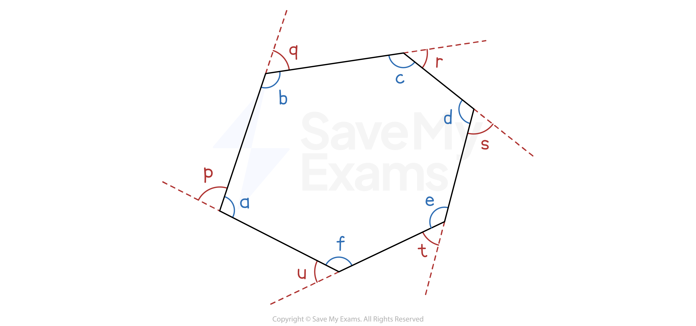
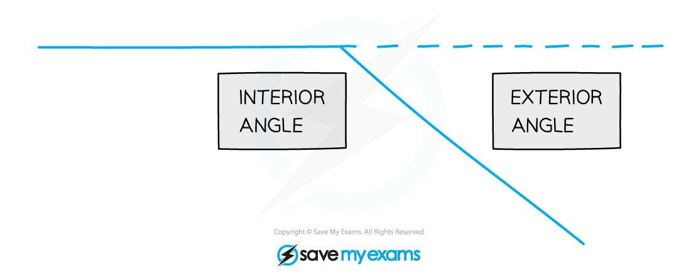

# Angles in Polygons

## Angles in Polygons

> **Spec point** — `spcpt_gzykj64JBx2RtBJ7`

## Angles in polygons

### What is a polygon?

- A **polygon** is a 2D shape with $n$* *straight sides

  - A **triangle** is a polygon with **3 sides**
  - A **quadrilateral** is a polygon with **4 sides**
  - A **pentagon** is a polygon with **5 sides**
- In a **regular** polygon **all the sides are the same length** and a**ll the angles are the same size**

  - A **regular polygon** with **3 sides** is an **equilateral triangle**
  - A **regular polygon** with **4 sides** is a **square**

### What are the interior angles and the exterior angles of a polygon?

- **Interior angles** are the angles **inside** a polygon at the corners
- The **exterior angle** at a corner is the angle needed to **make a straight line with the interior angles**

  - It is **not** the angle that forms a **full turn** at the corner

- The **interior **angle and **exterior **angle **add up to 180°** at each corner

### What is the sum of the interior angles in a polygon?

- To find the **sum of the** **interior angles **in a polygon of $n$ sides, use the rule

  - Sum of interior angles = $180^{\circ}\times(n--2)$
  
    - This formula comes from the fact that $n$-sided polygons can be split into $n-2$ triangles
- **Remember** the sums for these polygons

  - The interior angles of a **triangle** add up to **180°**
  - The interior angles of a **quadrilateral** add up to **360°**
  - The interior angles of a **pentagon** add up to **540°**

### What is the sum of the exterior angles in a polygon?

- The** exterior angles **in **any **polygon always **sum to 360°**

### How do I find the size of an interior or exterior angle in a regular polygon?

- To find the **size of an interior angle** in a **regular polygon**:
- **Method 1**
Find the **sum** of the **interior angles**

  - For a pentagon: `180 degree cross times open parentheses 5 minus 2 close parentheses space equals space 540 degree`
  - **Divide** by the **number of sides** ($n$)
  
    - For a pentagon: $540^{\circ}\div5=108^{\circ}$
- **Method 2**
Use the **formula** `fraction numerator 180 open parentheses n minus 2 close parentheses over denominator n end fraction` which calculates the interior angle directly
- To find the **size of an exterior angle** in a **regular polygon**:

  - either divide 360° by the number of sides ($n$)
  
    - For a pentagon: $360^{\circ}\div5=72^{\circ}$
  - or use the **formula** $\frac{360}{n}$
- The **interior** angle and **exterior** angle add to **180°**

  - **Subtract** the **exterior** angle from **180° **to find the **interior** angle
  - **Subtract** the **interior** angle from **180° **to find the **exterior** angle

| Regular Polygon | Number of Sides | Sum of Interior Angles | Size of Interior Angle | Size of Exterior Angle |
|---|---|---|---|---|
| Equilateral Triangle | 3 | 180° | 60° | 120° |
| Square | 4 | 360° | 90° | 90° |
| Regular Pentagon | 5 | 540° | 108° | 72° |
| Regular Hexagon | 6 | 720° | 120° | 60° |
| Regular Octagon | 8 | 1080° | 135° | 45° |
| Regular Decagon | 10 | 1440° | 144° | 36° |

### How do I find a missing angle in a polygon?

- To find a **missing angle** in a polygon:

  - Use the formula `180 degree cross times open parentheses n minus 2 close parentheses` to work out the** sum** of the interior angles
  - **Subtract** the **other interior angles** in the polygon

### How do I find the number of sides in a regular polygon?

- If you are given the interior angle of a regular polygon

  - set the angle equal to `fraction numerator 180 open parentheses n minus 2 close parentheses over denominator n end fraction`
  - then solve the equation to find $n$

> **Exam Hint**
> Make sure you identify whether you are dealing with a **regular **or **irregular **polygon before you start a question.
> 
> Finding the sum of the interior angles using `180 cross times open parentheses n minus 2 close parentheses` can often be a good starting point for finding missing angles.

> **Worked Example**
> The exterior angle of a regular polygon is 45°.
> 
> Write down the name of the polygon.
> 
> **Answer:**
> 
> > *The formula for the exterior angle of a regular polygon is *$\mathrm{Exterior} \mathrm{Angle}=\frac{360^{\circ}}{n}$* *
> 
> > *Substitute the 45 for the exterior angle*
> 
> $45^{\circ}=\frac{360^{\circ}}{n}$
> 
> > *Solve by rearranging*
> 
> `table row n equals cell 360 over 45 end cell row n equals 8 end table`
> 
> > *Write down the name of a shape with 8 sides*
> 
> **Final answer:** **Regular octagon**
