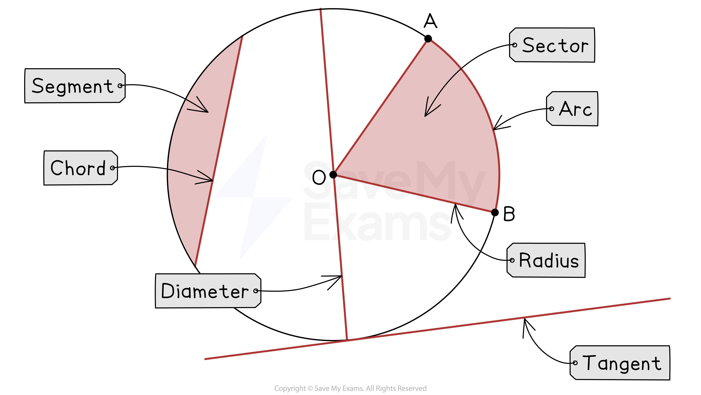

# Properties of Circles

## Properties of Circles

> **Spec point** — `spcpt_M22YV66GjwTPqSPX`

## Properties of circles

### What terms related to circles do I need to know?

- **Circles **have several specific terms that you need to be familiar with:

  - A circle's perimeter is called a **circumference**
  - Its line of symmetry is called a **diameter**
  - The line from the centre of the circle to its circumference is called a **radius**
  
    - The **diameter** is equal to **2 × the radius**
  - A portion of the circumference is called an **arc**
  - A portion of the area, contained between two radii and an arc, is called a **sector**
  - A line between two points on the circumference is called a **chord**
  - The area formed between a chord and an arc is called a **segment**
  - A line which intersects the circumference at one point only, is called a **tangent**

*Parts of a circle*

- The ratio $\frac{\mathrm{circumference}}{\mathrm{diameter}}$ is equal to **π **(3.14159...)
- **Circles **have many angle properties and you will need to learn some of them

  - These can be found in the revision note named **Circle Theorems**

> **Exam Hint**
> Always double check if a measurement is the diameter or the radius, this is a really common error in exams.
> 
> Diameter = 2 × Radius.
