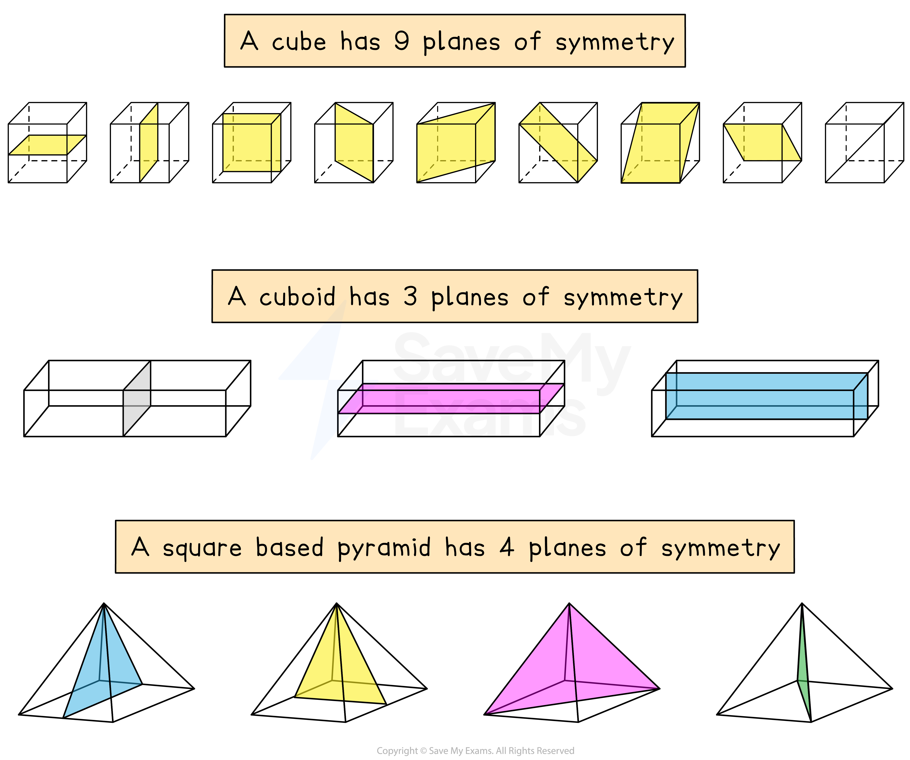
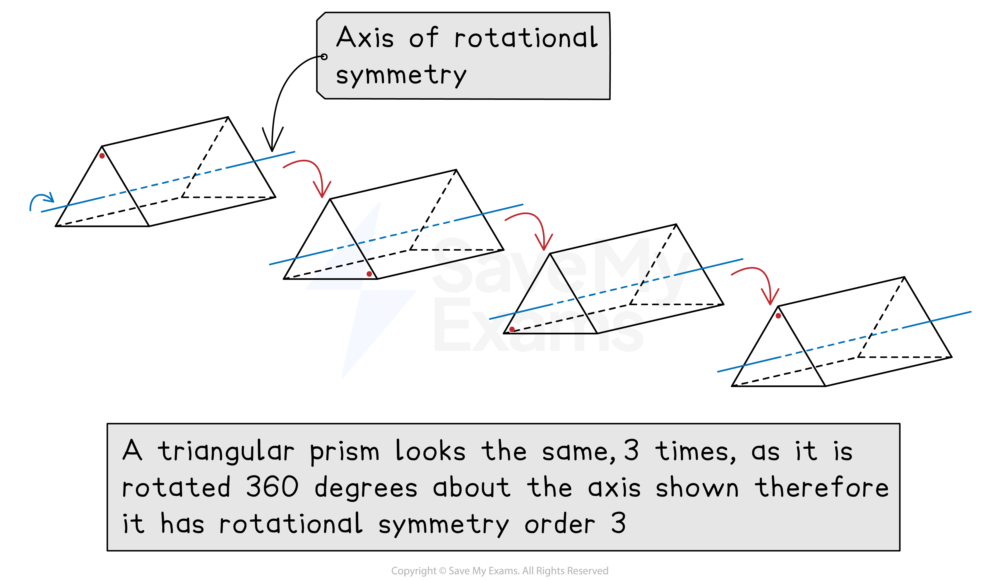
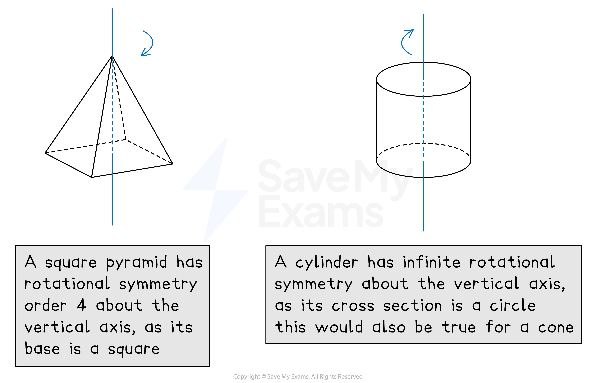

# Planes of Symmetry

## Planes of Symmetry

> **Spec point** — `spcpt_WDjD46wdhy2YdYdv`

## Planes of symmetry

### What is a plane of symmetry?

- A **plane **is a flat surface that can be any 2D shape
- A **plane of symmetry **is a **plane **that splits a 3D shape into two **congruent** (identical) halves
- If a 3D shape has a plane of symmetry, it has **reflection symmetry**

  - The two congruent halves are identical, mirror images of each other
- All **prisms** have at least one plane of symmetry

  - **Cubes** have 9 planes of symmetry
  - **Cuboids** have 3 planes of symmetry
  - **Cylinders** have an infinite number of planes of symmetry
  - The number of planes of symmetry in other prisms will be equal to the number of lines of symmetry in its cross-section plus 1
- **Pyramids **can have planes of symmetry too

  - The number of planes of symmetry in pyramids will be equal to the number of lines of symmetry in its 2D base
  - If the base of the pyramid is a **regular polygon** of *n *sides, it will have *n *planes of symmetry

### Can a 3D shape have rotational symmetry?

- 3D shapes are able to be **rotated around different axes**

  - Depending on which **axis **the shape is rotated around,** 3D shapes can have rotational symmetry**
- Recall that** rotational symmetry** is how many times the shape looks the same (congruent) when rotated through 360 degrees

  - See the example of the triangular prism where the cross-section is an **equilateral triangle**

> **Exam Hint**
> - If you’re unsure in the exam, consider the properties of the 3D shape.
> 
>   - Is it a **prism **or a **pyramid**?
>   - How many **lines of symmetry **are there in the **2D faces** or **cross-section**?

> **Worked Example**
> The diagram below shows a cuboid of length 8 cm, width 5 cm and height 11 cm.
> 
> Write down the number of planes of symmetry of this cuboid.
> 
> 
> 
> **Answer:**
> 
> > *A plane of symmetry is where a shape can be "sliced" such that it is symmetrical*
> 
> > *A cuboid with three different pairs of opposite rectangles has 3 planes of symmetry*
> 
> **Final answer:** **3 planes of symmetry**
