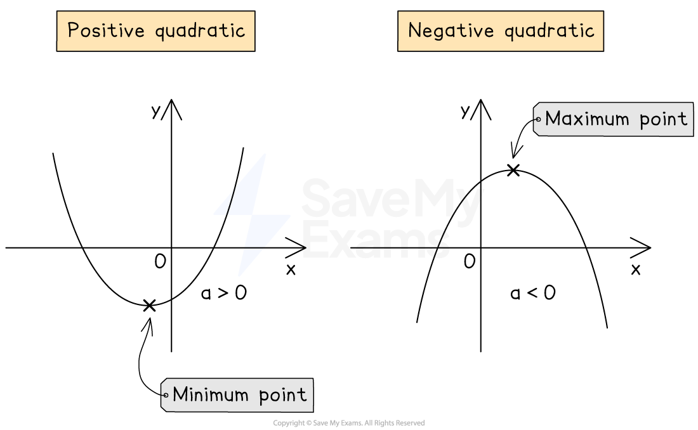

# Quadratic Graphs

## Quadratic Graphs

> **Spec point** — `spcpt_76gVqdMN62jnrZg6`

## Quadratic graphs

### What is a quadratic graph?

- A **quadratic graph** has the form $y=ax^{2}+bx+c$

  - where $a$ is not zero

### What does a quadratic graph look like?

- A quadratic graph is a smooth curve with a **vertical line of symmetry**

  - A **positive** number in front of $x^{2}$ gives a **u-shaped curve**
  - A **negative **number in front of $x^{2}$ gives an **n-shaped curve**
- The shape made by a quadratic graph is known as a **parabola**
- A quadratic graph will **always **cross the $y$**-axis**
- A quadratic graph** **intersects the** **$x$**-axis** **twice, once, or not at all**

  - The **x values** where the graph intersects the $x$-axis are called the **roots**
- If the graph is a **u-shape**, it has a** minimum point**
- If the graph is an **n-shape**, it has a **maximum point**
- Minimum and maximum points are both examples of **turning points**

  - A turning point can also be called a** vertex**

### How do I sketch a quadratic graph?

- It is important to know how to** sketch **a quadratic curve

  - A simple drawing showing the **key features** is often sufficient
  - (For a more accurate graph, create a table of values and plot the points)
- To **sketch a quadratic graph**:

  - First sketch the $x$ and $y$-axes
  - Identify the $y$-intercept and mark it on the $y$-axis
  
    - The $y$-intercept of $y=ax^{2}+bx+c$ will be `open parentheses 0 comma space c close parentheses`
    - It can also be found by substituting in $x=0$
  - Find all root(s) (0, 1 or 2) of the equation and mark them on the $x$-axis
  
    - The roots will be the solutions to $y=0$; $ax^{2}+bx+c=0$
    - You can find the solutions by factorising, completing the square or using the quadratic formula
  - Identify if the number $a$ in $ax^{2}+bx+c$ is positive or negative
  
    - A positive value will result in a u-shape
    - A negative value will result in an n-shape
  - Sketch a smooth curve through the $x$ and $y$-intercepts
  
    - Mark on any axes intercepts
    - Mark on the coordinates of the maximum/minimum point if you know it

### How do I find the coordinates of the turning point by completing the square?

- The coordinates of the **turning point **(vertex) of a quadratic graph can be found by **completing the square**
- For a quadratic graph written in the form `y equals a open parentheses x minus p close parentheses squared plus q`

  - the minimum or maximum point has **coordinates **`open parentheses p comma space q close parentheses`
- Beware: there is a **sign change** for the $x$-coordinate

  - A curve with equation `y equals open parentheses x minus 3 close parentheses squared plus 2`, has a minimum point at `open parentheses 3 comma space 2 close parentheses`
  - A curve with equation `y equals open parentheses x plus 3 close parentheses squared plus 2`, has a minimum point at `open parentheses negative 3 comma space 2 close parentheses`
- The value of $a$ does **not** **affect the coordinates** of the turning point but it **will change the shape** of the graph

  - If it is positive, the graph will be a u-shape
  
    - The curve `y equals 5 open parentheses x minus 3 close parentheses squared plus 2` has a** minimum** point at `open parentheses 3 comma space 2 close parentheses`
  - If it is negative, the graph will be an n-shape
  
    - The curve `y equals negative 8 open parentheses x minus 3 close parentheses squared plus 2` has a **maximum** point at `open parentheses 3 comma space 2 close parentheses`

### How do I find the coordinates of the turning point using differentiation?

- The coordinates of the **turning point **(maximum/minimum) of a quadratic can be found through **differentiation**
- To find the coordinates of the turning point

  - Differentiate the quadratic equation $y=ax^{2}+bx+c$
  
    - This will give you $\frac{dy}{dx}$
  - Set $\frac{dy}{dx}=0$  and solve for $x$
  
    - The solution will be the $x$-coordinate of the turning point
  - Substitute the $x$ value into $y=ax^{2}+bx+c$
  
    - This will give you the $y$-coordinate of the turning point

> **Worked Example**
> (a) Sketch the graph of $y=x^{2}-5x+6$ showing the $x$ and $y$ intercepts clearly.
> 
> **Answer:**
> 
> > *The *$+c$* at the end is the *$y$*-intercept*
> 
> $y$*-intercept:* *(0, 6)*
> 
> > *Factorise the quadratic expression*
> 
> `y equals open parentheses x minus 2 close parentheses open parentheses x minus 3 close parentheses`
> 
> > *Solve *$y=0$
> 
> `open parentheses x minus 2 close parentheses open parentheses x minus 3 close parentheses equals 0 comma space so space x equals 2 space or space x equals 3`
> 
> > *So the **x**-intercepts are given by the coordinates*
> 
> *(2, 0)  and (3, 0)*
> 
> > *It is a positive quadratic graph, so will be a u-shape*
> 
> 
> 
> (b) Sketch the graph of $y=x^{2}-6x+13$ showing the $y$-intercept and the coordinates of the turning point.
> 
> **Answer:**
> 
> > *It is a positive quadratic, so will be a u-shape*
> *The turning point will therefore be a minimum*
> 
> > *The *$+c$* at the end is the *$y$*-intercept*
> 
> $y$*-intercept:* *(0, 13)*
> 
> > *Find the minimum point by completing the square (or through differentiation)*
> 
> > *For example, complete the square by writing the equation in the form *`a open parentheses x minus p close parentheses squared plus q`* (you may need to look this method up)*
> 
> `table row cell x squared minus 6 x plus 13 end cell equals cell open parentheses x minus 3 close parentheses squared minus 9 plus 13 end cell row blank equals cell open parentheses x minus 3 close parentheses squared plus 4 end cell end table`
> 
> > *The turning point of *`y equals a open parentheses x minus p close parentheses squared plus q`* has coordinates *`open parentheses p comma space q close parentheses`
> *The minimum point is therefore*
> 
> *(3, 4)*
> 
> > *As the **minimum **point is above the *$x$*-axis, and the curve is a u-shape, this means the graph will not cross the *$x$*-axis (it has no roots)*
> 
> 
> 
> (c) Sketch the graph of $y=-x^{2}-4x-4$ showing the root(s), $y$-intercept, and the coordinates of the turning point.
> 
> **Answer:**
> 
> > *It is a negative quadratic, so will be an n-shape*
> *The turning point will therefore be a maximum*
> 
> > *The *$+c$* at the end is the *$y$*-intercept*
> 
> * *$y$*-intercept: (0, -4)*
> 
> > *Find the minimum point by completing the square or through differentiation*
> 
> > *For example, differentiate the equation*
> 
> $\frac{dy}{dx}=-2x-4$
> 
> > *Set the derivative equal to zero and solve for *$x$
> 
> `table row 0 equals cell negative 2 x minus 4 end cell row cell 2 x end cell equals cell negative 4 end cell row x equals cell negative 2 end cell end table`
> 
> > *Substitute this value of *$x$* back into the original equation for *$y$
> 
> `table row y equals cell negative open parentheses negative 2 close parentheses squared minus 4 open parentheses negative 2 close parentheses minus 4 end cell row y equals cell negative 4 plus 8 minus 4 end cell row cell space y end cell equals 0 end table`
> 
> > *This shows that the maximum point has coordinates*
> 
> *(-2, 0)*
> 
> > *As the maximum is on the *$x$*-axis, there is **only one root*
> 
> 

### How do I find the equation of a quadratic from its graph?

- If the **vertex **and **one other point **are known

  - Use the form `y equals a open parentheses x minus p close parentheses squared plus q` to fill in $p$ and $q$
  
    - The vertex is at `open parentheses p comma space q close parentheses`
  - Then substitute in the other known point `open parentheses x comma space y close parentheses` to find $a$
- If the **roots **($x$-intercepts) and **one other point** are known

  - Use the form `y equals a open parentheses x minus x subscript 1 close parentheses open parentheses x minus x subscript 2 close parentheses` to fill in $x_{1}$ and $x_{2}$
  
    - The roots are at `open parentheses x subscript 1 space comma space 0 close parentheses` and `open parentheses x subscript 2 space comma space 0 close parentheses`
  - Then substitute in the other known point `open parentheses x comma space y close parentheses` to find $a$
- If $a=1$ then you only need either the **vertex** or the **roots**

> **Worked Example**
> (a) Find the equation of the graph below.
> 
> 
> 
> **Answer:**
> 
> > *The graph shows the roots and a point on the curve (in this case the *$y$*-intercept)*
> 
> > *Use the form *`y equals a open parentheses x minus x subscript 1 close parentheses open parentheses x minus x subscript 2 close parentheses`* to fill in *$x_{1}$* and *$x_{2}$* by inspection*
> 
> > *The roots are at *`open parentheses x subscript 1 space comma space 0 close parentheses`* and *`open parentheses x subscript 2 space comma space 0 close parentheses`
> 
> `y equals a open parentheses x minus 2 close parentheses open parentheses x minus 3 close parentheses`
> 
> > *Substitute in the other known point (0, 24) to find *$a$
> 
> `table row 24 equals cell a open parentheses 0 minus 2 close parentheses open parentheses 0 minus 3 close parentheses end cell row 24 equals cell a open parentheses negative 2 close parentheses open parentheses negative 3 close parentheses end cell row 24 equals cell 6 a end cell row 4 equals a end table`
> 
> > *Write the full equation*
> 
> $y=4(x-2)(x-3)$
> 
> > *You could also write this in expanded form: *$y=4x^{2}-20x+24$
> 
> (b) Find the equation of the graph below.
> 
> 
> 
> **Answer:**
> 
> > *The graph shows the vertex and a point on the curve*
> 
> > *Use the form *`y equals a open parentheses x minus p close parentheses squared plus q`* to fill in *$p$* and *$q$* by inspection*
> 
> > *The vertex is at *`open parentheses p comma space q close parentheses`
> 
> `y equals a open parentheses x minus 9 close parentheses squared minus 16`
> 
> > *Substitute in the other known point (2, 82) to find *$a$
> 
> `table row 82 equals cell a open parentheses 2 minus 9 close parentheses squared minus 16 end cell row 82 equals cell a open parentheses negative 7 close parentheses squared minus 16 end cell row 82 equals cell 49 a minus 16 end cell row 98 equals cell 49 a end cell row 2 equals a end table`
> 
> > *Write the full equation*
> 
> $y=2(x-9)^{2}-16$** or***  *$y=2x^{2}-36x+146$
