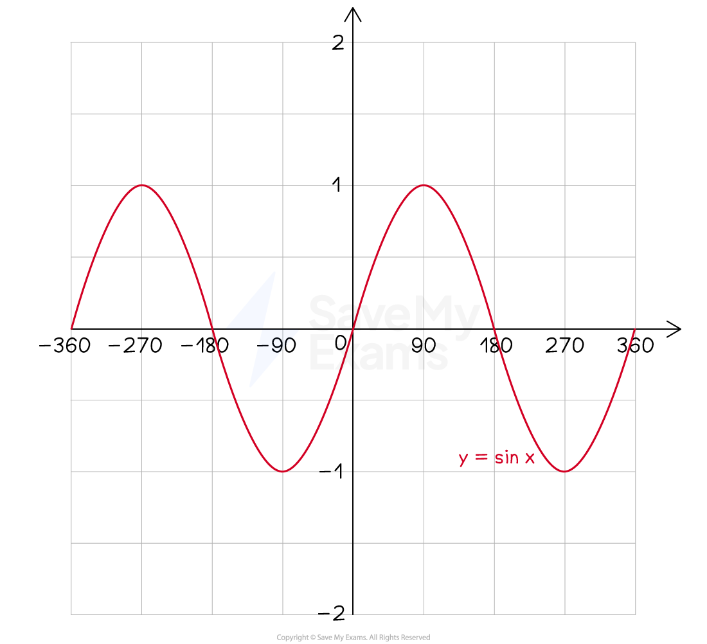
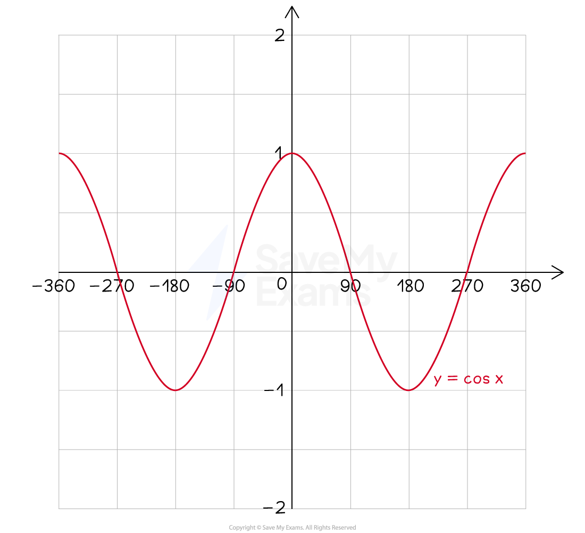
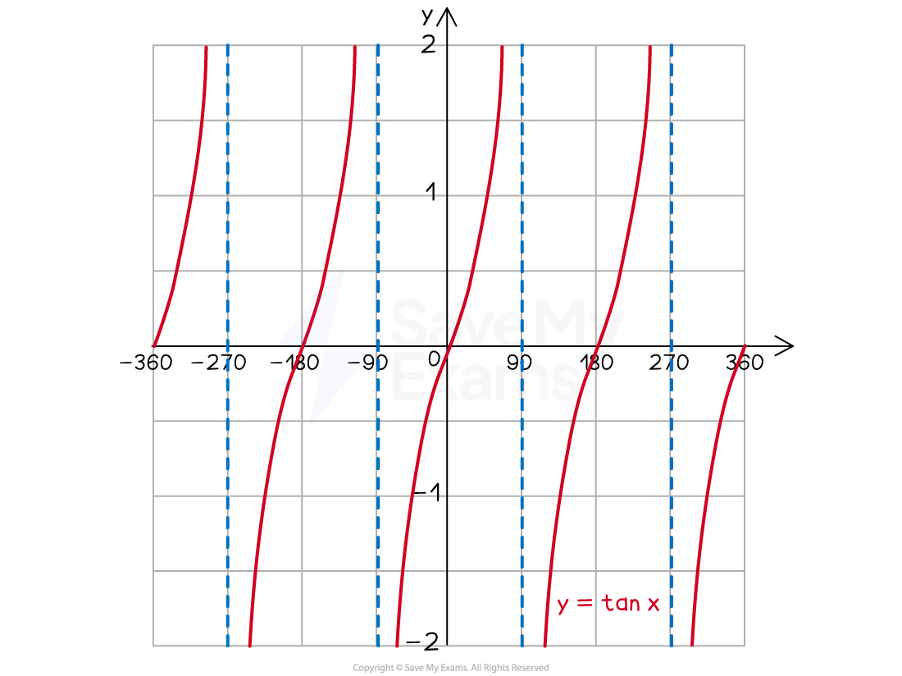

# Trigonometric Graphs

## Drawing Trig Graphs

> **Spec point** — `spcpt_6bYjJ8kxTNBbcSjX`

## Drawing trig graphs

### What are trig graphs?

- **Trigonometric (trig) graphs** are the graphs of

  - $y=\mathrm{sin}x$
  - $y=\mathrm{cos}x$
  - $y=\mathrm{tan}x$
- The variable $x$ is like an angle

  - but the angle can now go **beyond acute** to become **obtuse **and **reflex**
  
    - $0^{\circ}\leqx\leq360^{\circ}$
- Trig graphs have **repeating** (periodic) shapes and **symmetries **that you need to know

### What is the shape of the graph of y = sin x?

- The graph of $y=\mathrm{sin}x$ is a **wave** that oscillates between **heights of 1 and -1** and **repeats every 360° **(its **period** is 360°)

  - It goes through the **origin**, (0, 0)
  - Plot a point whenever $x$ is a **multiple of 90°**
  
    - The $y$ coordinates cycle through the numbers 0, 1, 0, -1

| $x$ | 0° | 90° | 180° | 270° | 360° | 450° |
|---|---|---|---|---|---|---|
| $y$ | 0 | 1 | 0 | -1 | 0 | 1 |

### What is the shape of the graph of y = cos x?

- The graph of $y=\mathrm{cos}x$ is a **wave** that oscillates between **heights of 1 and -1** and **repeats every 360° **(its **period** is 360°)

  - It has a ***y*****-intercept of 1**, coordinates (0, 1)
  - Plot a point whenever $x$ is a **multiple of 90°**
  
    - The $y$ coordinates cycle through the numbers 1, 0, -1, 0

| $x$ | 0° | 90° | 180° | 270° | 360° | 450° |
|---|---|---|---|---|---|---|
| $y$ | 1 | 0 | -1 | 0 | 1 | 0 |

- $y=\mathrm{cos}x$ is the same as translating $y=\mathrm{sin}x$ by** **90 to the left

### What is the shape of the graph of y = tan x?

- The graph of $y=\mathrm{tan}x$ is **not a wave** but consists of** branches** that** repeat every 180° **(its **period** is 180°)

  - This is** half the period **of** **$\mathrm{sin}x$ and $\mathrm{cos}x$
- There are **dotted vertical lines** that separate the branches called **asymptotes**

  - These are every 180° at $x=90^{\circ}$, $x=270^{\circ}$, ...
  - The curve cannot touch these, but get** closer and closer** to them
  - A branch starts down at a height of $-\infty$ and goes up to a height of $+\infty$
- $y=\mathrm{tan}x$ goes through the **origin**, (0, 0)

