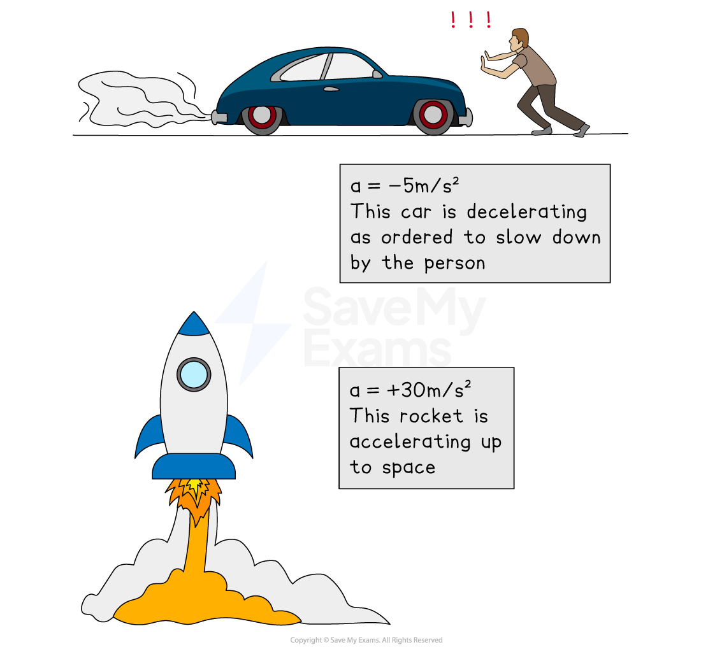
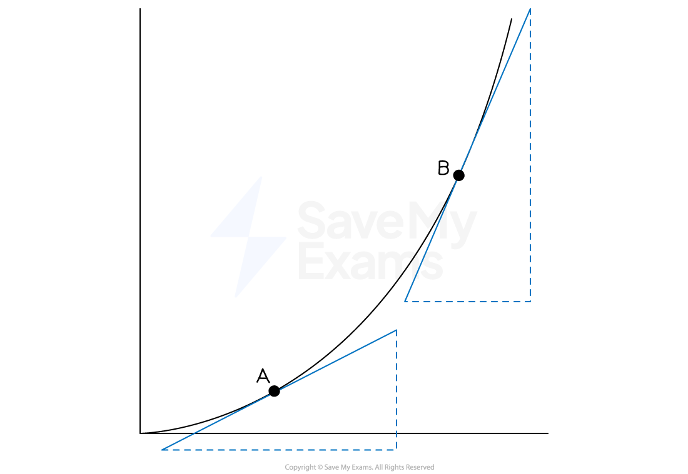

# Speed-Time Graphs

## Speed-Time Graphs

> **Spec point** — `spcpt_2nCMJhvvGsW7vMcV`

## Speed-time graphs

### How do I use a speed-time graph?

- **Kinematics** is the study of **motion** of objects

  - It looks at how an object moves **over time**

- **Speed-time** **graphs** show the speed of an object at different times

  - **Speed** is on the **vertical** axis
  - **Time** is on the **horizontal** axis
- The **gradient** of the graph is the **acceleration**

  - $\mathrm{Acceleration}=\frac{\mathrm{speed}}{\mathrm{time}}=\frac{\mathrm{rise}}{\mathrm{run}}$
- A **positive gradient **shows positive acceleration (speeding up)
- A **negative gradient** shows negative acceleration, (slowing down)

  - This is also called **deceleration**

- **Horizontal **lines indicate moving at a **constant speed**

  - The object is neither speeding up or slowing down
  - If the constant speed is **zero**, then it is at **rest**
- A **straight line** shows **constant acceleration**

- A **curve** shows **changing acceleration**

  - To find the acceleration at a particular point on the graph
  
    - draw a** tangent** to the graph at this point and find its **gradient**

- The **distance** covered by the object is the **area under the graph**

  - Split the area into simple shapes, e.g. rectangles and triangles
  - Find the area of each shape and add them together

> **Exam Hint**
> Always check the** vertical axis** to see if you are given a speed-time graph or a distance-time graph!

> **Worked Example**
> The speed-time graph for a car travelling between two sets of traffic lights is shown below.
> 
> 
> 
> (a) For how long was the car travelling at a constant speed?
> 
> **Answer:**
> 
> > *Constant speed is represented by horizontal lines*
> 
> > *There is a horizontal line from 6 seconds to 15 seconds*
> 
> *15 - 6 = 9*
> 
> **Final answer:** **9 seconds**
> 
> (b) Calculate the acceleration during the first 6 seconds.
> 
> **Answer:**
> 
> > *In a speed-time graph the acceleration is the gradient of the graph*
> 
> $\mathrm{acceleration}=\frac{\mathrm{rise}}{\mathrm{run}}=\frac{\mathrm{speed}}{\mathrm{time}}$
> 
> 
> 
> $\mathrm{acceleration}=\frac{9m/s}{6s}=1.5\frac{m/s}{s}$
> 
> **Final answer:** **Acceleration = 1.5 m/s****2**
> 
> (c) Work out the distance covered by the car.
> 
> **Answer:**
> 
> > *In a speed-time graph the distance travelled is equal to the area under the graph*
> 
> > * The graph is a trapezium so use the formula   *`Area space equals space fraction numerator open parentheses a space plus space b close parentheses h over denominator 2 end fraction`
> 
> *  *`Area space equals space fraction numerator open parentheses 9 space plus thin space 20 close parentheses space cross times space 9 over denominator 2 end fraction space equals space 261 over 2 space equals space 130.5 space`
> 
> **Final answer:** **  ****Distance travelled = 130.5 m**
