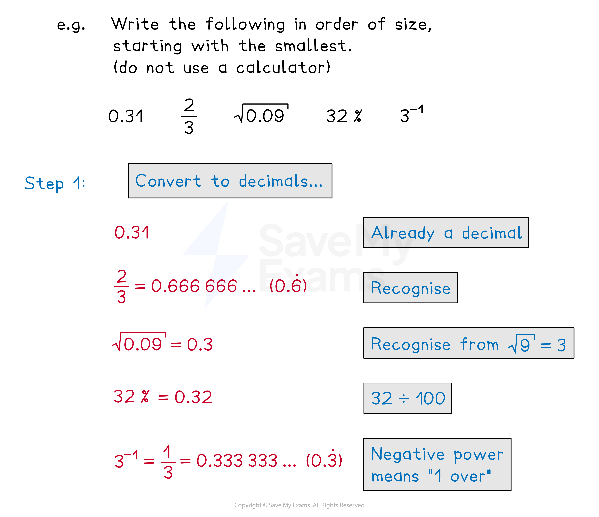
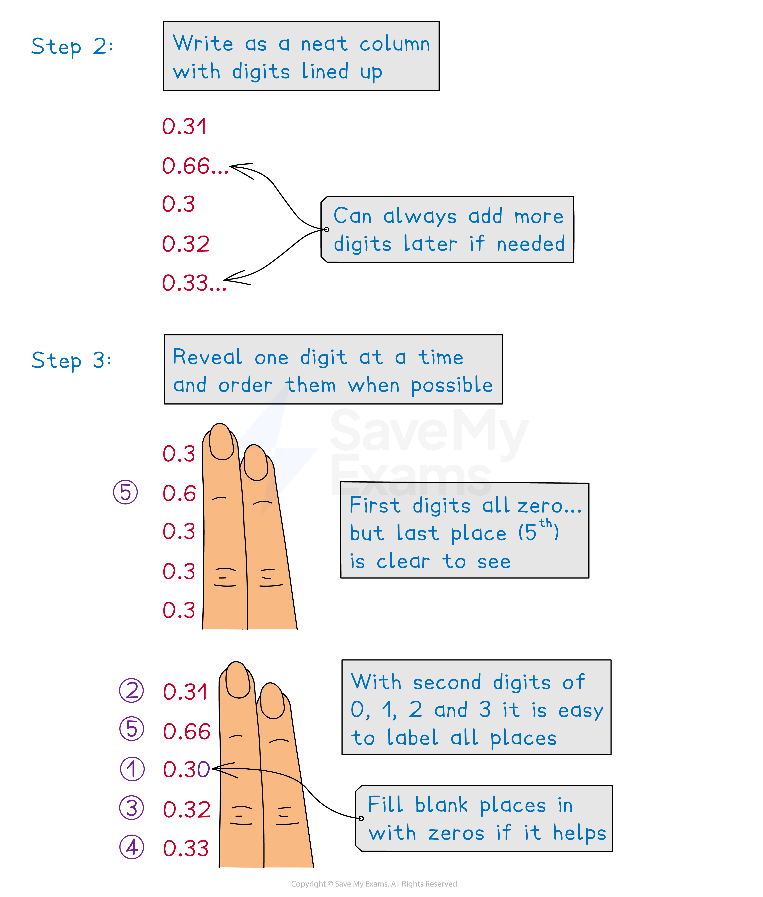
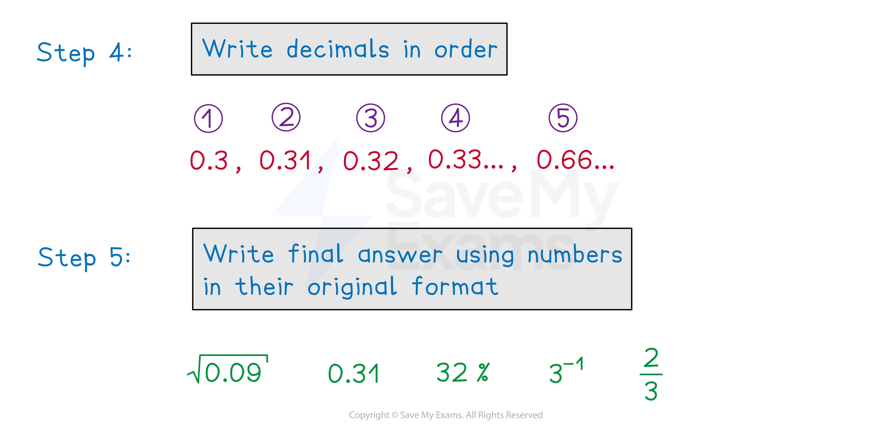

# Ordering Fractions, Decimals & Percentages

## Ordering FDP

> **Spec point** — `spcpt_KNXbNby67zKvX8SX`

## Ordering FDP

### How do I put fractions in order of size?

- When comparing **only fractions**, write them over a **lowest common denominator**

  - For $\frac{3}{5},\frac{1}{2},\frac{13}{20},\frac{7}{12}$, the lowest common denominator is **60**
  - So change them to $\frac{36}{60},\frac{30}{60},\frac{39}{60},\frac{35}{60}$ and then** order them by their numerators**
  - From smallest to largest: $\frac{30}{60},\frac{35}{60},\frac{36}{60},\frac{39}{60}$
  - Rewrite in their original form: $\frac{1}{2},\frac{7}{12},\frac{3}{5},\frac{13}{20}$
- Alternatively, a **calculator **can be used to **convert each fraction to a decimal**

  - To do this, enter each fraction as a division

### How do I put fractions, decimals and percentages in order of size?

- When comparing a mixture of fractions, decimals and percentages, **change everything into decimals**

### Which symbols can I use?

- Rather than just listing values in order, symbols can be used to compare them

  - For example, $\frac{1}{4}<\frac{1}{3}<\frac{1}{2}$
- Recall that $>$ means **greater than** and $\geq$ means greater than **or equal to**

  - Similarly, $<$ means **less **than and $\leq$ means less than or equal to
- You may also see $=$and $\neq$ (which means "**not **equal to")

> **Exam Hint**
> A calculator can be used to quickly convert any quantities into decimals.
> 
> E.g. A fraction can be entered as a division.

> **Worked Example**
> Without use of a calculator, write these numbers in order, starting with the smallest.
> 
> $\frac{1}{3}$,       $\frac{2}{5}$,     $\frac{9}{25}$,      $\frac{4}{15}$
> 
> **Answer:**
> 
> > *As they are all fractions, write them with a common denominator*
> *The lowest common denominator is 75*
> *Rewrite each fraction with a denominator of 75*
> 
> * *$\frac{1}{3}=\frac{25}{75}$*                       *$\frac{2}{5}=\frac{30}{75}$*                      *$\frac{9}{25}=\frac{27}{75}$*                 *$\frac{4}{15}=\frac{20}{75}$*            *
> 
> > *Compare and write in order from smallest to largest*
> 
> $\frac{20}{75},\frac{25}{75},\frac{27}{75},\frac{30}{75}$
> 
> > *Rewrite in their original form*
> 
> $\frac{4}{15},\frac{1}{3},\frac{9}{25},\frac{2}{5}$

> **Worked Example**
> Write these numbers in the spaces below.
> 
> $\frac{7}{8}$,       $\frac{5}{6}$,       $0.8$,       `78 percent sign`
> 
> ..... < ..... < ..... < .....
> 
> **Answer:**
> 
> > *As there is a mixture of fractions, decimals, and percentages, rewrite each as a decimal*
> 
> > *0.8 is already a decimal*
> 
> > *Convert 78% to a decimal by dividing by 100*
> 
> `78 percent sign space equals space 0.78`
> 
> > *Convert *$\frac{7}{8}$* to a decimal by entering into a calculator as a division*
> 
> $\frac{7}{8}=7\div8=0.875$
> 
> > *Convert *$\frac{5}{6}$* to a decimal in the same way*
> 
> `5 over 6 equals 5 divided by 6 equals 0.8333... equals 0.8 3 with dot on top`
> 
> > *Write them all with 3 decimal places to determine the order*
> 
> $0.875\,0.833\,0.800\,0.780$
> 
> > *Rewrite the decimals in order*
> 
> `0.78 comma space 0.8 comma space 0.8 3 with dot on top comma space 0.875`
> 
> > *Rewrite in their original form, and recall that < means "less than", so the smallest value will be first*
> 
> `bold 78 bold percent sign bold space bold less than bold space bold 0 bold. bold 8 bold space bold less than bold space bold 5 over bold 6 bold space bold less than bold space bold 7 over bold 8`
