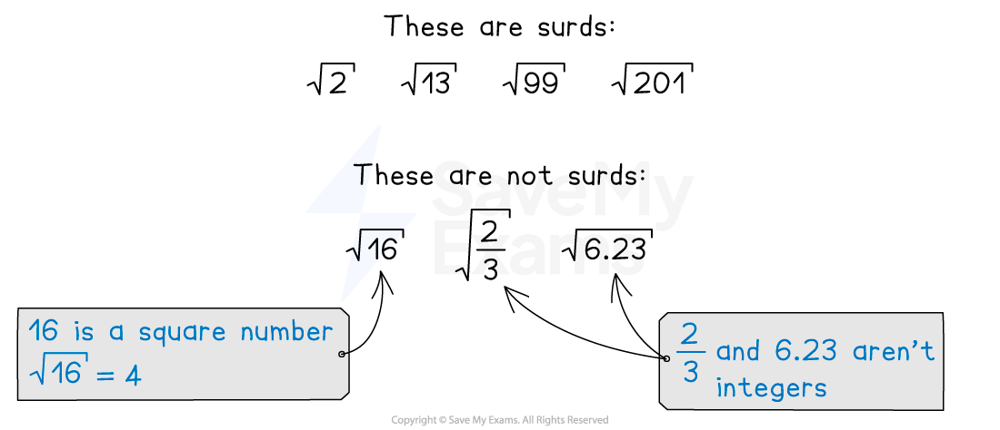
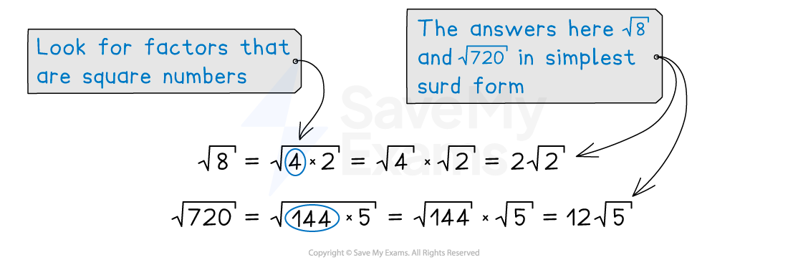

# Simplifying Surds

## Surds & Exact Values

> **Spec point** — `spcpt_4QRwffMSmK66nXtp`

## Surds & exact values

### What is a surd?

- A surd is the square root of a non-square integer
- Using surds lets you leave answers in exact form

  - e.g. $5\sqrt{2}$  rather than $7.071067812...$

### How do I do calculations with surds?

- ** Multiplying surds**

  - You can multiply numbers under square roots together
  - $\sqrt{3}\times\sqrt{5}=\sqrt{3\times5}=\sqrt{15}$
- **Dividing surds**

  - You can divide numbers under square roots
  - $\frac{\sqrt{21}}{\sqrt{7}}=\sqrt{21}\div\sqrt{7}=\sqrt{21\div7}=\sqrt{3}$
- **Factorising surds**

  - You can factorise numbers under square roots
  - $\sqrt{35}=\sqrt{5\times7}=\sqrt{5}\times\sqrt{7}$
- **Adding or subtracting surds**

  - You can only add or subtract multiples of “like” surds
  
    - This is similar to collecting like terms when simplifying algebra
  - $3\sqrt{5}+8\sqrt{5}=11\sqrt{5}$
  - $7\sqrt{3}--4\sqrt{3}=3\sqrt{3}$
  
    - However  $2\sqrt{3}+4\sqrt{6}$  cannot be simplified
  - You cannot add or subtract numbers under square roots
  - Consider $\sqrt{9}+\sqrt{4}=3+2=5$
  
    - This is not equal to $\sqrt{9+4}=\sqrt{13}=3.60555\dots$

> **Exam Hint**
> If your calculator gives an answer as a surd, leave the value as a surd throughout the rest of your working.
> 
> This will ensure you do not lose accuracy throughout your working.

## Simplifying Surds

> **Spec point** — `spcpt_stqdXPTn5YvgKtvm`

## Simplifying surds

### How do I simplify surds?

- To **simplify a surd**, factorise the number using a square number, if possible

  - If multiple square numbers are a factor, use the largest
- Use the fact that $\sqrt{ab}=\sqrt{a}\times\sqrt{b}$ and then work out any square roots of square numbers

  - E.g. $\sqrt{48}=\sqrt{16\times3}=\sqrt{16}\times\sqrt{3}=4\times\sqrt{3}=4\sqrt{3}$

- When simplifying multiple surds, simplify **each separately**

  - This may produce surds which can then be collected together
  
    - E.g. $\sqrt{32}+\sqrt{8}$ can be rewritten as $\sqrt{16}\sqrt{2}+\sqrt{4}\sqrt{2}$
    - This simplifies to  $4\sqrt{2}+2\sqrt{2}$
    - These surds can then be collected together
    - $6\sqrt{2}$
- You may have to expand double brackets containing surds

  - This can be done in the same way as multiplying out double brackets algebraically, and then simplifying
  - The property `open parentheses square root of a close parentheses squared space equals space a` can be used to simplify the expression, once expanded
  - E.g. `open parentheses square root of 6 minus 2 close parentheses open parentheses square root of 6 plus 4 close parentheses` expands to `open parentheses square root of 6 close parentheses squared space plus 4 square root of 6 minus 2 square root of 6 minus 8`
  
    - This simplifies to $6+2\sqrt{6}-8$ which gives $-2+2\sqrt{6}$

> **Worked Example**
> Write $\sqrt{54}-\sqrt{24}$ in the form $\sqrt{q}$ where $q$ is a positive integer.
> 
> **Answer:**
> 
> > *Simplify both surds separately by finding the highest square number that is a factor of each of them*
> 
> * 9 is a factor of 54, so *$\sqrt{54}=\sqrt{9\times6}=3\sqrt{6}$
> 
> * 4 is a factor of 24, so *$\sqrt{24}=\sqrt{4\times6}=2\sqrt{6}$
> 
> > *Simplify the whole expression by collecting the like terms*
> 
> $\sqrt{54}-\sqrt{24}=3\sqrt{6}-2\sqrt{6}=\sqrt{6}$
> 
> $\sqrt{6}$
