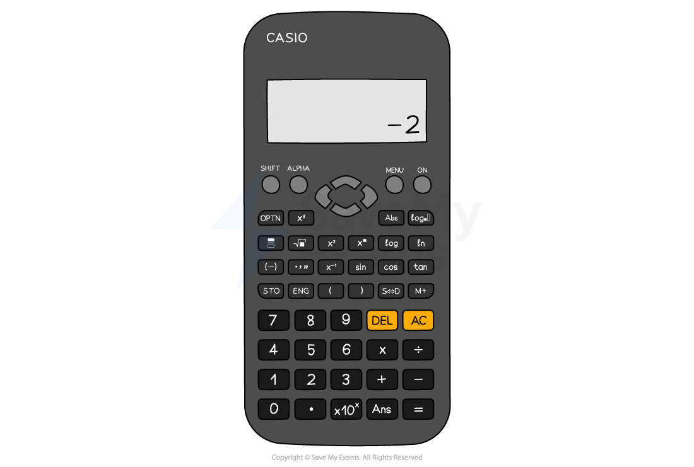
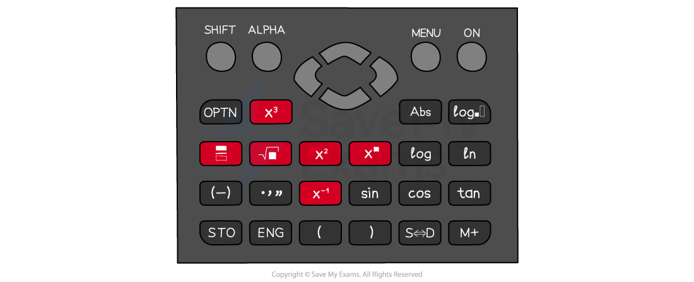

# Using a Calculator

## Using a Calculator

> **Spec point** — `spcpt_xf7Y5cxcQG3T6g65`

## Using a calculator

### Why are calculator skills important?

- There are many **special functions** on a scientific calculator

  - To answer questions successfully you need to be able to use your calculator effectively
- You may need to use some of the functions on the calculator in **other subjects** such as Science
- There are many **different models **of calculator

  - Any scientific calculator will have the functions you need but may be **accessed in different ways**
  - You need to know how to use the features on** your specific model**
- If you have an** old** or **very basic** scientific calculator the functions may be used **backwards**

  - To find the sine of an angle on a newer calculator, type sin (57)
  - On an older calculator you may need to type 57 then press the sin button
- The** **notes below** apply to most if not all scientific calculators **but the images are based on the **Casio fx-83GT**

*The Casio fx-83GTX Classwiz*

### How do I make sure that I have the correct settings on the calculator?

- Check you know how change the **mode** of your calculator

  - There is usually a button marked 'MODE'
  - Most calculators default to 'MATH' mode with the word MATH written across the top of the display or using a symbol
- The '**Angle Unit'** needs to be **degrees**

  - There is usually a button marked 'SETUP' where you can find the angle unit options
  - A **'D' **symbol at the top of the display is used to indicate that the calculator is in the degrees setting
- Make sure you can switch between **'exact'** answers (e.g. fractions) and** 'approximate'** answers (e.g. decimals)

  - When in 'MATH' mode press the** 'S**$\Leftrightarrow$**D' button ** to switch between answer types

> **Exam Hint**
> It is a good idea to reset your calculator before an exam. This ensures all the settings are correct. Look at your calculator's guide to learn how to reset it.

### What are the shortcut buttons on the calculator?

- There are several very useful** shortcut buttons **on the calculator that you should know

  - The **fraction**, **square**, **cube**, **power** and** square root** buttons are all frequently used
  - Use the** 'SHIFT'** (**2****nd** or **INV**) button to access functions including **mixed numbers**, **cube roots**, and **n****th**** roots**

### Why is using brackets important?

- **Applying brackets correctly** on your calculator helps you to **avoid errors** in your calculations

  - Use brackets as you would in written mathematics
  - Put brackets around **negative numbers** in calculations
  
    - Remember, $-3^{2}$ gives you a different result to `open parentheses negative 3 close parentheses squared`
    - Use the **'(-)' button** for negative values, not the minus button

### Which buttons are useful for trigonometry?

- Use the **sin**, **cos** and **tan** buttons when finding **missing sides** of a triangle

  - Remember to make sure that your calculator is in **degrees mode**
- Use **sin****-1**, **cos****-1** and **tan****-1** when finding **missing angles** of a triangle

  - Access these by using the** 'SHIFT' **button
- When using a **trig function**, the calculator gives you an open bracket '('

  - Remember to use a closed bracket ')' after typing the angle in

### Which buttons are useful for standard form and calculations involving π?

- To write a number in **standard form** on the calculator, use the **×10*****x***

  - Modern calculators display standard form in the way it is written, e.g., 2 x 105
  - Older models may use a small capital letter** 'E'** in place of ×10*x*, e.g., 2E5
- $π$  is often near the standard form button

  - You may need to use the** 'SHIFT'** button to access it

### What is the Ans function?

- The **Ans** (answer) button **recalls the last answer** the calculator calculated

  - Use this when working with decimals in the middle of solutions to avoid rounding until your final answer

### What is the table function?

- If your calculator has a **table** function or mode it can be used in** 'complete the table of values and draw the graph'** type questions

  - This can help you to **reduce **the** number of calculations **you have to do
  - It can also help to **reduce errors**

### How do I use my calculator for time calculations?

- Remember that **time** can be given in different formats

  - Time can be given in **hours/minutes/seconds**, e.g. 3 hours 46 minutes
  - Time can be given as a **decimal**, e.g. 2.7 hours
- You can use the **degrees, minutes and seconds function** `box enclose degree apostrophe double apostrophe end enclose` to enter time on your calculator

  - E.g. 3 minutes 45 seconds would be entered as $0^{\circ}3'45''$
  - You can convert between an answer on the calculator, given in either format of time, by pressing this button

> **Exam Hint**
> Get a calculator **early **and learn how to use all the** essential functions.**
> 
> When using your calculator in an exam do **one calculation at a time.**
> 
> Make sure you **write down **on paper **each calculation** that you do.
> 
> Always write down **more digits **than the final answer requires **in your working.**
> 
> Only** round **your** final answer.**

> **Worked Example**
> (a) Use your calculator to work out
> 
> `fraction numerator square root of 4.69 end root over denominator 0.34 cubed plus sin open parentheses 45 degree close parentheses end fraction`
> 
> Give your answer as a decimal.
> Write down all the figures on your calculator display.
> 
> **Answer:**
> 
> > *Type the calculations in the numerator and the denominator into your calculator separately*
> *Write down the decimal answers*
> *Use '...' to show that you have not rounded them*
> *You need to show this working to get full marks*
> 
> $\sqrt{4.69}=2.16564...$
> 
> `0.34 cubed plus sin open parentheses 45 close parentheses equals 0.746 space 410 space...`
> 
> > *Type the whole calculation into your calculator in one go*
> *Use the fraction button, square root button, cube button and remember to close the bracket after the sine function*
> 
> $2.901406085$
> 
> (b) Given that
> 
> $a=\frac{p+q}{p^{2}q}$
> 
> Find the value of a when $p=1.2\times10^{-3}$ and $q=7.83\times10^{5}$.
> Give your answer to 3 significant figures.
> 
> **Answer:**
> 
> > *Type the numerator of the right-hand side of the equation into your calculator, substituting in the values for **p** and **q*
> *Write this down to show your working*
> 
> $p+q=1.2\times10^{-3}+7.83\times10^{5}=783000.0012$
> 
> > *Type the denominator of the right-hand side of the equation into your calculator, substituting in the values for **p** and **q*
> *Use brackets when expressions get long or awkward*
> *Write this down to show your working*
> 
> `p squared q equals open parentheses 1.2 cross times 10 to the power of negative 3 end exponent close parentheses squared cross times open parentheses 7.83 cross times 10 to the power of 5 close parentheses equals 1.12752`
> 
> > *Write down all the digits on your calculator display for the working stages*
> 
> $a=\frac{783000.0012}{1.12752}=694444.4455$
> 
> > *Round to 3 significant figures*
> 
> $a=694000$** ****(3 s.f.)**** **
> 
> (c) Complete the table of values for $y=x^{3}-6x+1$.
> 
> | $x$ | -3 | -2 | -1 | 0 | 1 | 2 | 3 |
> |---|---|---|---|---|---|---|---|
> | $y$ |   | 5 |   |   |   |   | 10 |
> 
> **Answer:**
> 
> > *Use brackets around negative values and the '(-)' button*
> 
> `open parentheses negative 3 close parentheses cubed minus 6 cross times open parentheses negative 3 close parentheses plus 1 equals negative 8`
> 
> > *Use arrow keys to go back to the input line and change each '-3' to '-1'*
> 
> `open parentheses negative 1 close parentheses cubed minus 6 cross times open parentheses negative 1 close parentheses plus 1 equals 6`
> 
> > *Repeat for each of the remaining values in the table, 0, 1 and 2*
> 
> $0^{3}-6\times0+1=1\,1^{3}-6\times1+1=-4\,2^{3}-6\times2+1=-3$
> 
> > *Alternatively, use the 'Table' mode/feature if your calculator has one*
> 
> > *Complete the table with the values*
> 
> | $x$ | -3 | -2 | -1 | 0 | 1 | 2 | 3 |
> |---|---|---|---|---|---|---|---|
> | $y$ | **Final answer:** **-8** | 5 | **Final answer:** **6** | **1** | **Final answer:** **-4** | **Final answer:** **-3** | 10 |
