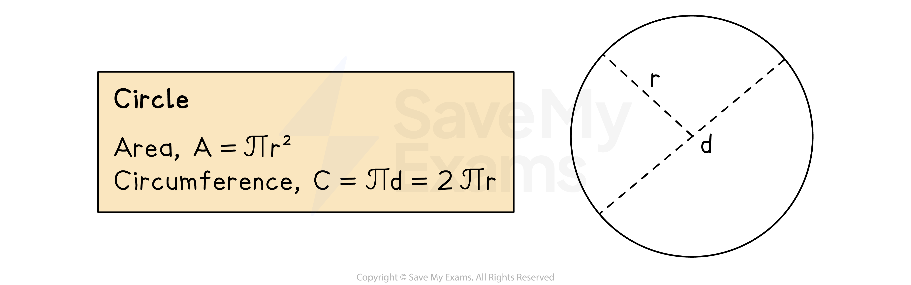

# Area & Circumference of Circles

## Area & Circumference

> **Spec point** — `spcpt_Mq2w9qKSCyF5mvvs`

## Area & Circumference

### What are the properties of a circle?

- A **circle** is a shape that is made up of all the points on a 2D plane that are **equidistant **from a single point

  - Equidistant means the same distance
- The **circumference** of a circle is its **perimeter**
- The **diameter**, ***d***, of a circle is** twice** its** radius**, ***r***
- $π$** (pi)** is the number (3.14159 …) that is the ratio between a circle’s **diameter** and its **circumference**

  - You may be asked to give an answer to a question as an 'exact value' or 'in terms of $π$'

### What circle formulae do I need to know?

- You are **not given the formulae** for the **area** and **circumference** of a circle
- The **area of a circle** can be calculated using the formula:

  - $A=πr^{2}$
- The **circumference of a circle** can be calculated using either of the following two formulae:

  - $C=πd$
  - $C=2πr$

- Working with circle formulae is just like working with any other formula:

  - **Write down **what you know (or what you want to know)
  - Pick the correct **formula**
  - **Substitute** the values in and **solve**

### How do I find the circumference of a circle?

- Identify the **diameter**

  - This is **double **the length of the **radius**
- **Multiply** the **diameter** by **π**

### How do I find the area of a circle?

- Identify the **radius**

  - This is **half** the length of the **diameter**
- **Square** the **radius**
- **Multiply** the **radius squared** by **π**

> **Exam Hint**
> Remember that area is always measured in square units (cm2, m2, ... etc.) and circumference is always measured in units of a single length (cm, m, ... etc.)

> **Worked Example**
> Find the area and perimeter of the semicircle shown in the diagram.
> 
> Give your answers in terms of $π$.
> 
> 
> 
> **Answer:**
> 
> *The **area **of a semicircle is half the area of the full circle with the same diameter, so begin by finding the area of the full circle*
> 
> > *Find the radius by dividing the diameter by 2*
> 
> $r=\frac{16}{2}=8\mathrm{cm}$
> 
> > *Substitute this into the formula for the area of a circle *$A=πr^{2}$*.*
> *Leave your answer in terms of *$π$*, (this just means do not multiply by *$π$*  on your calculator) *
> 
> `A subscript full space circle end subscript space equals space pi open parentheses 8 close parentheses squared space equals space 64 pi`
> 
> > *Find the area of the semicircle by dividing the full area by 2*
> 
> `A subscript semicircle space equals space 1 half open parentheses 64 pi close parentheses space equals space 64 over 2 pi space equals space 32 pi`
> 
> **Final answer:** **Area = 32****π**** ****cm****2**
> 
> > *The **perimeter **of the semicircle is made up of both the arc of the circle (half of the circumference) and the diameter of the semicircle*
> 
> > *Find the full length of the circumference of the circle using the formula  *
> 
> $C=2πr$*  (or *$C=πd$*)*
> 
> > *Substitute the radius = 8 cm into the formula*
> *Again, leave your answer in terms of *$π$
> 
> `C space equals space 2 pi open parentheses 8 close parentheses space equals space 16 pi`
> 
> > *Find the length of the arc (the curved part of the perimeter of the semicircle) by dividing the full area by 2*
> 
> `Curved space length space equals space 1 half open parentheses 16 pi close parentheses space equals space 16 over 2 pi space equals space 8 pi`
> 
> > *Find the full perimeter by adding this to the length of the diameter of the circle*
> 
> **Final answer:** **Perimeter = (8π+16) cm**
