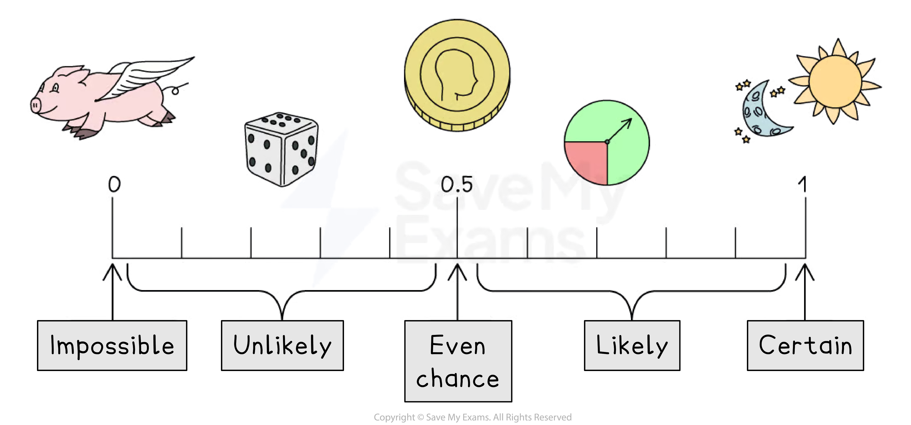

# Basic Probability

## Basic Probability

> **Spec point** — `spcpt_FVX7YRftjhnwYHQF`

## Basic probability

### What is probability?

- Probability describes the **likelihood** of something happening

  - In real-life you might use words such as **impossible, unlikely **and** certain**
- In maths we use the **probability scale** to describe probability

  - This means giving it a number between **0 and 1**
  
    - **0** means **impossible**
    - Between** 0 and 0.5** means **unlikely**
    - **0.5** means** even chance**
    - Between **0.5 and 1** means **likely**
    - **1** means **certain**
- Probabilities can be given as **fractions**, **decimals** or **percentages**

*Probability scale*

### What key words and terminology are used in probability?

- An **experiment** is an activity that is **repeated** to produce a set of **results**

  - Results can be observed (seen) or recorded
  - Each repeat is called a **trial**
- An **outcome** is a possible result of a trial
- An **event** is an outcome (or a collection of outcomes)

  - For example:
  
    - a dice lands on a six
    - a dice lands on an even number
  - Events are usually given capital letters
  - n(*A*)* *is the number of possible outcomes from event *A*
  
    - *A *= a dice lands on an even number (2, 4 or 6)
    - n*(A) *= 3
- A **sample space** is the set of **all **possible outcomes of an experiment

  - It can be represented as a **list** or a **table**
- The **probability** of event *A* is written P(*A*)
- An event is said to be** fair** if there is an **equal chance** of achieving each outcome

  - If there is not an equal chance, the event is **biased**
  - For example, a fair coin has an equal chance** **of landing on heads or tails

### How do I calculate basic probabilities?

- If all outcomes are **equally likely** then the probability for each outcome is the same

  - The probability for each outcome is $\frac{1}{\mathrm{Total} \mathrm{number} \mathrm{of} \mathrm{outcomes}}$
  
    - If there are 50 marbles in a bag then the probability of selecting a specific one is $\frac{1}{50}$
- The **theoretical probability** of an event can be calculated by dividing the number of outcomes of that event by the total number of outcomes

  - $P(A)=\frac{\mathrm{Total} \mathrm{number} \mathrm{of} \mathrm{outcomes} \mathrm{for} \mathrm{the} \mathrm{event}}{\mathrm{Total} \mathrm{number} \mathrm{of} \mathrm{outcomes}}$
  - This can be calculated without actually doing the experiment

- If there are 50 marbles in a bag and 20 are blue, then the probability of selecting a blue marble is $\frac{20}{50}$

### How do I find missing probabilities?

- The probabilities of **all** the outcomes **add up to 1**

  - If you have a table of probabilities with one **missing**, find it by making them all add up to 1
- The **complement of event *****A**** *is the event where ***A *****does not happen**

  - This can be thought of as **not *****A***
  - P(event does **not** happen) = 1 - P(event **does** happen)
  
    - For example, if the probability of rain is 0.3, then the probability of **not **rain is 1 - 0.3 = 0.7

### What are mutually exclusive events?

- Two events are **mutually exclusive** if they **cannot both happen at once**

  - When rolling a dice, the events “getting a prime number” and “getting a 6” are mutually exclusive (as 6 is not prime)
- If *A *and *B *are mutually exclusive events, then the probability of **either A or B happening** is **P(A) + P(B)**
- **Complementary events** are mutually exclusive

> **Exam Hint**
> If you are not told in the question how to leave your answer, then fractions are best for probabilities.

> **Worked Example**
> Emilia is using a spinner that has outcomes and probabilities as shown in the table.
> 
> | **Outcome** | **Blue** | **Yellow** | **Green** | **Red** | **Purple** |
> |---|---|---|---|---|---|
> | **Probability** |   | 0.2 | 0.1 |   | 0.4 |
> 
> The spinner has an equal chance of landing on blue or red.
> 
> (a) Complete the probability table.
> 
> **Answer:**
> 
> > *The probabilities of **all** the outcomes **should add** up to **1*
> 
> *1 - 0.2 - 0.1 - 0.4 = 0.3*
> 
> > *The probability that it lands on blue or red is 0.3*
> *As the probabilities of blue and red are **equal** you can halve this to get each probability*
> 
> *0.3 ÷ 2 = 0.15*
> 
> > *Now complete the table*
> 
> | **Outcome** | **Blue** | **Yellow** | **Green** | **Red** | **Purple** |
> |---|---|---|---|---|---|
> | **Probability** | **Final answer:** **0.15** | 0.2 | 0.1 | **Final answer:** **0.15** | 0.4 |
> 
> (b) Find the probability that the spinner lands on green or purple.
> 
> **Answer:**
> 
> > *As the spinner cannot land on green and purple at the same time they are **mutually exclusive*
> *This means you can **add** their probabilities together*
> 
> *0.1 + 0.4 = 0.5*
> 
> **P(Green or Purple) = 0.5**
> 
> (c) Find the probability that the spinner does not land on yellow.
> 
> **Answer:**
> 
> > *The probability of **not** landing on yellow is equal to 1 minus the probability of landing on yellow*
> 
> *1 - 0.2 = 0.8*
> 
> **Final answer:** **P(Not Yellow) = 0.8**
