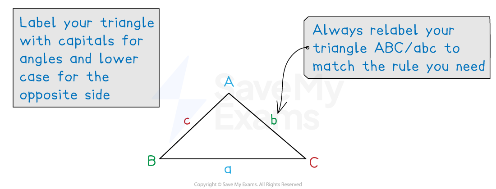

# The Cosine Rule

## Cosine Rule

> **Spec point** — `spcpt_HnxHKwwfTxKcvCN7`

## Cosine rule

### What is the cosine rule?

- The **cosine rule** is used in **non** **right-angled triangles**

  - It allows us to find missing side lengths or angles
- It states that for any triangle

$a^{2}=b^{2}+c^{2}-2bc\mathrm{cos}A$

- Where

  - $a$* *is the side **opposite** angle *A*
  - $b$* *and $c$* *are the other two sides
  
    - $b$* *and $c$ are either side of angle *A*
    - *A *is the angle between them

### How do I use the cosine rule to find a missing length?

- Use the **cosine rule** for lengths

  - when you have **two sides and the angle between them**
  - and you want to find the **opposite side**, *a*
- **Start by labelling your triangle** with the angles and sides

  - Angles have upper case letters
  - Sides **opposite** the angles have the equivalent lower case letter
- **Substitute** values into $a^{2}=b^{2}+c^{2}-2bc\mathrm{cos}A$

  - Make *a* the subject (don't forget to **square root**)

### How do I use the cosine rule to find a missing angle?

- Use the **cosine rule** for angles

  - when you have **all three sides**
  - and you want to find an angle
- It helps to** rearrange** the formula as follows, by adding $2bc\mathrm{cos}A$ to both sides then making $\mathrm{cos}A$ the subject

`table row cell a squared end cell equals cell b squared plus c squared minus 2 b c space cos space A end cell row cell a squared plus 2 b c space cos space A end cell equals cell b squared plus c squared end cell row cell 2 b c space cos space A end cell equals cell b squared plus c squared minus a squared end cell row cell cos space A end cell equals cell fraction numerator b squared plus c squared minus a squared over denominator 2 b c end fraction end cell end table`

- Use the formula `table row cell cos space A end cell equals cell fraction numerator b squared plus c squared minus a squared over denominator 2 b c end fraction end cell end table` to find the **unknown** **angle ***A*

  - Remember, *A *is the angle **between** sides *b *and *c*
  
    - (you may need to relabel the triangle)
  - You will need to use** inverse cosine **at the end, `cos to the power of negative 1 end exponent open parentheses... close parentheses`
- Unlike the sine rule, there is no ambiguous case of the cosine rule

> **Exam Hint**
> You are given the cosine rule in the form $a^{2}=b^{2}+c^{2}-2bc\mathrm{cos}A$ on the formula sheet.
> 
> Getting an error on your calculator when finding an angle may mean you have rearranged the formula incorrectly.

> **Worked Example**
> The following diagram shows triangle $\mathrm{ABC}$, where $\mathrm{AB}=4.2\mathrm{km}$, $\mathrm{BC}=3.8\mathrm{km}$ and $\mathrm{AC}=7.1\mathrm{km}$.
> 
> 
> 
> Calculate the value of angle $\mathrm{ABC}$.
> 
> **Answer:**
> 
> > *The side opposite the angle is 7.1, so *$a=7.1$
> 
> > *The sides 4.2 and 3.8 are *$b$* and *$c$* (in either order)*
> 
> > *Use the cosine rule in the rearranged form *$\mathrm{cos}A=\frac{b^{2}+c^{2}-a^{2}}{2bc}$
> 
> `table row cell cos space theta end cell equals cell fraction numerator 4.2 squared plus 3.8 squared minus 7.1 squared over denominator 2 open parentheses 4.2 close parentheses open parentheses 3.8 close parentheses end fraction end cell row theta equals cell cos to the power of negative 1 end exponent open parentheses fraction numerator 4.2 squared plus 3.8 squared minus 7.1 squared over denominator 2 open parentheses 4.2 close parentheses open parentheses 3.8 close parentheses end fraction close parentheses end cell row theta equals cell 125.04699... end cell end table`
> 
> **Final answer:** $θ=125.0^{\circ}$** (to 1 d.p.)**
