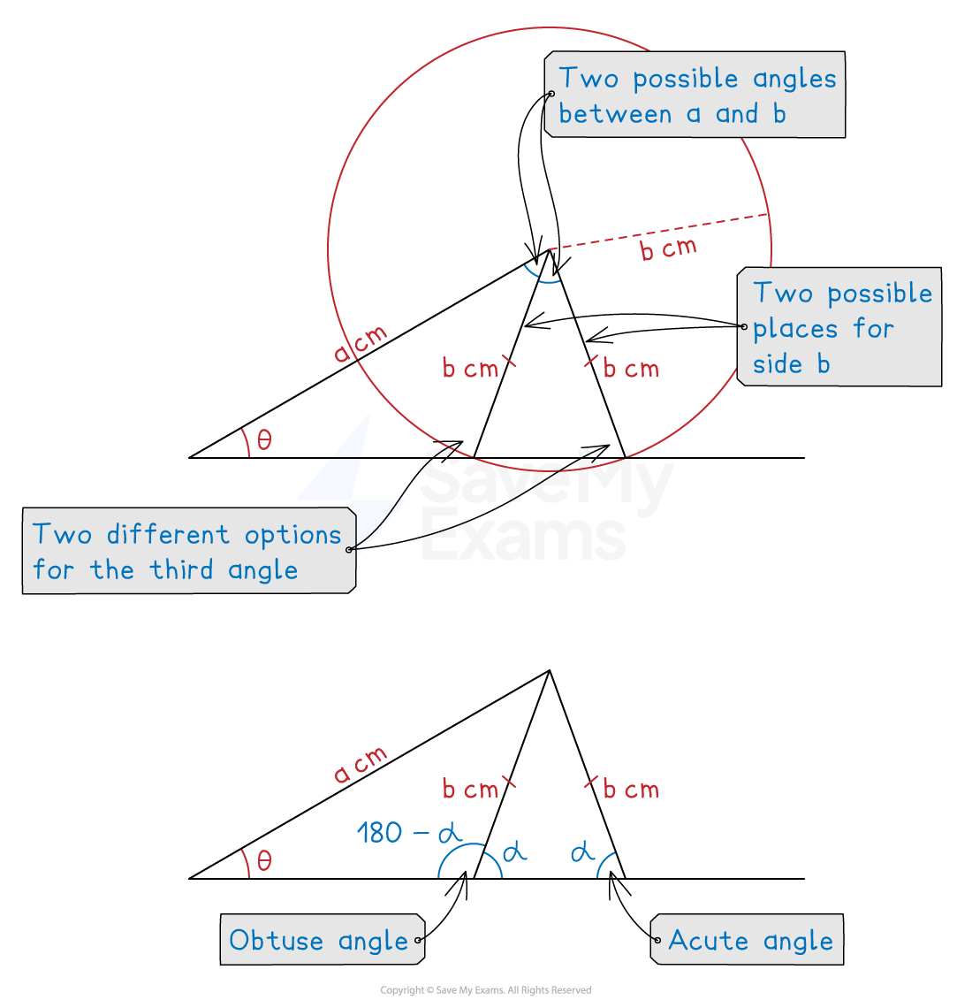

# The Sine Rule

## Sine Rule

> **Spec point** — `spcpt_QJNVgG7qqP279jnN`

## Sine rule

### What is the sine rule?

- The **sine rule** is used in **non** **right-angled triangles**

  - It allows us to find missing side lengths or angles
- It states that for any triangle with angles *A, B* and *C*

$\frac{a}{\mathrm{sin}A}=\frac{b}{\mathrm{sin}B}=\frac{c}{\mathrm{sin}C}$

- Where

  - $a$* *is the side **opposite** angle *A*
  - $b$* *is the side **opposite** angle *B*
  - $c$* *is the side **opposite** angle *C*

### How do I use the sine rule to find missing lengths?

- Use the **sine rule **

  - when you have **opposite pairs** of sides and angles in the question
  
    - *a* and *A*, or *b* and *B*, or *c* and *C*
- **Start by labelling your triangle** with the angles and sides

  - Angles have upper case letters
  - Sides **opposite** the angles have the equivalent lower case letter
- To find a **missing length**, substitute numbers into the formula $\frac{a}{\mathrm{sin}A}=\frac{b}{\mathrm{sin}B}=\frac{c}{\mathrm{sin}C}$

  - You only need to have two parts equal to each other (not all three)
  
    - Then solve to find the side you need

### How do I use the sine rule to find missing angles?

- To find a** missing angle**, it is easier to **rearrange **the formula first by flipping each part $\frac{\mathrm{sin}A}{a}=\frac{\mathrm{sin}B}{b}=\frac{\mathrm{sin}C}{c}$

  - The angles are now in the numerators of the fractions
  - Substitute the values you have into the formula and solve
  
    - You will need to use** inverse sine** in your calculation, `sin to the power of negative 1 end exponent open parentheses... close parentheses`

> **Exam Hint**
> You are given the formula $\frac{a}{\mathrm{sin}A}=\frac{b}{\mathrm{sin}B}=\frac{c}{\mathrm{sin}C}$ in your exam.
> 
> You are **not** given the formula $\frac{\mathrm{sin}A}{a}=\frac{\mathrm{sin}B}{b}=\frac{\mathrm{sin}C}{c}$. However, you can derive it by flipping each fraction in the formula you are given.

### What is the ambiguous case of the sine rule?

- Given information about a triangle, there may be **two different ways** to draw it
- In the diagram below, the lengths of two sides are given,  *a* and *b*

  - A base angle is also given, $θ$, but no angle near *b *is given
  - It turns out that there are **two possible ways** to arrange *b to *complete the triangle!
  
    - Both triangles have the correct values of *a*, *b* and $θ$
- The other base angle could either be **obtuse or acute**

  - The **sine rule **only gives the **acute **answer on your calculator
  
    - You need to check the diagram to see if the angle you need is actually obtuse
    - If it is, use this rule: **obtuse angle = 180 - acute angle**

> **Worked Example**
> The following diagram shows triangle ABC.
> 
> $\mathrm{AB}=8.1\mathrm{cm}$, $\mathrm{BC}=12.3\mathrm{cm}$ and angle $\mathrm{BCA}=27^{\circ}$.
> 
> 
> 
> (a) Calculate the value of $x$.
> 
> **Answer:**
> 
> > *Label the sides of the diagram*
> 
> 
> 
> > *x** is an angle so use the sine rule with the angles on top *
> 
> > $\frac{\mathrm{sin}A}{a}=\frac{\mathrm{sin}B}{b}=\frac{\mathrm{sin}C}{c}$
> *In practice, you only need to equate two of these three parts*
> 
> `table row cell fraction numerator sin space x over denominator 12.3 end fraction end cell equals cell fraction numerator sin space 27 over denominator 8.1 end fraction end cell row cell sin space x end cell equals cell fraction numerator 12.3 space sin space 27 over denominator 8.1 end fraction end cell row x equals cell sin to the power of negative 1 end exponent open parentheses fraction numerator 12.3 space sin space 27 over denominator 8.1 end fraction close parentheses end cell row x equals cell 43.58207... end cell end table`
> 
> **Final answer:** $43.6^{\circ}$** ****(to 1 d.p)**
> 
> (b) Calculate the value of $y$.
> 
> **Answer:**
> 
> > *To find** y** you need to know the angle opposite (angle ABC)*
> *You know 27 and **x** from above, so subtract these from 180*
> 
> `table row cell Angle space A B C end cell equals cell 180 minus 27 minus 43.58207... end cell row blank equals cell 109.41792... end cell end table`
> 
> > *y** is a length so use the sin rule with the sides on the top*
> $\frac{a}{\mathrm{sin}A}=\frac{b}{\mathrm{sin}B}=\frac{c}{\mathrm{sin}C}$
> 
> `table row cell fraction numerator y over denominator sin open parentheses 109.41792... close parentheses end fraction end cell equals cell fraction numerator 8.1 over denominator sin space 27 end fraction end cell row y equals cell fraction numerator 8.1 space sin open parentheses 109.41792... close parentheses over denominator sin space 27 end fraction end cell row y equals cell 16.82691... end cell end table`
> 
> **Final answer:** $y=16.8\mathrm{cm}$** (to 3 s.f.)**
