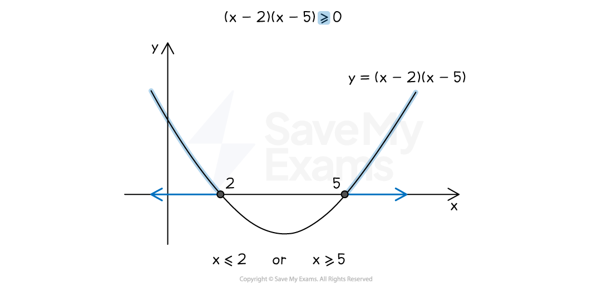
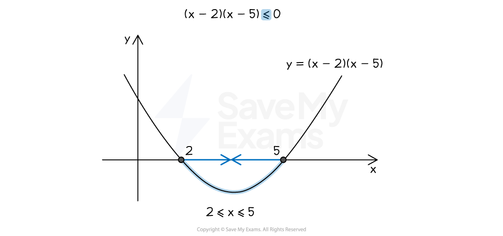
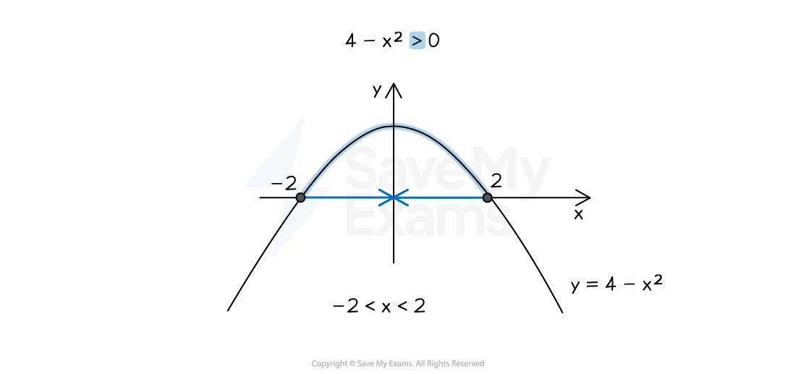

# Solving Quadratic Inequalities

## Solving Quadratic Inequalities

> **Spec point** — `spcpt_dnkHMPkqhhdDxPkZ`

## Solving quadratic inequalities

### What are quadratic inequalities?

- A **quadratic inequality **has the form $ax^{2}+bx+c\geq0$

  - There is an $x^{2}$ term and any **inequality sign**, $\geq,\leq,>,<$
  - They can usually be **factorised**
  
    - For example, `open parentheses x minus 2 close parentheses open parentheses x minus 5 close parentheses greater or equal than 0`
- **Solutions** to quadratic inequalities are **ranges of **$x$** values**

  - For example, $1\leqx\leq4$

### How do I solve a quadratic inequality?

- Quadratic inequalities are** solved **by **sketching a graph**

  - The solutions then appears along the $x$-axis
- For example, to solve `open parentheses x minus 2 close parentheses open parentheses x minus 5 close parentheses greater or equal than 0`

  - Sketch the graph of `y equals open parentheses x minus 2 close parentheses open parentheses x minus 5 close parentheses`
  
    - Show the** **$x$**-intercepts** of 2 and 5
    - These come from solving `open parentheses x minus 2 close parentheses open parentheses x minus 5 close parentheses equals 0`
  - As the inequality is** **$\geq0$, **shade **any **parts of the curve **that are **above the **$x$**-axis**
  
    - These are left of $x=2$ and right of $x=5$
  - The **solutions** are the **ranges **on the $x$**-axis **for those shaded parts
  
    - $x\leq2$ or $x\geq5$
    - Use the word "**or**" for two separate parts
    - In** set notation** this is `open curly brackets x colon space x less or equal than 2 close curly brackets union open curly brackets x colon space x greater or equal than 5 close curly brackets`

### What do I do if the sign of the inequality changes?

- If the quadratic inequality is $ax^{2}+bx+c\geq0$ where $a$ is positive

  - then shade the parts of the curve** above** the $x$-axis
- If the quadratic inequality is $ax^{2}+bx+c\leq0$ where $a$ is positive

  - then shade the part of the curve** below **the $x$-axis
- For example, to solve `open parentheses x minus 2 close parentheses open parentheses x minus 5 close parentheses less or equal than 0`

  - Repeat the process above but shade where the curve is below the $x$-axis
  
    - The solution is $2\leqx\leq5$
    - (You do not use the word "or", but could say $x\geq2$ "**and**" $x\leq5$)
    - In** set notation** this is `open curly brackets x colon space x greater or equal than 2 close curly brackets intersection open curly brackets x colon space x less or equal than 5 close curly brackets`, or alternatively `open curly brackets x colon space 2 less or equal than x less or equal than 5 close curly brackets`

- If **strict inequality signs **are used, $>$ or $<$

  - then you must use strict inequalities in your final answer

### How can quadratic inequalities be made harder?

- You may need to **bring all the terms to one side **first

  - For example $x^{2}-x<6$ becomes $x^{2}-x-6<0$
  
    - It is easier to pick the side with a positive $x^{2}$
- You may have to **factorise **the quadratic inequality first

  - This may involve factorising
  
    - $ax^{2}+bx+c$ into **double brackets**
    - `a squared x squared minus b squared equals open parentheses a x plus b close parentheses open parentheses a x minus b close parentheses` (the **difference of two squares**)
    - `a x squared plus b x equals x open parentheses a x plus b close parentheses` (**factorising out** an $x$)
  - If it does **not** factorise, you may need the **quadratic formula **to find $x$-intercepts
- You may be given a quadratic inequality $ax^{2}+bx+c\geq0$ where $a$ is** negative**

  - This means the sketch will be an $\cap$ shape
- For example, solve $4-x^{2}>0$

  - The $x$ intercepts are found from $4-x^{2}=0$ giving $x=\pm2$
  - The same process is then applied, but the graph has an $\cap$ shape

> **Exam Hint**
> Think of inequalities with $x^{2}$ terms as graph-sketching questions in the exam.

> **Worked Example**
> Find the set of values for which $3x^{2}+2x-6>x^{2}+4x-2$
> 
> **Answer**:
> 
> > *Rearrange to get a zero on one side*
> 
> $2x^{2}-2x-4>0$
> 
> > *Divide everything by 2 as it is a common factor*
> 
> $x^{2}-x-2>0$
> 
> > *Find the roots of the quadratic*
> 
> `x squared minus x minus 2 equals 0
> open parentheses x minus 2 close parentheses open parentheses x plus 1 close parentheses equals 0
> x equals 2 comma space x equals negative 1`
> 
> > *Sketch the graph and identify the parts which are above the **x**-axis*
> 
> 
> 
> $x<-1\mathrm{or}x>2$
