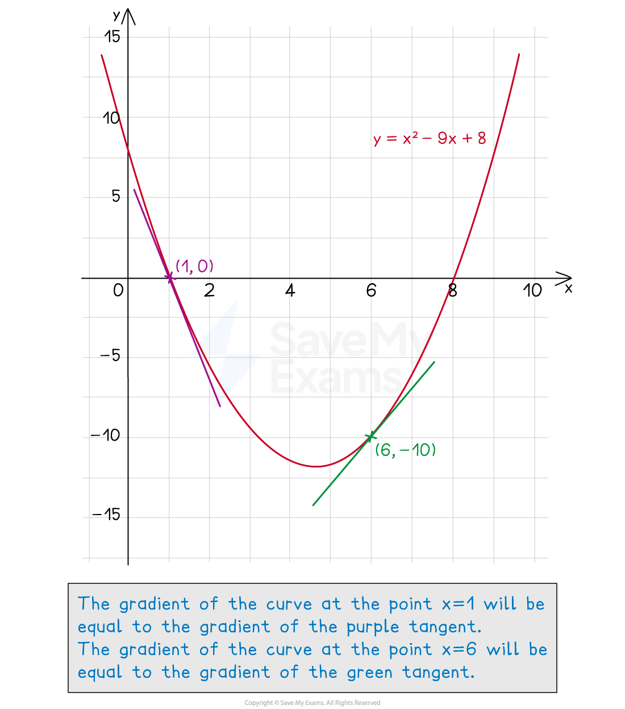

# Finding Gradients of Tangents

## Finding Gradients of Tangents

> **Spec point** — `spcpt_zrrC3yxSp579jY7k`

## Finding gradients of tangents

### How are the gradients of graphs and tangents related?

- The **gradient of a graph at a point** is **equal** to the **gradient of the tangent** to the curve **at that point**

  - A tangent is a line that touches a curve, but does not cross it

### How do I estimate the gradient of a curve using a tangent?

- To find an **estimate **for the **gradient **of a curve **at a point**: 

  - **Draw **a **tangent **to the curve at the **point**
  - Find the **gradient of the tangent** using
  
    - **Gradient = rise ÷ run**
    - or difference in *y* ÷ difference in *x*
    - In the example below, the **gradient of the tangent** at *x* = 4 would be $\frac{-2.5}{4}=-0.625$
    - Remember that the rise is** negative** if it is going down
    - This means the **gradient of the curve** at *x* = 4 is **also -0.625**
- It is an **estimate** because the **tangent** has been drawn by eye and is not exact

  - To find the exact gradient we would need to use** differentiation**

### What does the gradient represent?

- The gradient represents the **rate of change** of *y* with *x*

  - I.e. For every increase in *x* by 1, how much does *y* increase?
- Consider the quantities used for the axes to determine the meaning of the gradient

  - In general, **the units of the gradient** will be the **units of *****y***** divided by the units of *****x***
  - In a **distance-time graph**, the gradient is the rate of change of distance with time
  
    - This is the **speed**,
    - Common units for speed are metres per second or kilometres per hour
  - In a **speed-time graph**, the gradient is the rate of change of speed with time
  
    - This is the **acceleration**
    - Common units for acceleration are metres per second per second (metres per second2)
  - In a **graph of volume against radius**, e.g. as a balloon is inflated, the gradient is the rate of change of volume as the radius increases
  
    - This could be measured in m3 per m, which is equivalent to m2

> **Exam Hint**
> When drawing a tangent by hand:
> 
> - Use a ruler
> - Draw the line as long as you can
> 
> When finding the gradient of the tangent:
> 
> - Pick two points that are far away from one another
> - This will reduce the effect of any inaccuracy

> **Worked Example**
> The graph below shows `y equals cube root of x` for $0\leqx\leq1$.
> 
> Find an estimate of the gradient of the curve at the point where $x=0.5$.
> 
> 
> 
> **Answer:**
> 
> > *Draw a tangent to the curve at the point where **x **= 0.5*
> 
> 
> 
> > *Find suitable, easy to read coordinates as far apart as possible and draw a right-angled triangle between them*
> 
> > *Find the difference in the **y** coordinates (rise) and the difference in the **x** coordinates (run).*
> 
> 
> 
> > *Find the gradient by dividing the difference in **y **(rise) by the difference in **x*
> 
> $\mathrm{Gradient}=\frac{0.3}{0.5}=\frac{3}{5}=0.6$
> 
> > *The gradient of the tangent at **x** = 0.5 is equal to the gradient of the curve at **x **= 0.5*
> 
> **Final answer:** **Estimate of gradient = 0.6**
