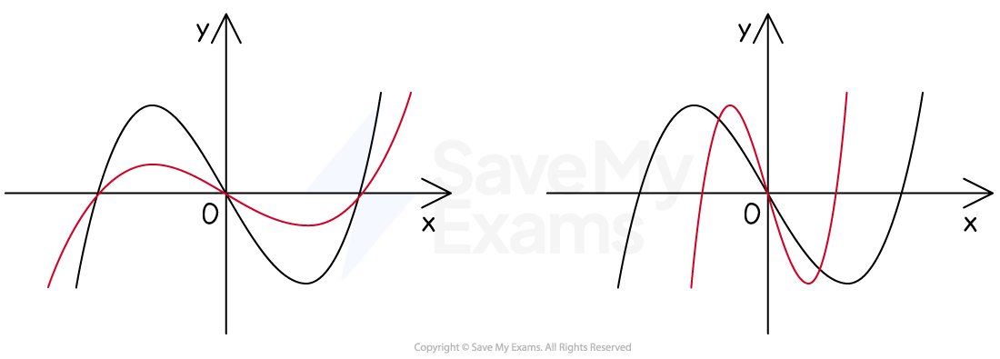
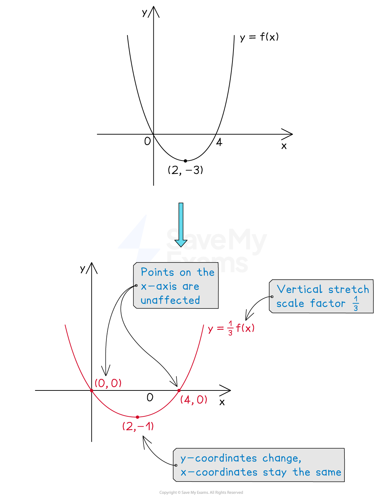
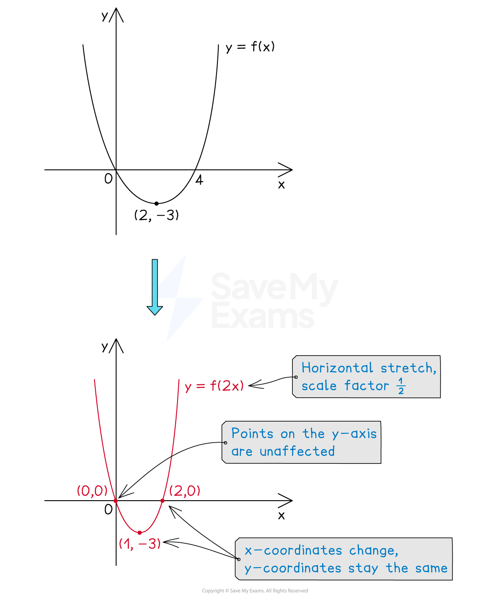
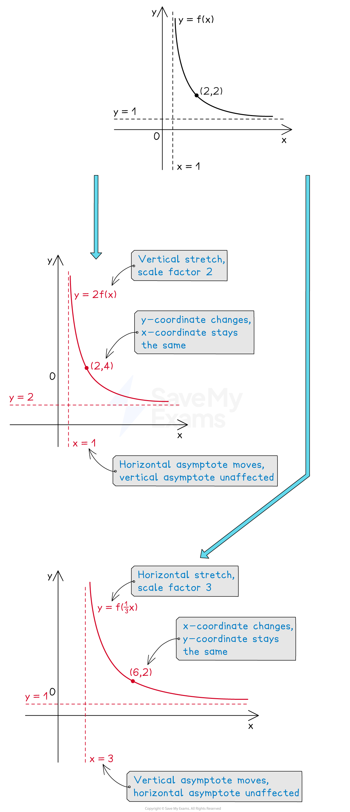

# Stretches of Graphs

## Stretches of Graphs

> **Spec point** — `spcpt_YcMPxJgtrjtBzMkV`

## Stretches of graphs

### What are stretches of graphs?

- **Stretches **of graphs are a type of **transformation** that pushes points away from, or towards, the $x$-axis or $y$-axis

  - Graphs look like they have been **stretched** or **squashed**
  
    - either **horizontally** or **vertically**

*Examples of stretches*

### How do I stretch graphs?

- Let `y equals straight f open parentheses x close parentheses` be the **equation** of the **original graph**

#### Vertical stretches: y=af(x)

- `y equals a straight f open parentheses x close parentheses` is a **vertical stretch **(in the $y$-direction) of **scale factor **$a$

  - The $x$-coordinates stay the same but the $y$ coordinates are multiplied by $a$
  - Points appear to move **parallel to the **$y$**-axis**
  
    - either stretching vertically away from the $x$-axis if $a>1$
    - or squashing vertically towards the $x$-axis if $0<a<1$
  - Points on the $x$-axis stay where they are

#### Horizontal stretches: y=f(ax)

- `y equals straight f open parentheses a x close parentheses` is a **horizontal stretch **(in the $y$-direction) of **scale factor **$\frac{1}{a}$ (not $a$)

  - The $y$-coordinates stay the same but the $x$ coordinates are multiplied by $\frac{1}{a}$ (divided by $a$)
  - Points appear to move **parallel to the **$x$**-axis**
  
    - either squashing horizontally towards the $y$-axis if $a>1$
    - or stretching horizontally away from the $y$-axis if $0<a<1$
  - Points on the $y$-axis stay where they are
- This means `y equals straight f open parentheses 2 x close parentheses` is more like a **horizontal squash **of scale factor 2

  - though the correct way to say this is a horizontal stretch of scale factor $\frac{1}{2}$
  
    - This also means that `straight f open parentheses x over 2 close parentheses` is a horizontal stretch of scale factor 2

### What happens to asymptotes when a graph is stretched?

- Any ***asymptotes*** of `straight f open parentheses x close parentheses` are also stretched

### How does a stretch affect the equation of the graph?

- When a graph is stretched, you can **change its equation algebraically **

  - There is no need to sketch the graph
- Stretching vertically by a scale factor of 3 puts a 3** in front **of the whole **equation**

  - For example, $y=x^{2}+2x$ becomes `y equals 3 open parentheses x squared plus 2 x close parentheses`
  
    - This simplifies to $y=3x^{2}+6x$
- Stretching horizontally by a scale factor of $\frac{1}{3}$ ("squashing horizontally" by a scale factor of 3) **replaces any **$x$** with **`open parentheses 3 x close parentheses`** **in the equation

  - For example, $y=x^{2}+2x$ becomes `y equals open parentheses 3 x close parentheses squared plus 2 open parentheses 3 x close parentheses`
  
    - This simplifies to $y=9x^{2}+6x$

### How do I apply a combined stretch?

- The graph of `y equals b straight f open parentheses a x close parentheses` is a **combined stretch****,** both horizontally and vertically

  - It **does not matter which order **you apply these in
  
    - For example, a horizontal stretch of scale factor $\frac{1}{a}$ followed by a vertical stretch of scale factor $b$

> **Worked Example**
> The diagram below shows the graph of `y equals straight f open parentheses x close parentheses`.
> 
> 
> 
> Sketch the graph of `y equals 2 straight f open parentheses x over 3 close parentheses`.
> 
> **Answer:**
> 
> > `straight f open parentheses x over 3 close parentheses`* represents a horizontal stretch of scale factor *`fraction numerator 1 over denominator open parentheses 1 third close parentheses end fraction equals 3`
> *And *`2 straight f open parentheses... close parentheses`* represents a vertical stretch of scale factor 2*
> 
> > *Apply these in any order, e.g. start with the horizontal stretch, scale factor 3*
> 
> 
> 
> > *Now apply a vertical stretch of scale factor 2*
> 
> 
> 
> > *Show the coordinates of the new points clearly*
> 
> 
