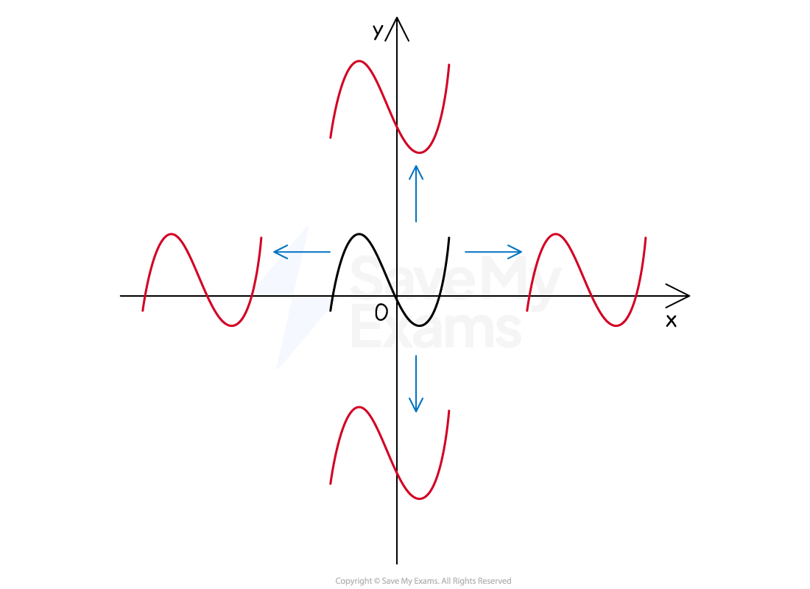
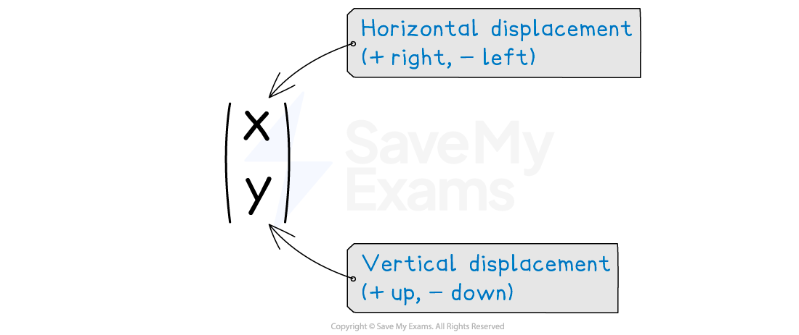
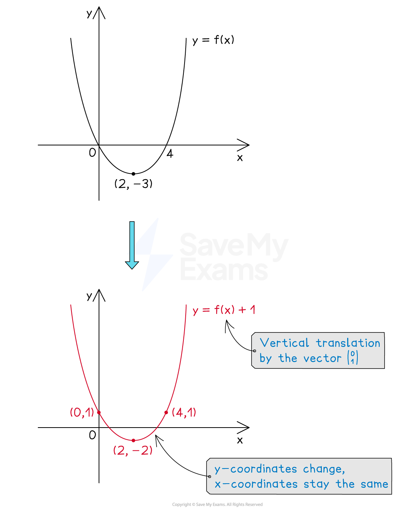
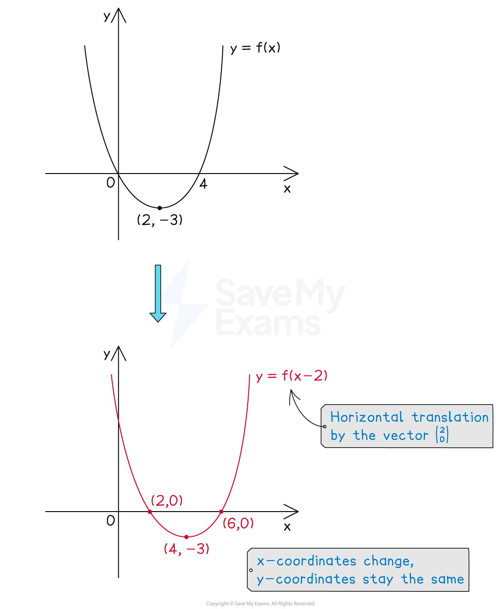
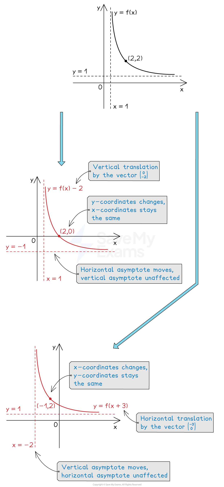
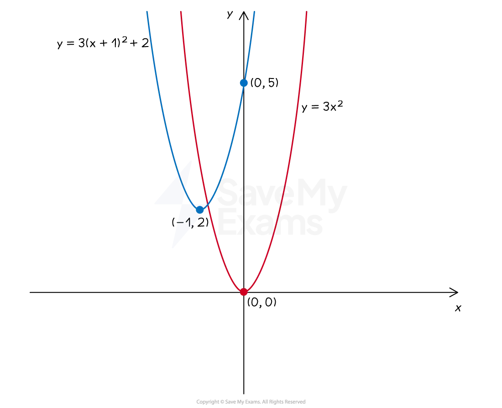

# Translations of Graphs

## Translations of Graphs

> **Spec point** — `spcpt_wt53CcTmwpZ3sjm3`

## Translations of graphs

### What are translations of graphs?

- The **equation** of a graph can be changed in certain ways

  - This has an effect on the **graph**
  
    - How a graph changes is called a **graph transformation**
- A **translation** is a type of graph transformation that **shifts (moves)** a graph (up or down, left or right) in the *xy* plane

  - The shape, size, and orientation of the graph remain unchanged

*Examples of translations*

- A particular translation is specified by a **translation vector**

### How do I translate graphs?

- Let `y equals straight f open parentheses x close parentheses` be the **equation** of the **original graph**

#### Vertical translations: y=f(x) + a

- $y=f(x)+a$ is a **vertical translation** by the vector `open parentheses table row 0 row a end table close parentheses`

  - The graph moves** up for positive** values of $a$* *
  - The graph moves **down for negative** values of $a$
  - The ***x*****-coordinates** stay the** same**

*Example of a vertical translation*

#### Horizontal translations: y=f(x + a)

- $y=f(x+a)$ is a **horizontal translation **by the vector `open parentheses table row cell negative a end cell row 0 end table close parentheses`

  - The graph moves** left for positive** values of $a$
  
    - This is often the opposite direction to which people expect
  - The graph moves* ***right for negative** values of $a$
  - The** *****y*****-coordinates **stay the **same**

*Example of a horizontal translation*

### What happens to asymptotes when a graph is translated?

- Any ***asymptotes*** of **f(*****x*****)** are also translated

  - An asymptote **parallel** to the **direction of translation** will **not **be affected

### How does a translation affect the equation of the graph?

- For a **horizontal translation** `y equals straight f open parentheses x minus a close parentheses` of the graph `y equals straight f open parentheses x close parentheses`

  - $a$** is subtracted from **$x$** **throughout the equation
  - Every instance of $x$ in the equation is replaced with `open parentheses x minus a close parentheses`
- E.g. the graph $y=x^{2}-3x+7$ undergoes a **translation** of **6 units** to the **right**

  - `y equals straight f open parentheses x close parentheses` becomes `y equals straight f open parentheses x minus 6 close parentheses`
  - $x$ is replaced throughout the equation by `open parentheses x minus 6 close parentheses`
  
    - `y equals open parentheses x minus 6 close parentheses squared minus 3 open parentheses x minus 6 close parentheses plus 7` is the **new **equation
  - The equation can be left in this form or expanded and simplified
  
    - $y=x^{2}-12x+36-3x+18+7$
    - $y=x^{2}-15x+61$
- For a **vertical translation** `y equals straight f open parentheses x close parentheses plus a` of the graph `y equals straight f open parentheses x close parentheses`

  - $a$ is **added** to the **equation as a whole**
- E.g. the graph $y=4x^{2}+2x+1$ undergoes a **translation** of **5 units** **down**

  - `y equals straight f open parentheses x close parentheses` becomes `y equals straight f open parentheses x close parentheses minus 5`
  - 5 is subtracted from the equation as a whole
  
    - $y=4x^{2}+2x+1-5$
  - The equation can be left in this form or simplified
  
    - $y=4x^{2}+2x-4$

### How do I apply a combined translation?

- For a **horizontal translation** of $p$ units and **vertical translation** of $q$units **combined**

  - `y equals straight f open parentheses x close parentheses` becomes `y equals straight f open parentheses x minus p close parentheses plus q`
- E.g. the graph $y=3x^{2}$ undergoes a **translation** of **2 units up **and **1 unit **to the** left**

  - `y equals straight f open parentheses x close parentheses` will become `y equals straight f open parentheses x plus 1 close parentheses plus 2`
  - $x$ is replaced throughout the equation by `open parentheses x plus 1 close parentheses`
  - 2 is added to the equation as a whole
  
    - `y equals 3 open parentheses x plus 1 close parentheses squared plus 2`

- Note that when the equation is in the form `y equals a open parentheses x minus p close parentheses squared plus q`

  - the **vertex** is `open parentheses p comma space q close parentheses`
  - the value of $a$ does not affect the vertex coordinates

> **Worked Example**
> The diagram below shows the graph of `y equals straight f open parentheses x close parentheses`.
> 
> 
> 
> Sketch the graph of `y equals straight f open parentheses x plus 3 close parentheses`.
> 
> **Answer:**
> 
> > *The transformation of the graph is a horizontal translation with vector *`open parentheses table row cell negative 3 end cell row 0 end table close parentheses`* (3 units to the left)*
> 
> > *The **x**-coordinates of the points change (subtract 3 from each)*
> *The **y**-coordinates of the points stay the same*
> 
> 
