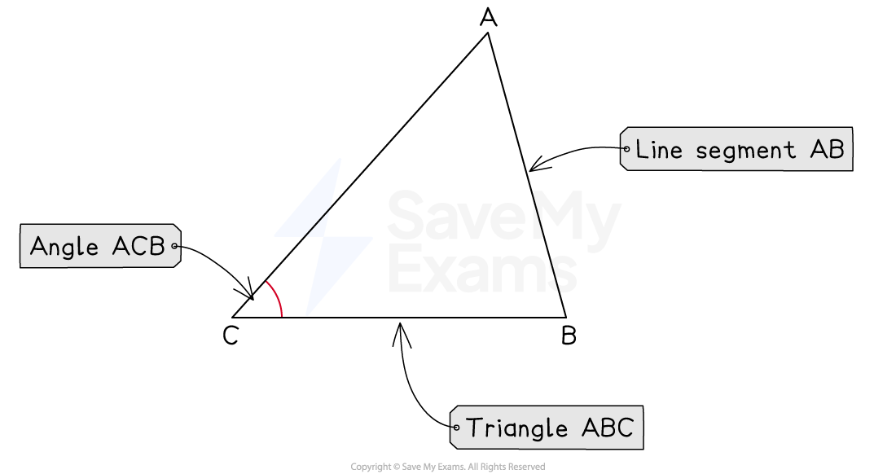
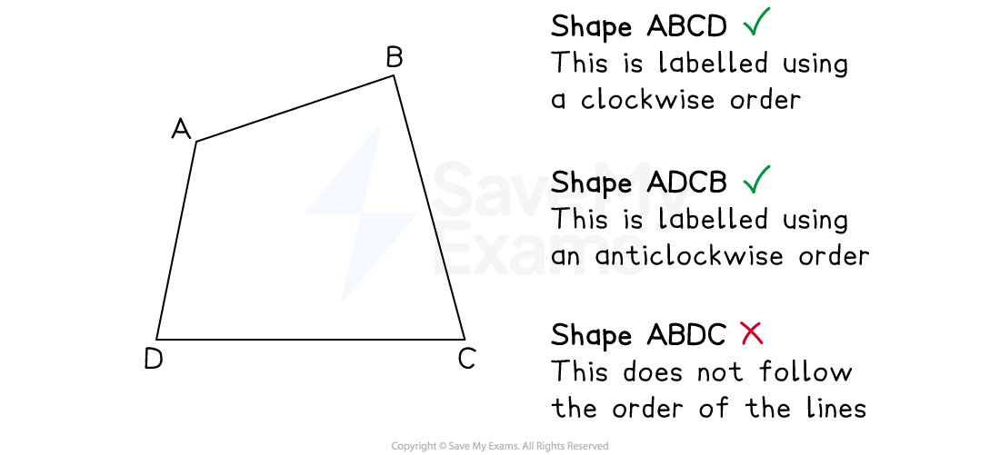
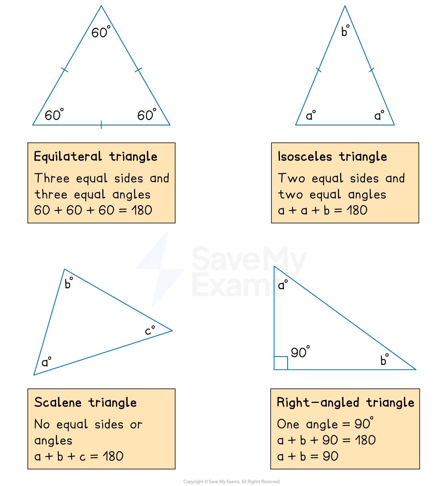

# Basic Angle Properties

## Basic Angle Properties

> **Spec point** — `spcpt_5FMXZMjqSZ3GK53q`

## Basic angle properties

### How do I label lines segments, angles and shapes?

- The **line segment** *AB* goes from point *A* to point *B*
- The **angle ***ABC* is formed by the line segments *AB* and *BC*

  - The angle is at point *B*
  - The angle is the acute or obtuse angle, not the reflex angle
- The **triangle ***ABC *is formed by the line segments *AB*, *BC* and *CA*

*Labels for line segments, angles and triangles*

- The **quadrilateral ***ABCD *is formed by the line segments *AB*, *BC*, *CD* and *DA*

  - The points are labelled starting at a point and following the sides
  - *ABDC *is **not **the same shape because it is formed by the line segments *AB*, *BD*, *DC* and *CA*
- The same idea is used to label other **polygons**

*Labels for shapes*

### What are the basic angle properties?

- Angles around a **point** add up to **360°**
- Angles that form a **straight line** add up to **180°**
- **Vertically opposite** angles are **equal**

  - Vertically opposite angles occur when **two lines intersect**, as in the diagram below

*Vertically opposite angles*

> **Worked Example**
> The diagram below shows three straight lines intersecting at a point.
> 
> 
> 
> Find the values of $x$ and $y$.
> 
> **Answer:**
> 
> > *Vertically opposite angles between two intersecting lines are equal*
> 
> $x=25$
> 
> > *Angles that meet on a straight line add up to 180°*
> 
> `table row cell x space plus space y space plus space 98 space end cell equals cell space 180 space end cell row cell 25 space plus space y space plus space 98 space end cell equals cell space 180 end cell row cell 123 space plus space y space end cell equals cell space 180 end cell end table`
> 
> > *Solve to find *$y$
> 
> $y=180-123\,y=57$
> 
> $x=25,y=57$

### What are the angle properties of triangles?

- The **three** interior angles inside any triangle **add up to 180°**
- If the triangle is **isosceles** then **two angles will be equal**

  - These will be the **two angles opposite** the **two sides of equal length**
- If the triangle is **equilateral** then all three angles will be equal

  - Each angle will equal **60°**

- A **right-angled triangle **has one 90° angle

> **Exam Hint**
> Find all the missing angles that you can using the angles that are given to you in a question
> 
> - They might not seem to help you straight away but having more angles will lead you to find the angle you need

> **Worked Example**
> The diagram below is formed using three straight lines. Find the value of $x$.
> 
> 
> 
> **Answer:**
> 
> *Label the other missing angles inside the triangle*
> 
> 
> 
> > *Vertically opposite angles between two intersecting lines are equal*
> 
> $y=60$
> 
> > *Angles that meet on a straight line add up to 180°*
> 
> `table row cell z space plus space 130 space end cell equals cell space 180 space end cell row cell z space end cell equals cell space 50 end cell end table`
> 
> > *Interior angles in a triangle add up to 180°*
> 
> `table row cell x plus 60 plus 50 end cell equals 180 row cell x plus 110 end cell equals 180 end table`
> 
> $x=70$

### What are the angle properties of quadrilaterals?

- The **four** interior angles inside any quadrilateral **add up to 360°**
- If the quadrilateral is a **square** or a **rectangle** then all the angles are equal to **90°**
- You can use any **symmetries** of the quadrilateral to identify other equal angles

  - For a **parallelogram** (or** **rhombus), **opposite angles** are **equal**
  - For a **kite,** **one pair** of **opposite angles** are **equal**

> **Worked Example**
> The diagram below shows an irregular quadrilateral. Find the value of $y$.
> 
> 
> 
> **Answer:**
> 
> > *First, add together the three given angles*
> 
> $97+115+85=297$
> 
> > *Subtract the answer from 360°*
> 
> `table row cell 360 space minus space 297 space end cell equals cell space 63 space end cell end table`
> 
> > *Add this to the diagram*
> 
> 
> 
> > *Angles on a straight line add up to 180°, so subtract the answer from 180°*
> 
> `table row cell y plus 63 end cell equals 180 row y equals cell 180 minus 63 end cell row y equals 117 end table`
> 
> $y=117$
