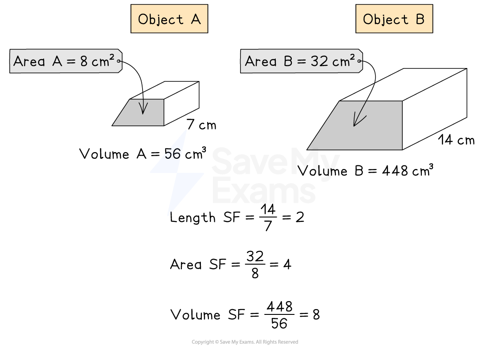

# Similar Areas & Volumes

## Similar Areas & Volumes

> **Spec point** — `spcpt_dBwfqg3wJvDp9PNs`

## Similar areas & volumes

### How do I find the length, area or volume scale factors of similar shapes?

- The **scale factor** (SF) for a given quantity (length, area or volume) between **two similar shapes** can be found by dividing the quantity on one shape by the quantity on the other shape

  - $\mathrm{scale} \mathrm{factor}=\frac{\mathrm{quantity} \mathrm{on} \mathrm{one} \mathrm{shape}}{\mathrm{corresponding} \mathrm{quantity} \mathrm{on} \mathrm{the} \mathrm{other} \mathrm{shape}}$

*Example of scale factor of similar shapes*

- An object could be made either** bigger or smaller** by a scale factor

  - The object gets **bigger **if the scale factor is **bigger than 1**
  - The object gets **smaller **if the scale factor is **bigger than 0** and** less than 1**

### What is the connection between the scale factors for lengths, areas and volumes of similar shapes?

- The **length**, **area **and **volume scale factors** are powers with the same base number
- If the length **scale factor **is *k* then

  - The **area scale factor **is *k*2
  - The **volume scale factor **is *k*3
- If you know one scale factor, you can find the **scale factors**

  - If you have the **length **scale factor
  
    - `Area space scale space factor equals open parentheses Length space scale space factor close parentheses squared`
    - `Volume space scale space factor equals open parentheses Length space scale space factor close parentheses cubed`
  - If you have the **area **scale factor
  
    - $\mathrm{Length} \mathrm{scale} \mathrm{factor}=\sqrt{\mathrm{Area} \mathrm{scale} \mathrm{factor}}$
    - `Volume space scale space factor equals open parentheses square root of Area space scale space factor end root close parentheses cubed`
  - If you have the **volume **scale factor
  
    - `Length space scale space factor equals cube root of Volume space scale space factor end root`
    - `Area space scale space factor equals open parentheses cube root of Volume space scale space factor end root close parentheses squared`

### How do I find missing lengths, areas and volumes for similar shapes?

- **STEP 1**
Identify the **equivalent** known quantities

  - Recognise if the quantities are lengths, areas or volumes
- **STEP 2**
Find the **scale factor** from two known **lengths, areas **or **volumes**

  - $\mathrm{scale} \mathrm{factor}=\frac{\mathrm{second} \mathrm{quantity}}{\mathrm{first} \mathrm{quantity}}$
- **STEP 3**
Use the scale factor you have found to find **other required scale factor(s)**

  - $\mathrm{Length} \mathrm{scale} \mathrm{factor}=k$
  - $\mathrm{Area} \mathrm{scale} \mathrm{factor}=k^{2}$
  - $\mathrm{Volume} \mathrm{scale} \mathrm{factor}=k^{3}$
- **STEP 4**
Multiply or divide by relevant scale factor to find the **missing quantity**

  - Think about whether the quantity should be bigger or smaller than the given quantity

> **Exam Hint**
> Take extra care not to mix up** which shape is which** when you have started carrying out the calculations, It can help to **label the shapes** and write an equation.

> **Worked Example**
> Solid *A *and solid *B *are mathematically similar.
> 
> The volume of solid *A *is 32 cm3.
> The volume of solid *B *is 108 cm3.
> The height of solid *A *is 10 cm.
> 
> Find the height of solid *B.*
> 
> **Answer:**
> 
> > *Calculate *$k^{3}$*, the scale factor of enlargement for the volumes, using: *`volume space B equals k cubed open parentheses volume space A close parentheses`
> 
> > *Or *$k^{3}=\frac{\mathrm{larger} \mathrm{volume}}{\mathrm{smaller} \mathrm{volume}}$
> 
> `table row 108 equals cell 32 k cubed end cell row cell k cubed end cell equals cell 108 over 32 equals 27 over 8 end cell end table`
> 
> > *Find the length scale factor *$k$* by taking the cube root of the volume scale factor *$k^{3}$
> 
> `k equals cube root of 27 over 8 end root equals 3 over 2`
> 
> > *Substitute the value for *$k$* into formula for the heights of the similar shapes:*
> 
> `Height space B equals k open parentheses height space A close parentheses`
> 
> `table row h equals cell 10 k end cell row h equals cell 10 open parentheses 3 over 2 close parentheses equals 30 over 2 equals 15 end cell end table`
> 
> **Final answer:** **Height of ****B**** = 15**** ****cm**
