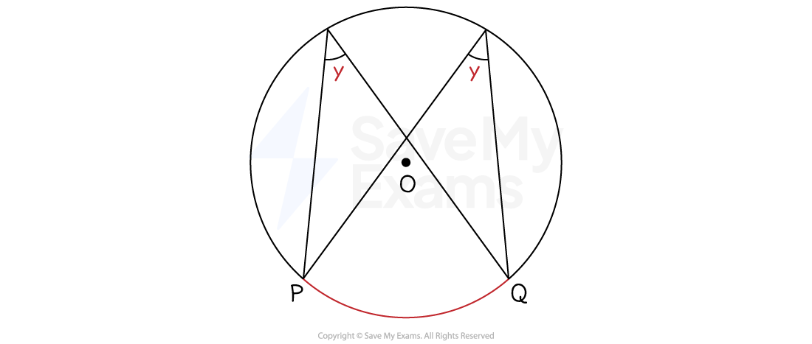
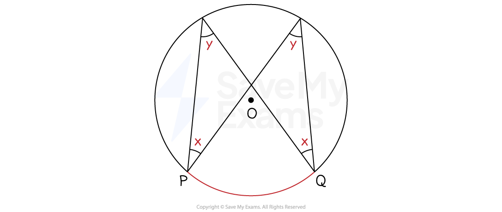

# Angles in the Same Segment

## Circles & Segments

> **Spec point** — `spcpt_fMWRd3TnmcQ3c92k`

## Circles & segments

### Circle Theorem: Angles in the same segment are equal

- **Any** **two angles** on the **circumference** of a circle that are formed from the **same two points** on the circumference are **equal**

  - These two angles are in the **same segment** of the circle
  
    - To see this, add the chord *PQ* below to split the circle into two segments

- To spot this circle theorem on a diagram

  - Find **two points** on the **circumference** that meet at a **third point **
  - See if there are **any other pairs of lines** from the** same two original points** that meet at a different point on the circumference
- When explaining this theorem in an exam you must use the keywords:

  - **Angles in the same segment are equal**
- Look out for a **bowtie shape**

  - The theorem works **upside down**, in that the angles at* P* and *Q* are **also equal**

> **Exam Hint**
> An exam question diagram may have **multiple equal angles**.
> 
> Look for as many as possible by seeing how many pairs of lines start from the same two points on the circumference.

> **Worked Example**
> The diagram below shows a circle with centre, *O*.
> *A*, *B*, *C*, *D* and *E* are five points on the circumference on the circle.
> 
> Angle *AEB* = 12º.
> Angle *BEC* = 14º.
> Angle *CED* = 73º.
> Angle *EBD* = *θº.*
> 
> Find the value of *θ* .
> 
> 
> 
> **Answer:**
> 
> > *CE **is a diameter*
> *This means that triangles **EAC** and **CDE** are both triangles in a semicircle*
> 
> *Angle ***EAC*** = 90º*
> *Angle ***CDE*** = 90º*
> *Angle in a semicircle = 90º*
> 
> > *Find the other angles in the triangles *
> 
> *Angle ***ECA*** = 64º*
> *Angle ***ECD*** = 17º*
> *Angles in a triangle = 180º*
> 
> > *Label these angles on the diagram*
> 
> 
> 
> > *Angle **θ  **is formed by two lines coming from either end of the chord **ED*
> *Angle **ECD** is also formed by two lines coming from either end of the chord **ED*
> 
> *Angle ***θ*** = angle ECD = 17º*
> *Angles in the same segment are equal*
> 
> **Final answer:** **Angle ****θ****  = 17º**
