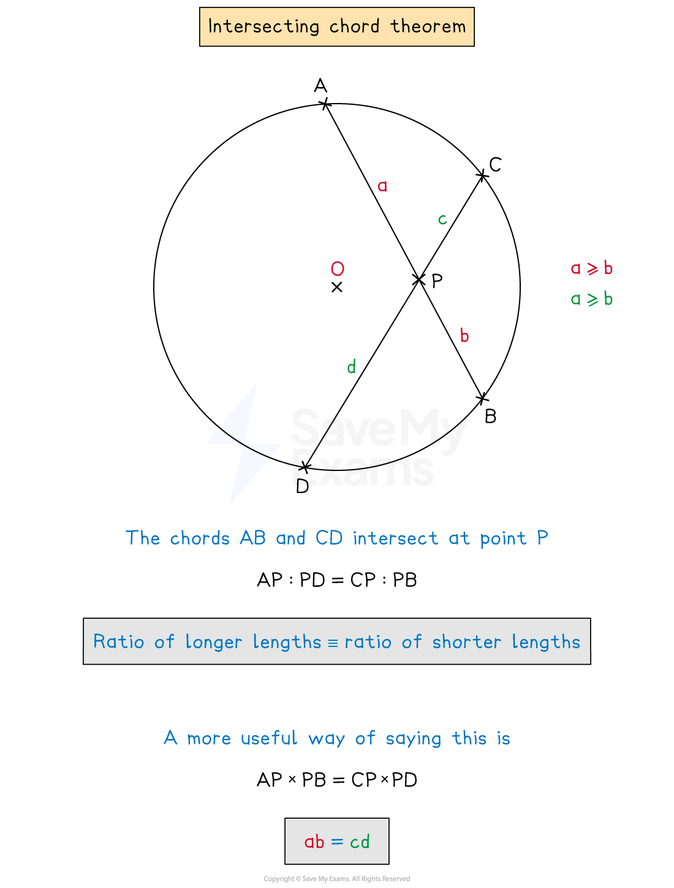
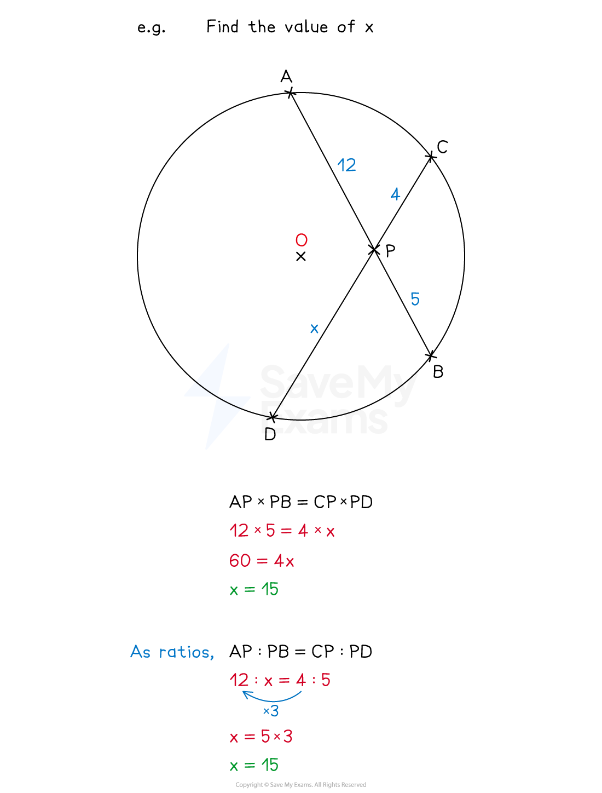
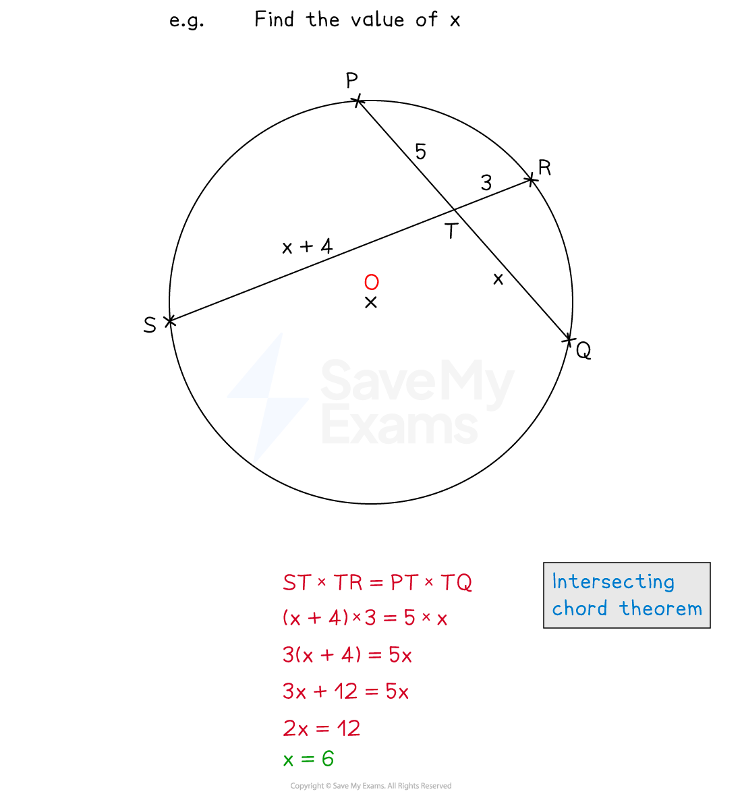
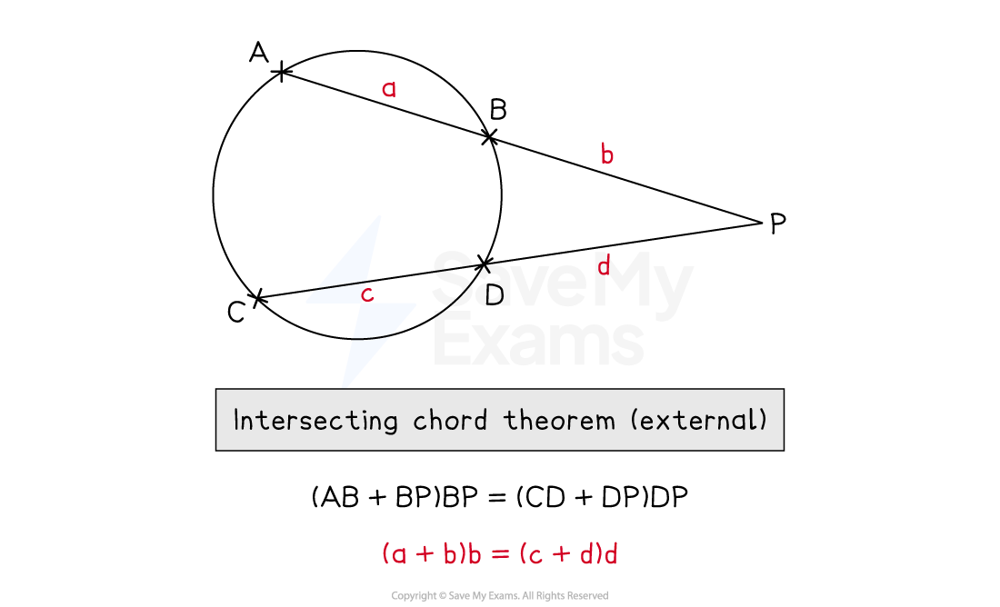
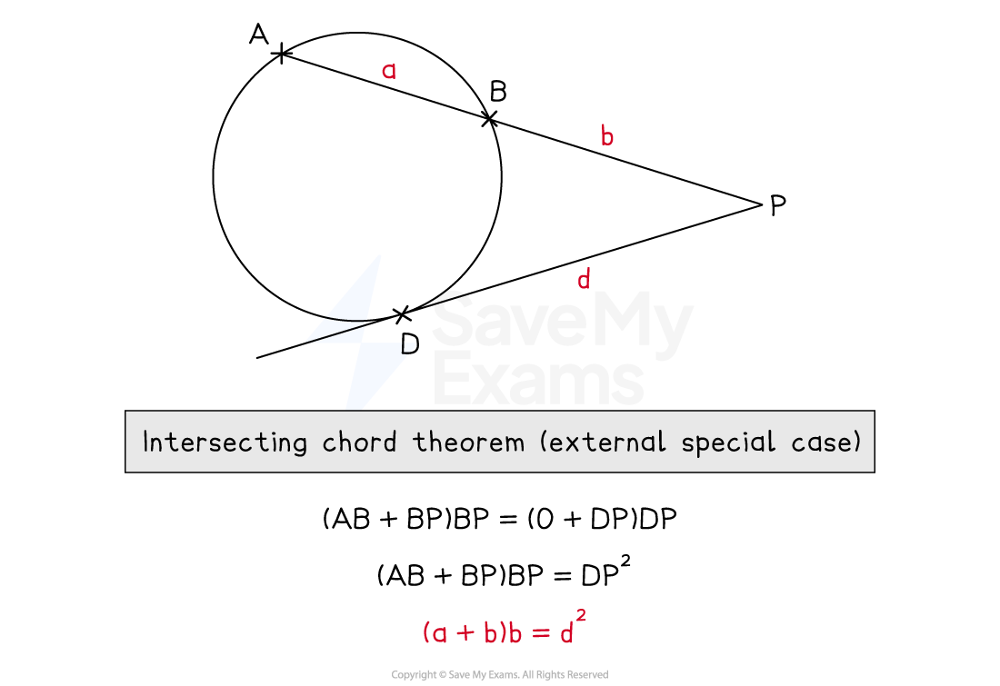

# Intersecting Chord Theorem

## Intersecting Chord Theorem

> **Spec point** — `spcpt_znWXTZjqCR7PspTc`

## Intersecting chord theorem

### What is the intersecting chord theorem?

- For two chords, **AB** and **CD** that meet at point P

  - **AP : PD ≡ CP : PB**
  - **Ratio** of **longer** lengths (of chords) ≡ **Ratio** of **shorter** lengths (of chords)
  - This can also be written as **AP × PB = CP × PD**
- You do not need to know the proof of this theorem
- This theorem is closely related to **similar shapes**

### How do I use the intersecting chord theorem to solve problems?

- If two chords intersect, you can find a missing length using the intersecting chord theorem

  - You can usually choose to solve the problem either using multiplication (**AP × PB = CP × PD**) or using ratio (**AP : PD ≡ CP : PB)**
- Carefully keep track of which distance is associated with each part of each chord

### What if the lengths are algebraic?

- If any of the lengths are algebraic expressions, use the fact that **AP × PB = CP × PD **to form an equation and then solve it

> **Worked Example**
> The diagram below shows a circle with centre *O* and two chords, *PQ* and *RS*.
> 
> 
> 
> The chords *PQ* and *RS* meet at the point *T*.
> 
> (a) Find the possible value(s) of $x$.
> 
> **Answer:**
> 
> > *Using the intersecting chord theorem which states that*
> 
> $PT\timesTQ=RT\timesTS$
> 
> > *Fill in the information from the diagram*
> 
> `open parentheses x plus 2 close parentheses 2 x equals open parentheses 3 x plus 1 close parentheses x`
> 
> > *Simplify*
> 
> `table row cell 2 x squared plus 4 x end cell equals cell 3 x squared plus x end cell row 0 equals cell x squared minus 3 x end cell end table`
> 
> > *Solve by factorising*
> 
> `0 equals x open parentheses x minus 3 close parentheses
> x equals 0 space or space x equals 3`
> 
> > *Consider if both answers are possible*
> 
> $x$* refers to a length, so cannot be zero*
> 
> $x=3$
> 
> (b) Hence, or otherwise, write down the simplified ratio of *PT*:*RT*.
> 
> **Answer:**
> 
> **Method 1**
> 
> > *Substitute the found value of *$x$* into the expressions on the diagram for **PT** and **RT*
> 
> $PT=x+2=5\,RT=3x+1=10$
> 
> > *Write as a ratio **PT**:**RT*
> 
> $5:10$
> 
> > *Simplify*
> 
> $1:2$
> 
> **Method 2**
> 
> > *Using the ratio form of the intersecting chord theorem, and the expressions on the diagram*
> 
> `table row cell P T colon R T space end cell equals cell space T S colon T Q end cell row cell open parentheses x plus 2 close parentheses space colon space open parentheses 3 x plus 1 close parentheses space end cell equals cell space open parentheses x close parentheses space colon space open parentheses 2 x close parentheses end cell end table`
> 
> > *This shows that the ratio of **PT**:**RT **is the same as the ratio of **TS**:**TQ*
> 
> $PT:RT\,x:2x\,1:2$
> 
> $1:2$

## Intersecting Chord Theorem (External)

> **Spec point** — `spcpt_syhVK6wH6NDDfgdB`

## Intersecting Chord Theorem (External)

### What is the external case of the intersecting chord theorem?

- The **intersecting secant theorem **is the mathematical name given to the **external case of the intersecting chord theorem**

  - A **secant **is a line which **extends through **a circle cutting the circumference at two points
- It occurs when two chords **intersect outside of the circle**

  - For two chords, **AB** and **CD** that extend and meet at point **P** outside of the circle
  
    - **AP : PD ≡ CP : PB **where **AP **=** AB **+** BP **and **CP **=** CD **+** DP**
    - Therefore **(AB + BP) : PD ≡ (CD + DP) : PB**
  - A more practical way to deal with most problems involving the intersecting secant theorem is
  
    - **BP(AB + BP) = DP(CD + DP)**

### How do I use the intersecting secant theorem to solve problems?

- If two chords intersect **outside **of a circle, you can find a missing length using the intersecting secant theorem

  - Substitute the values into the multiplication formula
  - **BP(AB + BP) = DP(CD + DP)**
- If any of the lengths are **algebraic **expressions, an **equation **will be formed which can then be solved

> **Worked Example**
> In the diagram below, *A, B, C *and *D* are points on a circle.
> 
> 
> 
> *ABE* *and CDE  *are straight lines.
> *AB* = $x$ cm
> *BE  *= 12 cm
> *CD  *= 4 cm
> *DE  *= 14 cm
> 
> Work out the value of $x$*.*
> 
> **Answer:**
> 
> > *Using the properties of Intersecting Chords (external intersection)*
> 
> $AB\timesAE=CD\timesCE$
> 
> > *Or equivalently*
> 
> `B E cross times open parentheses A B plus B E close parentheses equals D E cross times open parentheses C D plus D E close parentheses`
> 
> > *Substitute the values from the diagram*
> 
> `12 cross times open parentheses 12 space plus space x close parentheses equals 14 cross times open parentheses space 4 plus space 14 close parentheses`
> 
> > *Solve for *$x$
> 
> `table row cell 12 open parentheses 12 space plus space x close parentheses space end cell equals cell space 252 end cell row cell 12 plus x end cell equals 21 row x equals 9 end table`
> 
> $x=9$

### What if one of the lines is a tangent?

- A special case of the intersecting secant theorem is when one of the lines is a **tangent**, rather than a secant

  - A tangent **touches the circumference of the circle once**, rather than intersecting it
  - In this case,** one of the lengths becomes zero**
  
    - **BP(AB + BP) = DP(0 + DP) **
    - **BP(AB + BP) = DP****2**

> **Worked Example**
> In the diagram below, *A, B, *and *C* are points on a circle.
> 
> 
> 
> *ABX*  is a straight line.
> *YCX  *is a tangent to the circle.
> *AB  *= 12.5 cm
> *BE  *= 10 cm
> 
> Work out the length of *CX.*
> 
> **Answer:**
> 
> > *This is a special case of the properties of Intersecting Chords (external intersection), where one of the lines is a tangent, and therefore one of the line segments has length zero*
> 
> `B X cross times open parentheses A B plus B X close parentheses equals C X cross times open parentheses C X plus 0 close parentheses`
> 
> > *Substitute the values from the diagram*
> 
> `10 cross times open parentheses 12.5 plus 10 close parentheses equals C X cross times open parentheses C X plus 0 close parentheses`
> 
> > *Simplify and solve for *$CX$
> 
> `table row cell 10 space open parentheses 22.5 close parentheses space end cell equals cell space open parentheses C X close parentheses squared end cell row cell 225 space end cell equals cell space open parentheses C X close parentheses squared end cell row cell square root of 225 end cell equals cell C X end cell row 15 equals cell C X end cell end table`
> 
> **Final answer:** **CX**** = 15 cm**
