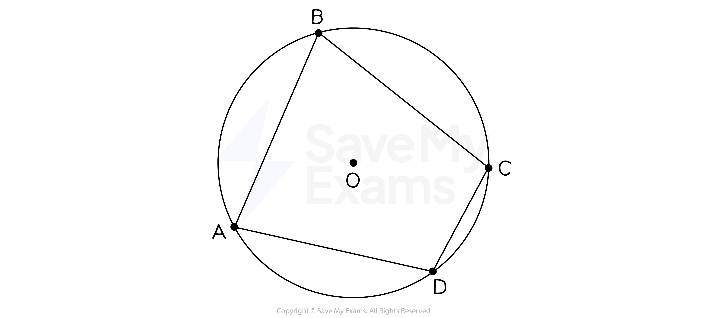
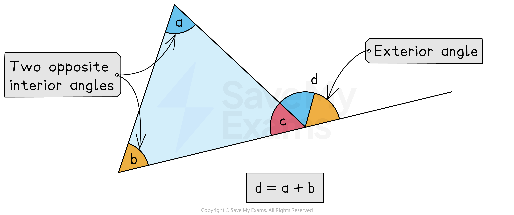

# Geometrical Proof

## Geometrical Proof

> **Spec point** — `spcpt_hK2H8q4Y8NYv833v`

## Geometrical proof

### What is a geometrical proof?

- **Geometric proof** involves using known rules about geometry to prove a new statement about geometry
- A proof question might start with “Prove…” or “Show that …”
- The rules that you might need to use to complete a proof include;

  - **Properties of** **2D shapes**
  
    - Especially triangles and quadrilaterals
  - **Basic angle properties**
  - **Angles in polygons**
  - **Angles in parallel lines**
  - **Congruence and similarity**
  - **Pythagoras theorem**
- You will need to be familiar with the vocabulary of the topics above, in order to fully answer many geometrical proof questions

### How do I write a geometrical proof?

- Usually you will need to write down two or three **steps** to prove the statement
- At each step, you should write down a** fact and a reason**

  - For example, “*AB* = *CD*, *opposite sides of a rectangle are equal length*”
- The proof is complete when you have **written down all the steps clearly**

  - Use the diagram!
  - **Add key information** such as angles or line lengths to the **diagram** as you work through the steps
  
    - but you must write them down in your written answer too

### What geometric notation should I use?

- **Points** or **vertices of a shape** are labelled with **capital letters**

  - *A*, *B*, *C* and *D* are the vertices of the quadrilateral
  - *O* is the centre of the circle
- **Two letters** are used to represent the **line between the points**

  - *AB* is the line between points *A* and *B*
- **Three letters** are used to represent the **angle formed by the three points**

  - Angle *ABC* is the angle between lines *AB* and *BC*
  - The letter in the middle is the point where the angle is at
- **Multiple letters** are used to represent the **whole shape**

  - *ABCD* is a quadrilateral
  - The letters are written down so that they go **clockwise** around the shape
- If you use a **variable** to represent a **length** or an **angle** then write it down

  - Angle *ABC* = $x$

### How can I prove that the exterior angle of a triangle is equal to the sum of the interior angles at the other two vertices?

- Let a, b and c be the **three interior angles** in a triangle
- Let d be the **exterior angle** next to the interior angle c

#### Method 1 - Using angles in a triangle

- The interior **angles in the triangle** add up to 180°

  - *a *+* b* + *c* = 180°
- An **interior **angle and its **exterior **angle add up to 180°

  - *c* + *d* = 180°
- The **right-hand sides** of the equations are both equal (180°)

  - Therefore, the left-hand sides are equal
  
    - *a *+* b* + *c* = *c* + *d*
  - Subtract *c* from both sides
  
    - *a *+* b* = *d*
- Therefore the **exterior angle** is the **sum** of the **two opposite interior angles**

#### Method 2 - Using parallel lines

- Split d into **two angles** by **drawing a parallel line** to the other side of the triangle

  - There will be an angle **alternate** to angle a
  - There will be an angle **corresponding** to angle b
- Therefore the **exterior angle** is the **sum** of the **two opposite interior angles**

### What are common geometric reasons I can use?

- There are **common phrases** that are sufficient as explanations and should be **learnt**

  - These will be what mark schemes look for
- For **triangles** and **quadrilaterals**

  - **Angles** in a **triangle** **add **up to** 180°**
  - **Base angles** of an **isosceles triangle** are **equal**
  - **Angles** in an **equilateral triangle** are **equal**
  - **Angles** in a** quadrilateral add** up to **360°**
  - An **exterior angle** of a triangle is **equal** to the** sum** of the** interior opposite angles**
- For **straight lines**

  - **Vertically opposite** angles are **equal**
  - **Angles** on a **straight line** **add **up to **180°**
  - **Angles** at a **point** **add **up to** 360°**
- For **parallel lines**

  - **Alternate** angles are **equal**
  - **Corresponding** angles are **equal**
  - **Allied** (or **co-interior**) angles **add **up to **180°**
- For **polygons**

  - **Exterior angles** of a polygon **add **up to** 360°**
  - The **interior and exterior angle** of any polygon** add **up to** 180°**

> **Exam Hint**
> DO show all the key steps. If in doubt, include it.
> 
> DON'T write in full sentences. For each step, just write down the fact, followed by the key mathematical reason that justifies it.

> **Worked Example**
> In the diagram below, *AC *and *DG* are parallel lines. *B* lies on *AC*, *E *and* F* lie on *DG *and triangle *BEF *is isosceles.
> 
> 
> 
> Prove that angle *EBF* is $180-2x$. Give reasons for each stage of your working.
> 
> **Answer:**
> 
> > *Mark on the diagram that triangle **BEF **is isosceles*
> 
> 
> 
> > *AC **and **DG **are parallel lines, so using alternate angles we know that angle **BEF** = *$x$
> *Mark this on the diagram*
> 
> 
> 
> > *Write the fact, and the reason using the key mathematical vocabulary*
> 
> **Final answer:** **angle**** BEF**** = **$x$**, alternate angles are equal**
> 
> > *Now using the fact that triangle **BEF** is isosceles, we can see that angle **BFE** = *$x$
> *Mark this on the diagram*
> 
> 
> 
> > *Write the fact, and the reason using the key mathematical vocabulary*
> 
> **Final answer:** **angle**** BFE**** = **$x$**, base angles of an isosceles triangle are equal**
> 
> > *Now we can see that angle **EBF** is the last remaining angle in a triangle, and as the angles in a triangle sum to 180, angle **EBF** = *$180-2x$
> 
> > *Write the fact, and the reason using the key mathematical vocabulary*
> 
> **Final answer:** **angle**** EBF**** = **$180-2x$**, angles in a triangle sum to 180**
