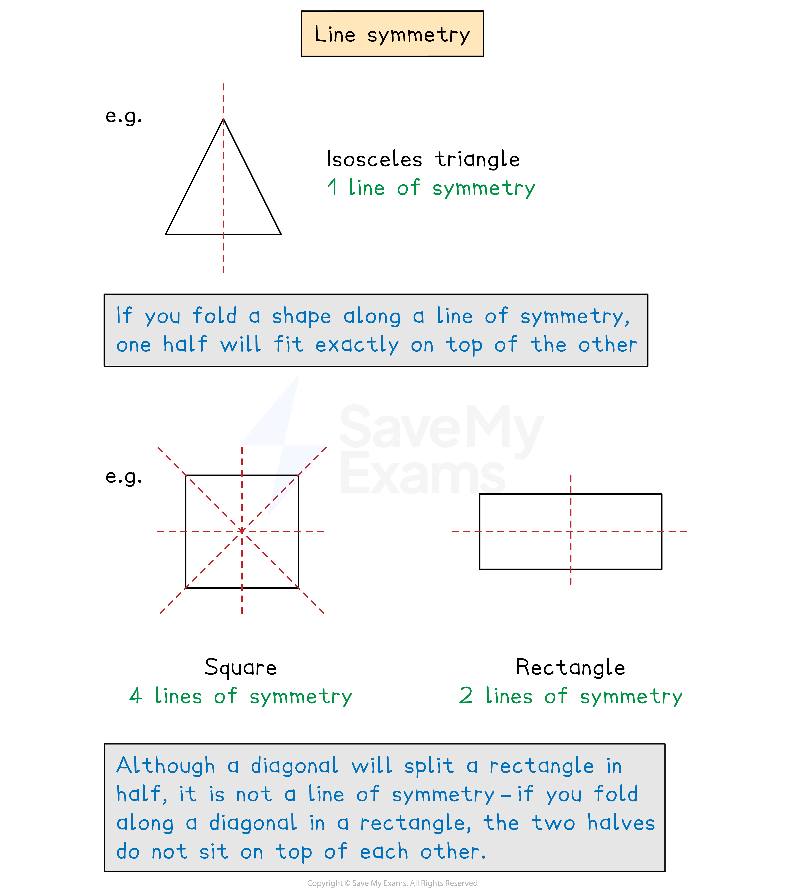
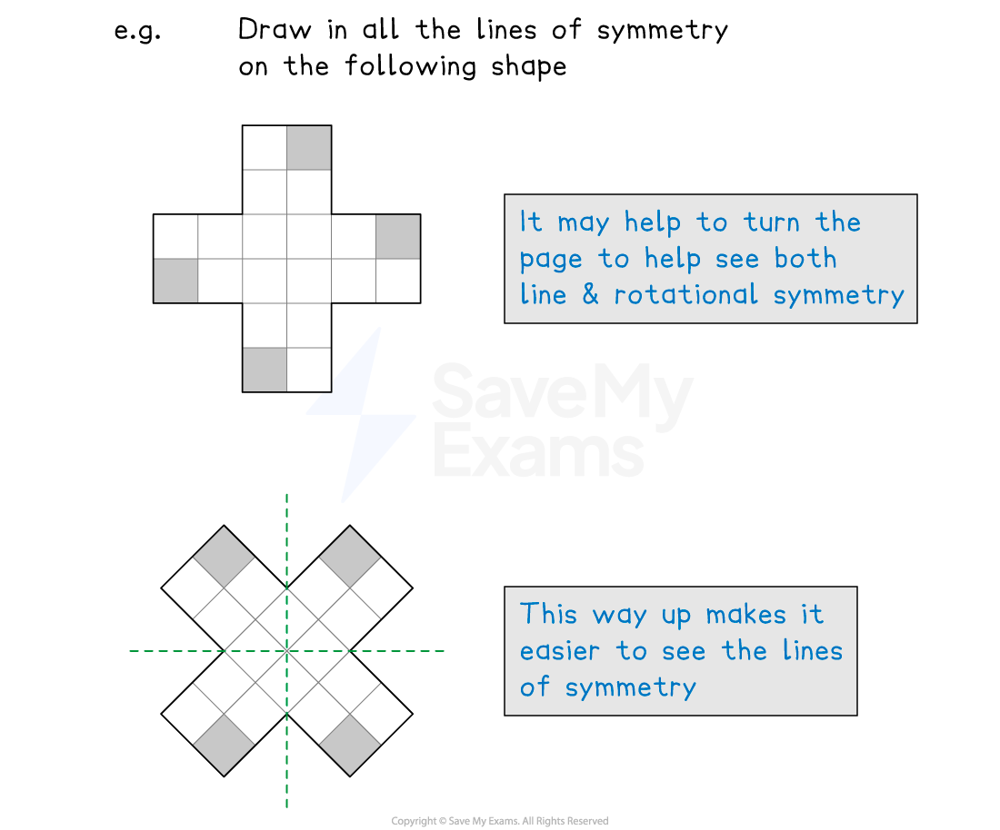
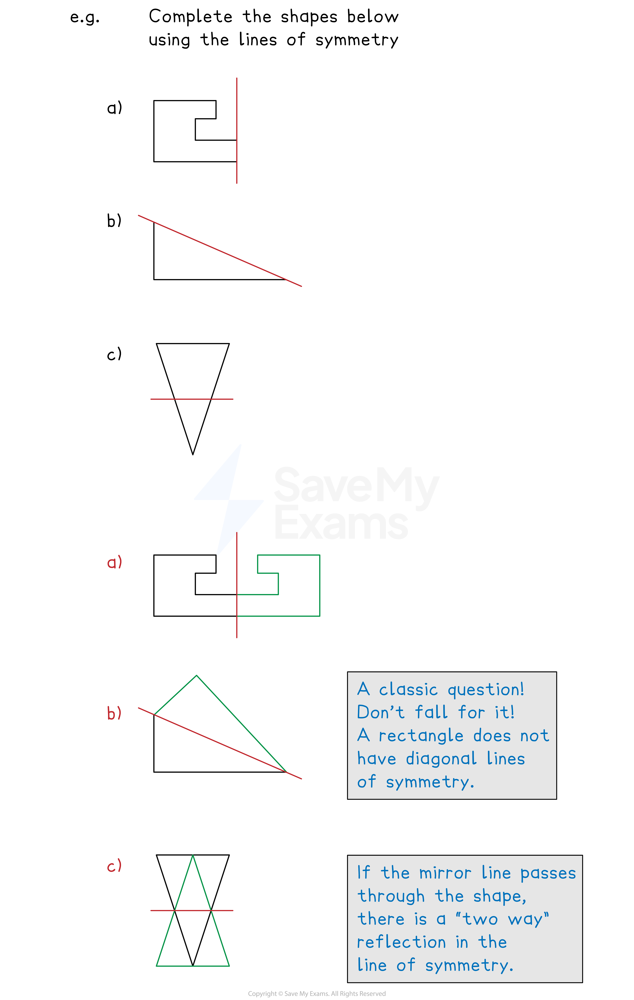

# Lines of Symmetry

## Lines of Symmetry

> **Spec point** — `spcpt_NyC8VYj2kktfwnZP`

## Lines of symmetry

### What is line symmetry?

- **Line** **symmetry** refers to shapes that can have **mirror** lines added to them

  - Each side of the line of symmetry is a **reflection** of the other side

- Lines of symmetry can be thought of as a **folding** line too

  - **Folding** a shape along a line of symmetry results in the two parts sitting **exactly** on top of each other

- It can help to look at shapes from different angles; turn the page to do this

- Some questions will provide a portion of a shape and a line of symmetry, and you need to fill in the remaining half of the shape
- Be careful with **diagonal** lines of symmetry

  - Use tracing paper to trace the shape and then flip along the line of symmetry

- “**Two**-**way**” **reflections** (like part c below) occur if the line of symmetry passes **through** the shape

> **Exam Hint**
> It can help to add the lines of symmetry to a diagram if one is given in a question.
> 
> You should be provided with tracing paper in the exam, use this to help you.

> **Worked Example**
> Consider the shape below.
> 
> 
> 
> (a) Write down the number of lines of symmetry.
> 
> **Answer:**
> 
> *The only line of symmetry is shown below*
> 
> 
> 
> **There is ****1**** line of symmetry.**** **
> 
> (b) Shade exactly 4 more squares so that the shape has 4 lines of symmetry.
> 
> **Answer:**
> 
> *The shape below has a horizontal, a vertical, and 2 diagonal lines of symmetry*
> 
> 
