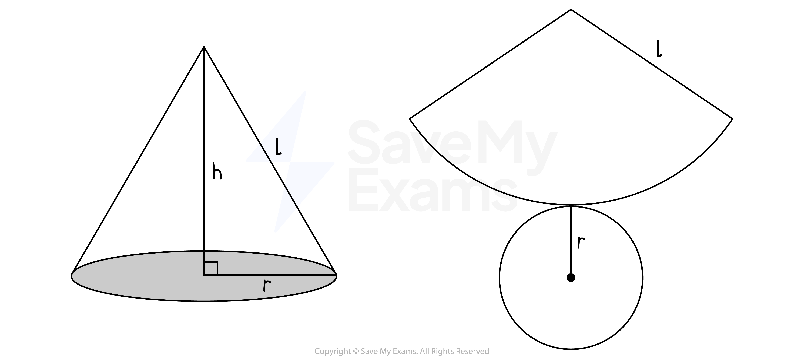
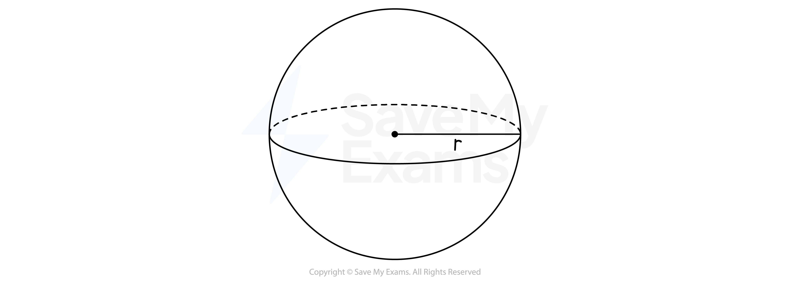
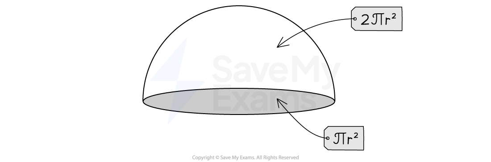

# Surface Area

## Surface Area

> **Spec point** — `spcpt_2w9hbV5pTbvc5Smj`

## Surface area

### What is surface area?

- The **surface area** of a 3D object is the **sum of the areas of all the faces **that make up the shape

  - Area is a 2D idea being applied into a 3D situation
  - A face is one of the flat or curved **surfaces** that make up a 3D object

### How do I find the surface area of cubes, cuboids, and prisms?

- In cubes, cuboids, and polygonal-based prisms (prisms whose bases have straight sides), **all the faces are flat**
- The **surface area** is found by

  - calculating the area of each individual flat face
  - adding these areas together
- You should remember the formulas for the **area of a rectangle**, a **triangle**, and a **circle **to help you calculate surface areas
- When calculating surface area, it can be helpful to **draw a 2D net for the 3D shape** in question

### How do I find the surface area of a cylinder?

- A cylinder has **two flat surfaces** (the top and the base) and** one curved surface**
- The **net** of a cylinder consists of** two circles** and a **rectangle** 
- The **curved surface area** of a cylinder, *A*, with base radius, *r*, and height, *h*, is therefore given by

  - $A=2πrh$
  - This formula is given to you in the exam
- The **total surface area **of a cylinder, *A**Total*, can be found using the formula

  - $A_{Total}=2πrh+2πr^{2}$
  - This formula is **not** given to you in the exam

### How do I find the surface area of a cone?

- A cone has **one flat surface** (the base) and **one curved surface**
- The net of a cone, with radius, *r*, perpendicular height, *h*, and sloping edge, (slant height), *l*, consists of

  - A **circular** **base**
  - A **sector** with radius, *l*, and an arc length equal to the circumference of the base

- The **curved surface area** of a cone, *A*, with radius, *r*, perpendicular height, *h*, and sloping edge, *l*, can be found using the formula

  - $A=πrl$
  - This formula is given to you in the exam
- The **total surface area** of a cone, *A**Total*, can be found using the formula
- $A_{Total}=πrl+πr^{2}$
- This formula is **not** given to you in the exam

### How do I find the surface area of a sphere?

- A sphere has a **single curved surface**

- The surface area of a sphere, *A*, with radius, *r*, can be found using the formula

  - $A=4πr^{2}$
  - This formula is given to you in the exam

- A **hemisphere** has half the curved surface area of a sphere and the flat circular base

- The surface area of a hemisphere, *A*, with radius, *r*, can be found using the formula

  - $A=2πr^{2}+πr^{2}$
  - This formula is **not** given to you in the exam

> **Exam Hint**
> - The **curved** **surface area **for a cylinder, cone and sphere are given to you in the exam
> 
>   - Read the question carefully, you may need to add additional areas, e.g. a base
>   - Make you are confident in calculating the areas of rectangles, circles and triangles

> **Worked Example**
> A toy consists of a cone of radius 5 cm and slant height 12 cm placed on top of a hemisphere with the same radius. Find the total surface area of the toy. Give your answer to 3 significant figures.
> 
> 
> 
> **Answer:**
> 
> > *Calculate the curved surface area of the cone using the formula, *$A=πrl$
> 
> $A_{cone}=π\times5\times12=60π$
> 
> > *Calculate the curved surface area of a hemisphere using the formula for the curved surface area of a sphere, *$A=4πr^{2}$* and dividing it by 2*
> 
> $A_{hemisphere}=\frac{4π\times5^{2}}{2}=50π$
> 
> > *Add the two areas together to find the total surface area of the toy*
> 
> $A_{Totsl}=60π+50π=110π$
> 
> > *Evaluate on your calc and round to 3 significant figures*
> 
> $A_{Total}=345.57519...$
> 
> **Final answer:** **346 cm****2**** (3 s.f.)**
