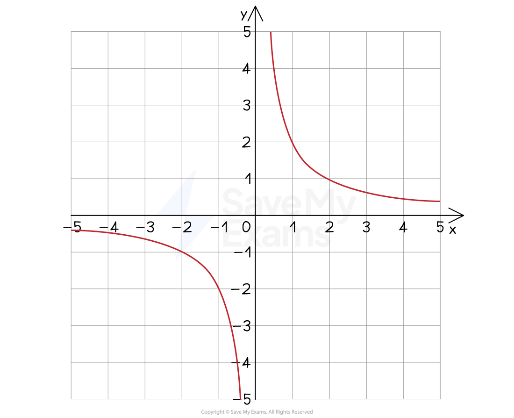

# Inverse Proportion

## Inverse Proportion

> **Spec point** — `spcpt_b7HzYMMwjGWQSz77`

## Inverse proportion

### What is inverse proportion?

- **Inverse** proportion means as **one variable goes up** the **other goes** **down** by the same **factor**

  - If two quantities are **inversely proportional**, then we can say that one is **directly proportional **to the **reciprocal** of the other
- The symbol, $\propto$, is used to show that one quantity is "directly proportional to the reciprocal of" (inversely proportional to) another quantity

  - "*y * is inversely proportional to *x*" is written $y\propto\frac{1}{x}$
- If *x* and *y* are inversely proportional then

  - $\frac{1}{x}:y$ will always be the same
  - there will be some value of *k *such that $y=\frac{k}{x}$
- The** graph** of $y=\frac{k}{x}$ is shown below

*Example of a graph showing inverse proportion*

### How do I use inverse proportion with powers and roots?

- Problems may involve a variable* *being **inversely proportional** to a** power or root **of another variable
- For example

  - *y* is **inversely** proportional to the **square of *****x***
  
    - * *$y\propto\frac{1}{x^{2}}$
    - means that $y=\frac{k}{x^{2}}$
  - *y* is** inversely** proportional to the **square root of *****x***
  
    - $y\propto\frac{1}{\sqrt{x}}$
    - means that $y=\frac{k}{\sqrt{x}}$
  - *y* is **inversely** proportional to the **cube of *****x***
  
    - $y\propto\frac{1}{x^{3}}$
    - means that $y=\frac{k}{x^{3}}$
  - Each of these would have a **different type of graph**, depending on the power or root

### How do I find the equation between two inversely proportional variables?

- Inverse proportion questions always have the same process:

  - **STEP 1**
  **Identify** the two variables and write down the **formula in terms of *****k***
  
    - E.g. ***y*** is **inversely **proportional to ***x***
    - write down the formula $y=\frac{k}{x}$
  - **STEP 2**
  **Find** ***k*** by substituting any given values **from the question** into your formula, then solving to get *k*
  
    - E.g. if you are told *y* = 5 when *x* = 6
    - then $5=\frac{k}{6}$ giving $k=30$
  - **STEP 3**
  **Rewrite** the formula with the **known value of *****k ***from above (substitute it in)
  
    - $y=\frac{30}{x}$
    - This is the **equation** relating the two variables
  - **STEP 4**
  **Use the equation **to answer other parts of the question
  
    - E.g. find *y* when *x* = 2
    - $y=\frac{30}{x}$ gives $y=\frac{30}{2}=15$

> **Worked Example**
> The time, $t$ hours, it takes to complete a project is inversely proportional to the square root of the number, $n$, of people working on it.
> 
> If 25 people work on the project, it takes 50 hours to complete.
> 
> (a) Find an equation connecting $t$ and $n$.
> 
> Identify the two variables
> 
> **Answer:**
> 
> $t,n$
> 
> > *We are told this is **inverse** proportion to the square root of *$n$
> *Write down the formula involving **k*
> 
> `t equals fraction numerator k over denominator square root of n end fraction`
> 
> > *Find **k** by substituting in *$n=25$* and *$t=50$* (from the words in the question)*
> 
> `table row 50 equals cell fraction numerator k over denominator square root of 25 end fraction end cell row 50 equals cell k over 5 end cell row cell 50 cross times 5 end cell equals k row 250 equals k end table`
> 
> > *Substitute this value of **k** back into the formula to get the full equation*
> 
> `bold italic t bold equals fraction numerator bold 250 over denominator square root of bold italic n end fraction`
> 
> (b) Given that the project needs to be completed within 40 hours, find the minimum number of people needed to work on it.
> 
> **Answer:**
> 
> > *Use the formula to find *$n$* when *$t=40$
> 
> `table row 40 equals cell fraction numerator 250 over denominator square root of n end fraction end cell row cell square root of n end cell equals cell 250 over 40 equals 6.25 end cell row n equals cell 6.25 squared equals 39.0625 end cell end table`
> 
> > *A sensible answer here is a whole number (as *$n$* is the number of people)*
> *39 people would not complete it in time, but 40 would*
> 
> **Final answer:** **40 people**
