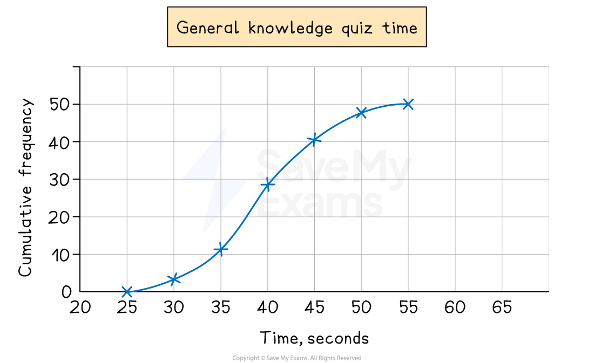

# Drawing Cumulative Frequency Diagrams

## Drawing Cumulative Frequency Diagrams

> **Spec point** — `spcpt_kwGrBDCwB6YtVVBQ`

## Drawing cumulative frequency diagrams

### What is a cumulative frequency diagram?

- A **cumulative frequency diagram** is a way of representing **grouped continuous data**
- A cumulative frequency diagram can be used to **estimate** other **statistical values**

  - For example the **median**, **quartiles** or **percentiles**

### How do I draw a cumulative frequency diagram?

- This is best explained with an example

  - The times taken to complete a short general knowledge quiz taken by 50 students are shown in the table below: | **Time taken (**$s$** seconds)** | **Frequency** |
  |---|---|
  | $25\leqs<30$ | 3 |
  | $30\leqs<35$ | 8 |
  | $35\leqs<40$ | 17 |
  | $40\leqs<45$ | 12 |
  | $45\leqs<50$ | 7 |
  | $50\leqs<55$ | 3 |
  | **Total** | **50** |
  - Then the **cumulative frequency** is the running total of the frequencies | **Time taken (**$s$** seconds)** | **Frequency** | **Cumulative Frequency** |
  |---|---|---|
  | $25\leqs<30$ | 3 | 3 |
  | $30\leqs<35$ | 8 | 3 + 8 = 11 |
  | $35\leqs<40$ | 17 | 11 + 17 = 28 |
  | $40\leqs<45$ | 12 | 28 + 12 = 40 |
  | $45\leqs<50$ | 7 | 40 + 7 = 47 |
  | $50\leqs<55$ | 3 | 47 + 3 = 50 |
  | **Total** | **50** |   |
- We can now draw the **cumulative frequency diagram**

  - The most important part is that **cumulative frequency** is plotted against the **end **(**upper bound**) of the **class interval**
  
    - The end of the class interval is the *x-*coordinate
    - The cumulative frequency is the *y-*coordinate
    - For the above example the first two points to plot would be (30, 3) and (35, 11)
  - To explain this, consider the second row ($30\leqs<35$)
  
    - The 8 students in this group could have taken **any** time between 30 and 35 seconds
    - They cannot **all** be guaranteed to have been accounted for until we reach 35 seconds
  - Once all points from the table are plotted, a point for the **start** needs to be added
  
    - This will be at the lowest time from the table
    - i.e. at 25 seconds with a cumulative frequency of 0
    - Plot the point (25, 0)
  - Join points up with a **smooth curve** (this takes some practice)
  
    - Make sure it goes through all of the marked points
  - In general a cumulative frequency diagram has a **stretched-S-shape** appearance
  
    - A cumulative frequency diagram will **never** come back towards the *x*-axis
- Here is the final cumulative frequency diagram for the quiz times

*Example of a cumulative frequency diagram*
