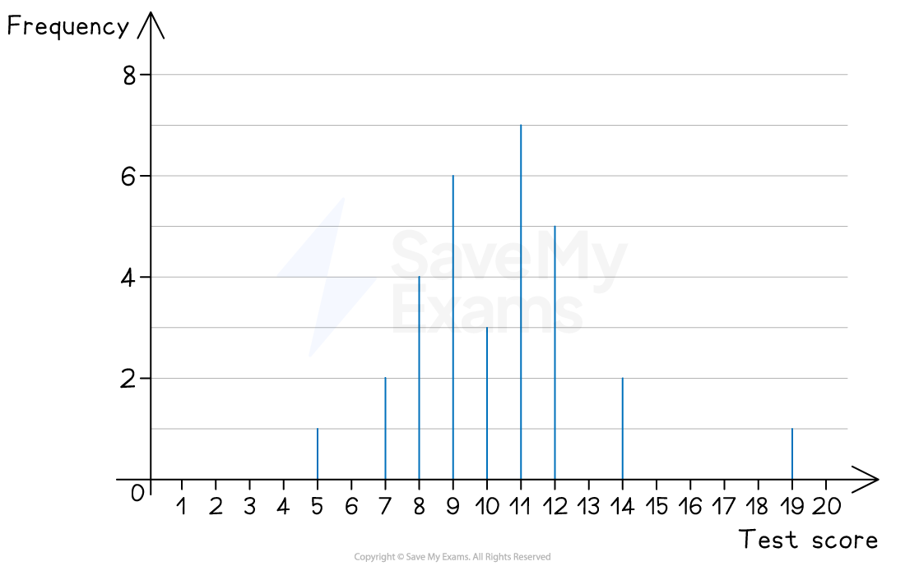
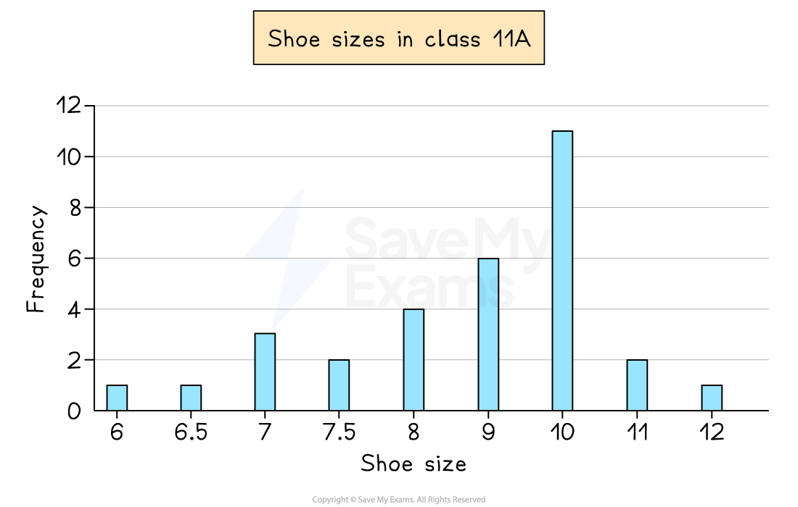
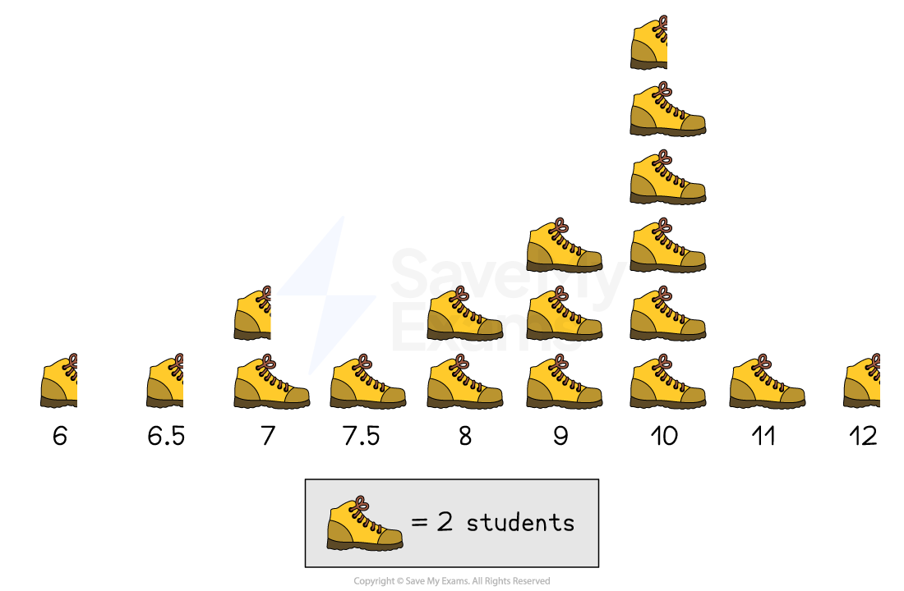

# Bar Charts & Pictograms

## Bar Charts & Pictograms

> **Spec point** — `spcpt_kHwc5r3247TGRwyS`

## Bar charts & pictograms

### What is a bar chart?

- A **bar chart** is a visual way to represent **discrete** data

  - Discrete data is data that can be **counted**
  
    - This can be **numerical **like** **shoe sizes in a class
    - Or **non-numerical **(categorical) like colours of cars down a road
- The **horizontal axis** shows the different **outcomes**
- The **vertical axis** shows the **frequency**
- The **heights** of the **bars **show the frequency

  - Bars should be **separated** by gaps
  - Bars should have **equal widths**

*Example of a line chart*

- The** mode** is the **outcome** with the **highest** bar

> **Exam Hint**
> If you need to find the **median** for data given in a bar chart
> 
> - Turn the data from the bar chart into a **table**
> - Then use the method for finding the median in the 'Averages from Tables' revision note

- You can also get **dual bar charts** to compare two data sets

  - Bars are in **pairs** (side-by-side) for each outcome

*Example of a bar chart*

### What is a pictogram?

- A **pictogram** is an **alternative **to a bar chart

  - It is used in the same situations
- There are **no axes**

  - **Frequency** is represented by **symbols**
  - A** key **shows the value of 1 symbol
  
    - For example, 1 symbol represents a frequency of 2
  - Half and quarter symbols are often used

*Example of a pictogram*

- The pictogram above shows the shoe sizes of students in a class

  - As 1 picture of a shoe represents 2 students
  
    - Half a shoe represents 1 student
  - The number of students with a shoe size of 7, is 3

> **Exam Hint**
> - If asked to draw a bar chart, find the largest frequency and choose a scale which makes that fit in the space provided
> - If asked to draw a pictogram, pick a symbol that is easy to duplicate and draw half (or quarter) of

> **Worked Example**
> Mr Barr teaches students in Year 7 and Year 8.
> He records the number of pets that students in each year have.
> His results are shown below.
> 
> 
> 
> (a) Write down the modal number of pets for his Year 7 students.
> 
> **Answer:**
> 
> > *The modal number (mode) is the number of pets that occurs the most*
> *Visually, this will be the highest bar for Year 7s*
> 
> **Final answer:** **The mode for Year 7 is 1 pet**
> 
> (b) How many Year 8 students does he teach?
> 
> **Answer:**
> 
> > *Add up all the heights (frequencies) of the Year 8 bars*
> 
> *4 + 8 + 4 + 3 + 0 + 2*
> 
> **Final answer:** **He teaches 21 Year 8 students**
