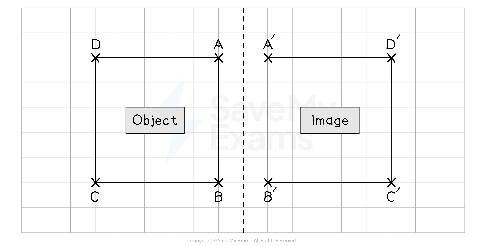
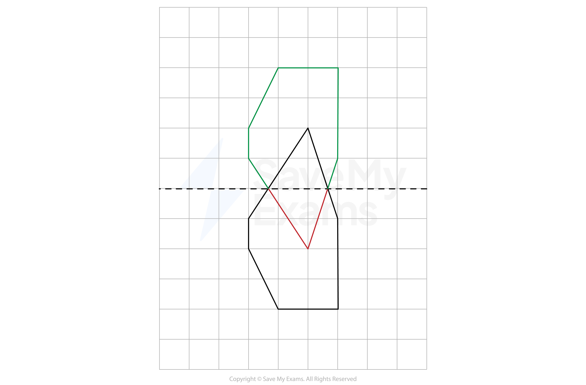

# Reflections

## Reflections

> **Spec point** — `spcpt_DQrkJGG4Mngch9xc`

## Reflections

### What is a reflection?

- A** reflection flips **a shape across a **mirror line**

  - This is called the **line of reflection**
- The **reflected image **is the **same size **as the** original object**

  - It has been** flipped **across the mirror line to a **new position **and **orientation**
- The following two **distances will be equal** for each point:

  - The **perpendicular distance** between the **original point and the mirror line**
  - The **perpendicular distance** between the **reflected point and the mirror line**
- Any** points **that are** on the mirror line** do not move

  - These are called **invariant points**

### How do I reflect a shape?

- **STEP 1**
**Draw** the **line of reflection**

  - This will usually be a **vertical** line ($x=k$) or a **horizontal** line ($y=k$)
  - A **diagonal** line will either be $y=x$ or $y=-x$
- **STEP 2**
From **each vertex** on the **original object** measure the **perpendicular distance** to the **mirror line**

  - You can usually do this by **counting squares** on the grid
  - If the line is **diagonal** then count the **diagonals of the squares**
- **STEP 3** Find the **reflected** point by **measuring** the **same distance** in the **same direction **from the point on the mirror line
- **STEP 4**
**Join together** the reflected points and label the reflected image

### How do I reflect a shape when the line of reflection goes through the shape?

- You follow the **same steps** as above
- Part of the shape gets reflected on **one side** of the mirror line, and the other part gets reflected on the other side

> **Worked Example**
> On the grid below, reflect shape S in the line $x=-1$.
> 
> State the coordinates of all of the vertices of your reflected shape.
> 
> 
> 
> **Answer:**
> 
> > *Draw in the mirror line; *$x=-1$* will be a vertical line passing through -1 on the **x**-axis*
> *Measure or count the number of units from the shape "diagonals" on the other side of the mirror line to find the position of the corresponding vertex on the reflected image*
> 
> 
> 
> > *List the vertices of the reflected image. *
> *Work your way around the shape vertex by vertex so that you don't miss any out as there are quite a few!*
> 
> **Final answer:** **Vertices of the reflected shape: (1, 6), (2, 6), (2, 4), (3, 4), (3, 6), (4, 6), (4, 3), (3, 3), (3, 1), (2, 1), (2, 3), (1,3)**

### How do I describe a reflection?

- To describe a **reflection**, you must:

  - State that the transformation is a **reflection**
  - Give the mathematical **equation of the mirror line**
- To find the **equation** of the **reflection line**:

  - **Horizontal** lines are of the form $y=k$
  
    - $k$ is the number that the **line passes through on the y-axis**
  - **Vertical** lines are of the form $x=k$
  
    - $k$ is the number that the **line passes through on the x-axis**
  - A **diagonal** line with a **positive gradient **will be $y=x$
  - A **diagonal** line with a **negative gradient** will be $y=-x$

### How do I reverse a reflection?

- If a shape has been reflected to a new position, you can perform a single transformation to **return the shape** to its **original position**

  - You can **reverse the reflection**
- The transformation to **reverse a reflection**, is the **same transformation **as the** original **

  - E.g. If a shape is reflected in the *x*-axis, then reflecting it again in the *x*-axis will return it to its original position

> **Exam Hint**
> It is very easy to muddle up the equations for **horizontal** and **vertical** lines, remember:
> 
> - If the line crosses the **x-axis** then it will be $x=k$
> - If the line crosses the **y-axis** then it will be $y=k$

> **Worked Example**
> Describe fully the single transformation that creates shape B from shape A.
> 
> 
> 
> **Answer:**
> 
> > *You should be able to "see" where the mirror line should be without too much difficulty.*
> *Draw the mirror line on the diagram.*
> *You can check that it is in the correct position by measuring/counting the perpendicular distance from a pair of corresponding points on the original object and the reflected image to the same point on the mirror line.*
> *Be careful with mirror lines near axes as it is easy to miscount.*
> 
> 
> 
> > *Write down that the transformation was a reflection and the equation of the mirror line.*
> 
> **Final answer:** **Shape A has been reflected in the line **$x=-1$** to create shape B**
