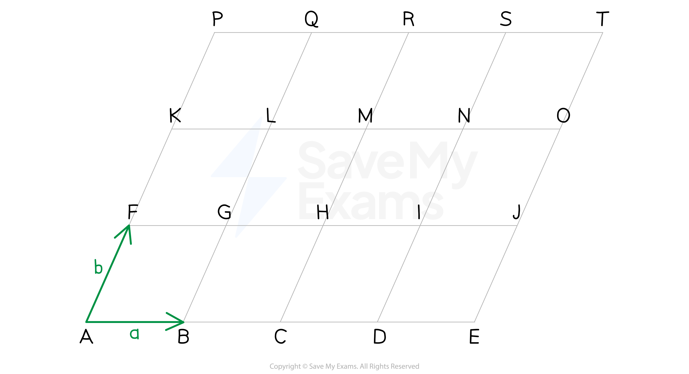
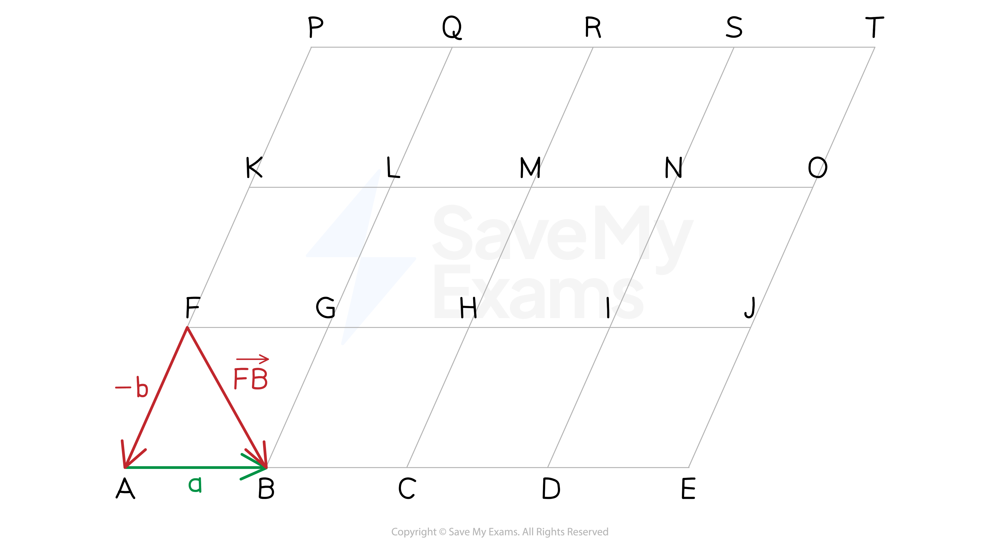

# Finding Vector Paths

## Finding Vector Paths

> **Spec point** — `spcpt_qbHvYk4bsCyRfQSv`

## Finding vector paths

### How do I find the vector between two points?

- A **vector path** is a path of vectors taking you from a **start point **to an **end point**
- The following grid is made up entirely of parallelograms

  - The vectors **a** and **b** defined as marked in the diagram:
  
    - Any vector that goes **horizontally to the right** along a side of a parallelogram will be equal to **a**
    - Any vector that goes** up diagonally to the right **along a side of a parallelogram will be equal to **b**

- To find the vector between two points

  - Count how many times you need to go **horizontally to the right**
  
    - This will tell you how many **a**'s are in your answer
  - Count how many times you need to go up **diagonally to the right**
  
    - This will tell you how many **b**'s are in your answer
  - Add the **a**'s and **b**'s together
  
    - E.g. $\overset{\rightarrow}{AR}=2a+3b$
- You will have to put a **negative** in front of the vector if it goes in the **opposite direction**

  - -**a** is one length **horizontally to the left**
  - -**b** is one length **down diagonally to the left**
  
    - E.g. $\overset{\rightarrow}{FB}=-b+a$ or $\overset{\rightarrow}{FB}=a-b$
    - Likewise, `stack B F with rightwards arrow on top equals negative stack F B with rightwards arrow on top equals negative open parentheses negative bold b plus bold a close parentheses equals bold b minus bold a`

- It is possible to describe **any vector** that goes from one point to another in the above diagram in terms of **a** and **b**

> **Exam Hint**
> - Mark schemes will accept different correct paths, as long as the final answer is fully simplified
> - Check for symmetries in the diagram to see if the vectors given can be used anywhere else

> **Worked Example**
> The following diagram consists of a grid of identical parallelograms.
> 
> Vectors **a*** *and **b***** ***are defined by $a=\overset{\rightarrow}{AB}$ and $b=\overset{\rightarrow}{AF}$.
> 
> 
> 
> Write the following vectors in terms of **a** and **b**.
> 
> (a) $\overset{\rightarrow}{AE}$
> 
> **Answer:**
> 
> *To get from **A **to **E **we need to follow vector **a** **four times to the right*
> 
> `table row cell stack A E with rightwards arrow on top space end cell equals cell space stack A B with rightwards arrow on top space plus thin space stack B C with rightwards arrow on top space plus space stack C D with rightwards arrow on top space plus space stack D E with rightwards arrow on top end cell row blank equals cell space bold a space plus bold space bold a space space plus space bold a space plus space bold a end cell end table`
> 
> **Final answer:** $\overset{\rightarrow}{AE}=4a$** **
> 
> (b) $\overset{\rightarrow}{GT}$
> 
> **Answer:**
> 
> *There are many ways to get from** G** to **T*
> *One option is to go from **G **to **Q **(**b** **twice), and then from **Q **to **T **(**a** three times)*
> 
> `table row cell stack G T with rightwards arrow on top space end cell equals cell space stack G L with rightwards arrow on top space plus thin space stack L Q with rightwards arrow on top space plus space stack Q R with rightwards arrow on top space plus space stack R S with rightwards arrow on top space plus space stack S T with rightwards arrow on top end cell row blank equals cell bold italic b space plus space bold italic b space plus space bold italic a space plus space bold italic a space plus space bold italic a end cell end table`
> 
> $\overset{\rightarrow}{GT}=3a+2b$
> 
> (c) $\overset{\rightarrow}{EK}$
> 
> **Answer:**
> 
> > *There are many ways to get from** E** to **K** *
> *One option is to go from** E **to O** **(**b** **twice), and then from **O **to **K **( -**a** four times)*
> 
> `table row cell stack E K with rightwards arrow on top space end cell equals cell space stack E J with rightwards arrow on top space plus thin space stack J O with rightwards arrow on top space plus space stack O N with rightwards arrow on top space plus space stack N M with rightwards arrow on top space plus space stack M L with rightwards arrow on top space plus space stack L K with rightwards arrow on top space space end cell row blank equals cell bold b space plus space bold b space minus space bold a space minus space bold a space minus space bold a bold space bold minus bold space bold a end cell end table`
> 
> $\overset{\rightarrow}{EK}=2b-4a$
