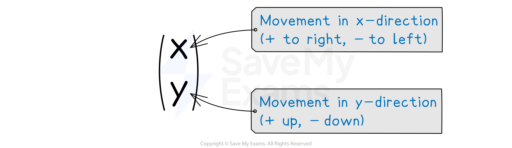

# Introduction to Column Vectors

## Basic Vectors

> **Spec point** — `spcpt_v6tP4DSVShVJMJhk`

## Basic vectors

### What are column vectors?

- A **column vector** can be used to **describe** how to get **from one point to another point**

  - This is also called a **translation vector**
  - `open parentheses table row 6 row 3 end table close parentheses` means **6 units to the right** and **3 units up**

### How do I add and subtract column vectors?

- **Adding and subtracting vectors** is done by looking at the **top** numbers and **bottom** numbers **separately**
- To **add** column vectors

  - Add the top numbers together
  - Add the bottom numbers together
  
    - `open parentheses table row 5 row 2 end table close parentheses plus open parentheses table row 3 row cell negative 1 end cell end table close parentheses equals open parentheses table row cell 5 plus 3 end cell row cell 2 plus open parentheses negative 1 close parentheses end cell end table close parentheses equals open parentheses table row 8 row 1 end table close parentheses`
- To **subtract **column vectors

  - Subtract** **the second top number from the first
  - Subtract the second bottom number from the first
  
    - `open parentheses table row 5 row 2 end table close parentheses minus open parentheses table row 3 row cell negative 1 end cell end table close parentheses equals open parentheses table row cell 5 minus 3 end cell row cell 2 minus open parentheses negative 1 close parentheses end cell end table close parentheses equals open parentheses table row 2 row 3 end table close parentheses`

### How do I multiply a vector by a scalar?

- A **scalar** is a **number** not a** vector**

  - It does not have a direction
- To **multiply** a column vector by a **scalar**

  - Multiply the top number by the scalar
  - Multiply the bottom number by the scalar
  
    - `3 open parentheses table row 2 row cell negative 1 end cell end table close parentheses equals open parentheses table row cell 3 cross times 2 end cell row cell 3 cross times open parentheses negative 1 close parentheses end cell end table close parentheses equals open parentheses table row 6 row cell negative 3 end cell end table close parentheses`

### How do I write an expression as a single column vector?

- You need to follow the **order of operations**

  - `2 open parentheses table row 5 row 2 end table close parentheses plus 5 open parentheses table row 3 row cell negative 1 end cell end table close parentheses`
- **STEP 1**
**Multiply** each vector by the scalar in front of it

  - `open parentheses table row cell 2 cross times 5 end cell row cell 2 cross times 2 end cell end table close parentheses plus open parentheses table row cell 5 cross times 3 end cell row cell 5 cross times open parentheses negative 1 close parentheses end cell end table close parentheses equals open parentheses table row 10 row 4 end table close parentheses plus open parentheses table row 15 row cell negative 5 end cell end table close parentheses`
- **STEP 2**
**Add or subtract** the new column vectors

  - `open parentheses table row cell 10 plus 15 end cell row cell 4 plus open parentheses negative 5 close parentheses end cell end table close parentheses equals open parentheses table row 25 row cell negative 1 end cell end table close parentheses`

> **Worked Example**
> `bold a equals open parentheses table row p row 3 end table close parentheses` and `bold b equals open parentheses table row cell negative 2 end cell row 1 end table close parentheses`.
> 
> Given that `2 bold a plus 3 bold b equals open parentheses table row 4 row q end table close parentheses`, find the value of $p$ and the value of $q$.
> 
> **Answer:**
> 
> > *Write the left-side side as one vector*
> *Multiply each vector by the scalar in front of it*
> 
> `open parentheses table row cell 2 p end cell row 6 end table close parentheses plus open parentheses table row cell negative 6 end cell row 3 end table close parentheses equals open parentheses table row 4 row q end table close parentheses`
> 
> > *Add the vectors together*
> 
> `open parentheses table row cell 2 p minus 6 end cell row 9 end table close parentheses equals open parentheses table row 4 row q end table close parentheses`
> 
> > *The top components are equal*
> *Form and solve an equation*
> 
> `table row cell 2 p minus 6 end cell equals 4 row cell 2 p end cell equals 10 row p equals 5 end table`
> 
> > *The bottom components are equal*
> 
> $9=q$
> 
> $p=5$ **and** $q=9$
