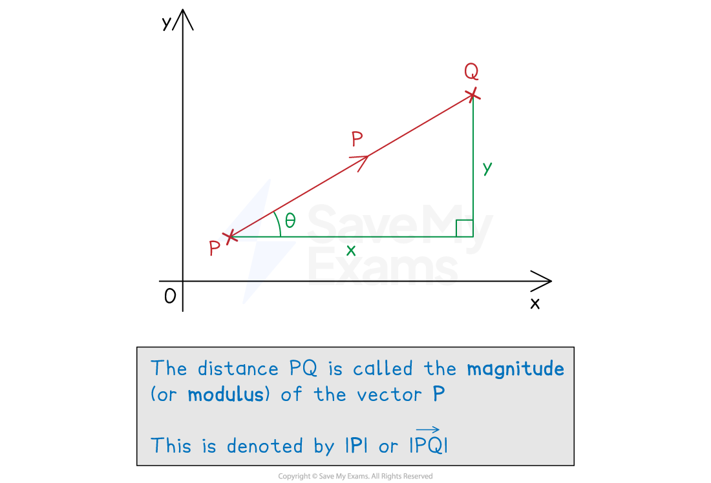

# Magnitude of a Vector

## Magnitude of a Vector

> **Spec point** — `spcpt_vqmZYnJx9pH7mGMC`

## Magnitude of a vector

### How do I find the magnitude of a vector?

- The **magnitude **of a **vector** is its **length **(distance)

  - It is also called the **modulus**
  - This is always a **positive** value
  - The direction of the vector is irrelevant
- The magnitude of $\overset{\rightarrow}{AB}$ is written `open vertical bar stack A B with rightwards arrow on top close vertical bar`

  - The magnitude of **a** is written |**a**|

- Depending on the use of the vector, the magnitude of a vector represents** different quantities**

  - For velocity, magnitude would be speed
  - For a force, magnitude would be the strength of the force (in Newtons)

- In** component** form, the magnitude is the **hypotenuse** of a right-angled triangle

  - Use **Pythagoras' theorem** to find the magnitude
  - The magnitude of `bold a equals blank open parentheses table row x row y end table close parentheses`
  
    - `open vertical bar bold a close vertical bar equals blank square root of x to the power of 2 space end exponent plus blank straight y squared end root`

> **Exam Hint**
> - If there is no diagram, sketch one!
> 
>   - You can sketch a vector and use it to form a right-angled triangle

> **Worked Example**
> Consider two points `A open parentheses negative 3 comma space 5 close parentheses` and `B open parentheses 7 comma space 1 close parentheses`.
> 
> (a) Write down the column vector $\overset{\rightarrow}{AB}$.
> 
> **Answer:**
> 
> > *Find the horizontal and vertical distances between the two points*
> *Subtract the **x** and **y** components of **A** from **B*
> 
> `stack A B with rightwards arrow on top equals open parentheses table row cell 7 minus negative 3 end cell row cell 1 minus 5 end cell end table close parentheses`
> 
> `Error converting from MathML to accessible text.`
> 
> (b) Find the modulus of vector $\overset{\rightarrow}{AB}$.
> 
> **Answer:**
> 
> > *Sketching a diagram of the vector *$\overset{\rightarrow}{AB}$* can help*
> 
> 
> 
> > *Apply Pythagoras' theorem to the **x** and **y** components of *$\overset{\rightarrow}{AB}$
> 
> `table row cell open vertical bar stack A B with rightwards arrow on top close vertical bar end cell equals cell square root of 10 squared plus open parentheses negative 4 close parentheses squared end root end cell row blank equals cell square root of 100 plus 16 end root end cell row blank equals cell square root of 116 end cell end table`
> 
> `Error converting from MathML to accessible text.`
> 
> (c) Briefly explain why `open vertical bar stack B A with rightwards arrow on top close vertical bar equals open vertical bar stack A B with rightwards arrow on top close vertical bar`.
> 
> **Answer:**
> 
> > *The magnitude of a vector is it's 'size'*
> 
> > *Direction of the vector is ignored*
> 
> **Final answer:** `open vertical bar stack B A with rightwards arrow on top close vertical bar equals open vertical bar stack A B with rightwards arrow on top close vertical bar`** since both vectors have the same distance**
> 
> Another vector, $\overset{\rightarrow}{CD}$, has three times the magnitude of vector $\overset{\rightarrow}{AB}$.
> 
> (d) Write down a possible column vector for $\overset{\rightarrow}{CD}$.
> 
> **Answer:**
> 
> > *Being three times *`open vertical bar stack A B with rightwards arrow on top close vertical bar`* means the vector *$\overset{\rightarrow}{AB}$* is three times longer*
> 
> > *One way to find a vector is to multiply each component of the vector *$\overset{\rightarrow}{AB}$* by 3 or -3*
> 
> `table row cell stack C D with rightwards arrow on top end cell equals cell 3 stack A B with rightwards arrow on top equals 3 open parentheses table row 10 row cell negative 4 end cell end table close parentheses end cell end table`
> 
> `Error converting from MathML to accessible text.`** or *** *`Error converting from MathML to accessible text.`
