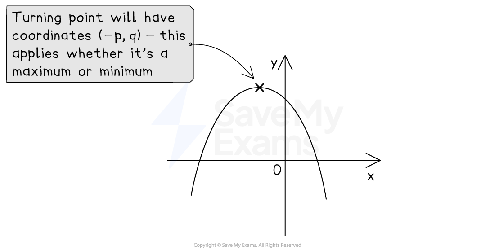

# Completing the Square

## Completing the Square

> **Spec point** — `spcpt_9Stcxtj75Q3wpqJF`

## Completing the square

### How can I rewrite the first two terms of a quadratic expression as the difference of two squares?

- Look at the quadratic expression *x*2 + *bx* + *c *
- The first** two terms** can be written as the **difference of two squares** using the following rule

$x^{2}+bx$ is the same as `open parentheses x plus p close parentheses squared minus p squared` where $p$ is **half** of $b$

- Check this is true by expanding the right-hand side

  - Is $x^{2}+2x$ the same as `open parentheses x plus 1 close parentheses squared minus 1 squared`?
  
    - Yes: (*x* + 1)(*x* + 1) - 12 = *x*2 + 2*x* + 1 - 1 = *x*2 + 2*x*
- This works for **negative** values of *b* too

  - $x^{2}-20x$ can be written as `open parentheses x minus 10 close parentheses squared minus open parentheses negative 10 close parentheses squared` which is `open parentheses x minus 10 close parentheses squared minus 100`
  - A negative *b* does not change the sign at the end

### How do I complete the square?

- **Completing the square** is a way to rewrite a quadratic expression in a form containing a **squared bracket**
- To complete the square on *x*2 + 10*x* + 9

  - Use the rule above to replace the first two terms, *x*2 + 10*x, *with (*x* + 5)2 - 52
  - then add 9:  (*x* + 5)2 - 52 + 9
  - **simplify** the **numbers**:  (*x* + 5)2 - 25 + 9
  - answer: (*x* + 5)2 - 16

### How do I complete the square when there is a coefficient in front of the x2 term?

- You first need to take $a$ out as a **factor** of the *x*2 and *x* terms only

  - **Factorise** the** first two terms**
  - `a x squared plus b x plus c equals a open square brackets x squared plus b over a x close square brackets plus c`
  
    - Use **square-shaped** **brackets** here to avoid confusion with round brackets later
- Then complete the square on the bit **inside** the brackets: $x^{2}+\frac{b}{a}x$

  - This gives `a open square brackets open parentheses x plus p close parentheses squared minus p squared close square brackets plus c`
  
    - where *p* is half of $\frac{b}{a}$
- Finally **multiply** this expression through by *a* (from outside the square brackets) and **add the c** on to the end

  - `a open parentheses x plus p close parentheses squared minus a p squared plus c`
  
    - This looks far more complicated than it is in practice!
  - Usually you are asked to give your final answer in the form  `a open parentheses x plus p close parentheses squared plus q`
  - For example,  *y *= 4*x*2 + 16*x* + 5
  
    - Factorise out '*a*' on the right-hand side (use square brackets)
    
      - *y* = 4[*x*2 + 4*x*] + 5
    - Replace *x*2 + 4*x* with (*x* + 2)2 - 22  (because *p* = $\frac{4}{2}$ = 2)
    
      - *y* = 4[(*x* + 2)2 - 22] + 5
    - Simplify the terms inside the square brackets
    
      - *y* = 4[(*x* + 2)2 - 4] + 5
    - Multiply everything inside the square brackets by 4
    
      - *y* = 4(*x* + 2)2 - 16 + 5
    - Simplify to get the final answer
    
      - *y* = 4(*x* + 2)2 - 11
- For quadratics like $-x^{2}+bx+c$, do the above but with *a* = -1

### How do I find the turning point by completing the square?

- Completing the square helps us find the **turning** **point** on a quadratic graph

  - If `y equals open parentheses x plus p close parentheses squared plus q` then the turning point is at `open parentheses negative p comma q close parentheses`
  
    - Notice the negative sign in the *x*-coordinate
    - This links to transformations of graphs
    - A translation of $y=x^{2}$ by *p* to the left and *q *up
  - If `y equals a open parentheses x plus p close parentheses squared plus q` then the turning point is still at `open parentheses negative p comma q close parentheses`
  
    - The *a* does **not change** the coordinates
    - The turning point is a minimum point if *a* > 0
    - or a maximum point if *a* < 0
- This can also help you **create the equation** of a quadratic when given the turning point

- It can also be used to **prove** or **show** results using the fact that any **squared term**, such as the squared bracket (*x* ± *p*)2, will always be **greater than or equal to 0**

  - You cannot square a number and get a negative value
  - The smallest a squared term can be is 0

> **Exam Hint**
> To know if you have completed the square correctly, expand your answer to check.

> **Worked Example**
> (a) By completing the square, find the coordinates of the turning point on the graph of $y=x^{2}+6x-11$.
> 
> > *Find half of +6 (call this **p**)*
> 
> $p=\frac{6}{2}=3$
> 
> > *Write **x**2** + 6**x** in the form (**x** + **p**)**2** - **p**2*
> 
> $x^{2}+6x$* is the same as *`open parentheses x plus 3 close parentheses squared minus 3 squared`
> 
> > *Put this result into the equation of the curve*
> 
> `y equals open parentheses x plus 3 close parentheses squared minus 3 squared minus 11`
> 
> > *Simplify the numbers*
> 
> `y equals open parentheses x plus 3 close parentheses squared minus 20`
> 
> > *Use the fact that the turning point of *`y equals open parentheses x plus p close parentheses squared plus q`* is at *`open parentheses negative p comma q close parentheses`* *
> *Here **p** = 3 and **q **= -20*
> 
> **Final answer:** **turning point at (-3, -20)**
> 
> (b)  Write $-3x^{2}+12x+24$ in the form `a open parentheses x plus p close parentheses squared plus q`.
> 
> > *Factorise -3 out of the first two terms only*
> *Use square-shaped brackets*
> 
> `negative 3 open square brackets x squared minus 4 x close square brackets plus 24`
> 
> > *Complete the square on the **x**2** - 4**x** inside the brackets*
> *Write in the form (**x** + **p**)**2** - **p**2** where **p** is half of -4*
> 
> `negative 3 open square brackets open parentheses x minus 2 close parentheses squared minus open parentheses negative 2 close parentheses squared close square brackets plus 24`
> 
> > *Simplify the numbers inside the brackets*
> *(-2)**2** is 4*
> 
> `negative 3 open square brackets open parentheses x minus 2 close parentheses squared minus 4 close square brackets plus 24`
> 
> *Multiply -3 by all the terms inside the square brackets*
> (*You do not multiply -3 by the 24)*
> 
> `negative 3 open parentheses x minus 2 close parentheses squared plus 12 plus 24`
> 
> > *Simplify the numbers*
> 
> `negative 3 open parentheses x minus 2 close parentheses squared plus 36`
> 
> > *This is now in the form **a**(**x** + **p**)**2** + **q** where **a **= -3, **p** = -2 and **q** = 36*
> 
> $-3(x-2)^{2}+36$
