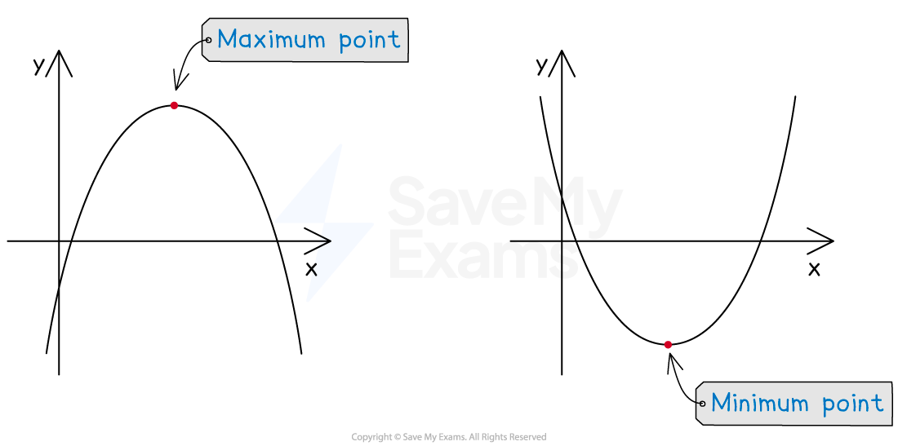
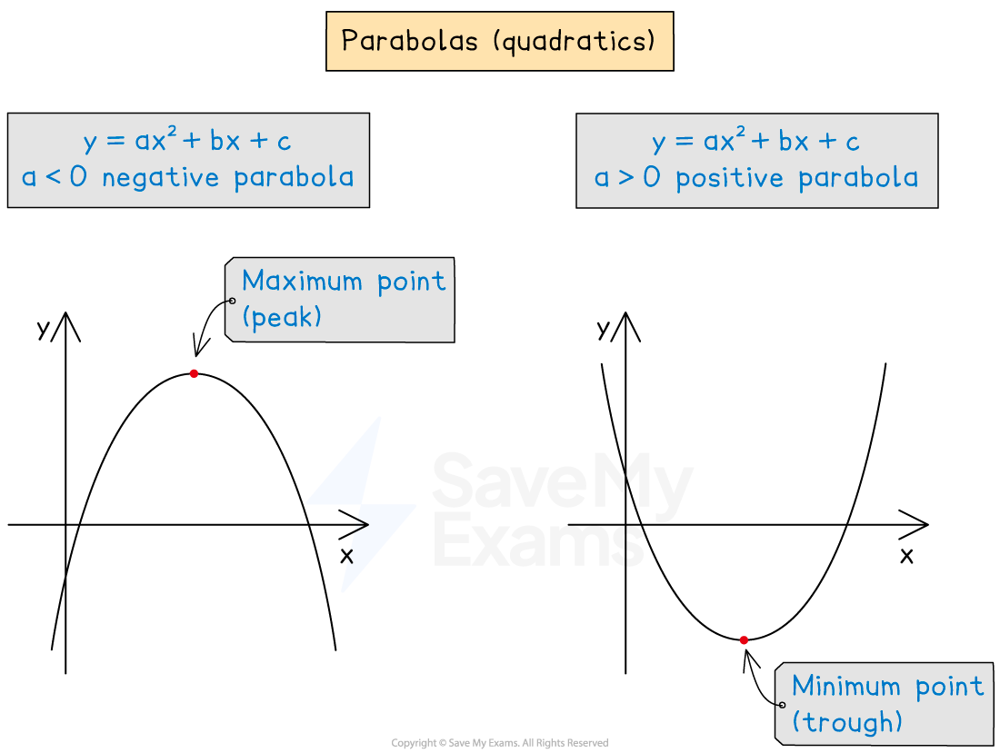
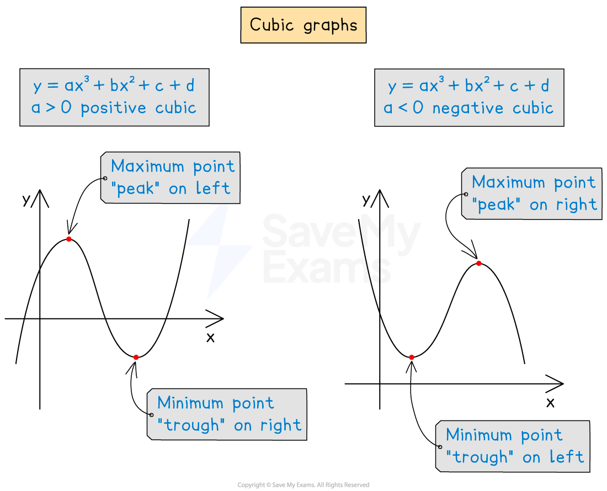

# Classifying Stationary Points

## Classifying Stationary Points

> **Spec point** — `spcpt_2KkPGzKqGcx5jPkt`

## Classifying stationary points

### What are the different types of stationary points?

- You need to know **two **different types** **of stationary points:

  - **Maximum** **points** (this is where the graph reaches a “**peak**”)
  - **Minimum** **points** (this is where the graph reaches a “**trough**”)
  
    - These are also called **turning points**
    - Deciding which is which is called **classifying** them (or finding the **nature** of them)

- If a graph has multiple turning points, the one you are interested in can be described as a **local** maximum or minimum point

  - Other parts of the graph may still reach higher/lower values elsewhere

### How do I classify turning points using graphs?

- You can use the **shape of common graphs** to classify different turning points
- To** classify the turning point** on a** quadratic curve** (parabola), remember that:

  - A **positive** quadratic (**positive** ***x*****2** term) must have a **minimum** point
  - A **negative** quadratic (**negative** ***x*****2** term) must have a **maximum** point

- To** classify two different turning points** on a** cubic curve**, remember that:

  - A **positive** cubic has a **maximum** point on the **left** and a **minimum** on the **right**
  - A **negative** cubic has a **minimum** point on the **left** and a **maximum** on the **right**

> **Worked Example**
> The turning points on the curve with equation $y=2x^{3}+3x^{2}-12x+1$ are (-2, 21) and (1, -6).
> 
> Determine the nature of these turning points.
> 
> **Answer:**
> 
> > *Make a quick sketch of the curve*
> *It is a positive cubic so you know that it will start at the bottom left, have two turning points and go towards the top right*
> *You know the coordinates of the turning points and the **y**-intercept: (0, 1)*
> *(the sketch does not have to be perfect!)*
> 
> 
> 
> **Final answer:** **From the graph, which is a positive cubic, **
> **(-2, 21) is to the left of (1, -6)**
> 
> **Final answer:** **Therefore, (-2, 21) is a maximum point and (1, -6) is a minimum point**
