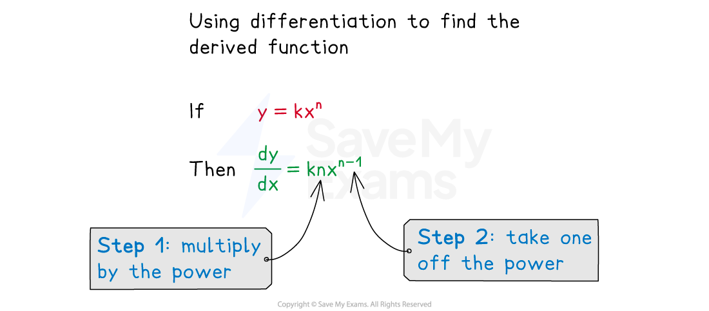
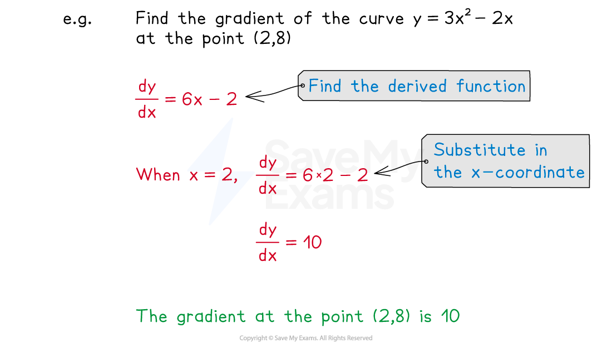
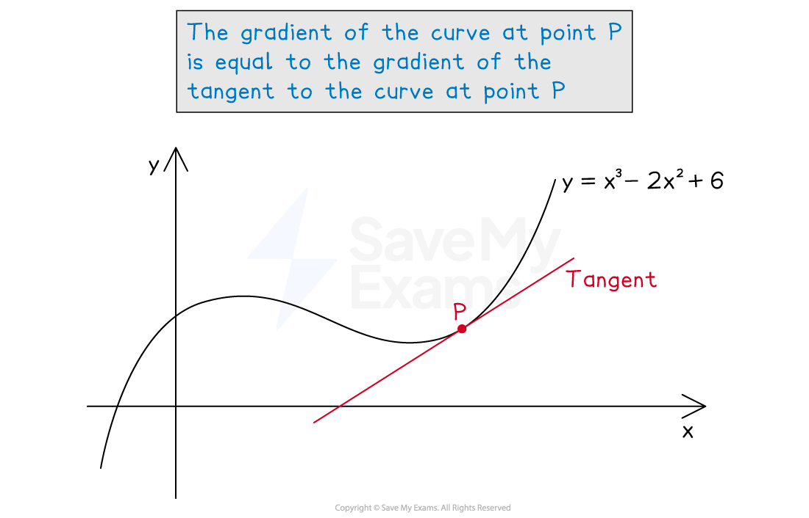

# Differentiation

## Differentiation

> **Spec point** — `spcpt_fGGbSYFZH9DW4sgm`

## Differentiation

### What is a gradient function?

- Recall that the **equation of a curve** gives the ***y*****-coordinate** of a point when you substitute in its* x*-coordinate

  - For example, $y=x^{2}+3x+5$
  
    - Substitute $x=2$ in to get $y=2^{2}+3\times2+5=15$
    - The point `open parentheses 2 comma space 15 close parentheses` lies on the curve
- A **gradient function** gives the **gradient** of the curve at a point when you substitute in its *x*-coordinate

  - A gradient function is written as $\frac{dy}{dx}=...$
  
    - pronounced "d*y* by d*x*"
    - This refers to the change in *y *over change in *x*
  - For example, the gradient function $\frac{dy}{dx}=2x+3$
  
    - Substitute $x=2$ in to get $\frac{dy}{dx}=2\times2+3=7$
    - The gradient at the point where $x=2$ is 7
- The gradient function $\frac{dy}{dx}$ can also be called the **derivative** or **derived function**

### What is differentiation and how does it work?

- **Differentiation** is an **algebraic method** that changes the **equation **of a curve, $y=...$, into a **gradient function**, $\frac{dy}{dx}=...$
- To differentiate a power of $x$, **bring down the power** and** reduce the power by 1**

  - Differentiating $y=x^{5}$ gives $\frac{dy}{dx}=5x^{4}$
  - Differentiating $y=x^{8}$ gives $\frac{dy}{dx}=8x^{7}$
  - Differentiating $y=x^{n}$ gives $\frac{dy}{dx}=nx^{n-1}$
- Any **number **that is already **in front** of $x$ is** multiplied **by the power that was brought down

  - Differentiating $y=2x^{5}$ gives $\frac{dy}{dx}=2\times5x^{4}=10x^{4}$
  - Differentiating $y=\frac{1}{2}x^{8}$ gives $\frac{dy}{dx}=\frac{1}{2}\times8x^{7}=4x^{7}$
  - Differentiating $y=kx^{n}$ gives $\frac{dy}{dx}=knx^{n-1}$
- Be careful with **two special cases**:

  - Differentiating $y=kx$ gives $\frac{dy}{dx}=k$
  
    - The $x$ **disappears** leaving just a number
    - For example, $y=2x$ differentiates to $\frac{dy}{dx}=2$
    - This makes sense, the gradient of the straight line $y=2x$ is 2
  - Differentiating just a number (a **constant** term), $y=c$, gives $\frac{dy}{dx}=0$
  
    - **Numbers disappear!**
    - For example, $y=4$ differentiates to $\frac{dy}{dx}=0$
    - This makes sense, the gradient of the horizontal line $y=4$ is zero

### How do I differentiate negative powers of x?

- The** same rules** apply to negative powers, $y=x^{n}$ becomes $\frac{dy}{dx}=nx^{n-1}$

  - Be careful: subtracting 1 from a negative power creates a **larger negative** number!
  
    - E.g. $y=x^{-3}$ becomes $\frac{dy}{dx}=-3x^{-3-1}=-3x^{-4}$
- You may need to use** index laws **to convert **algebraic fractions** into **negative powers** (and vice versa)

  - For example
  
    - $y=\frac{1}{x}\rightarrowy=x^{-1}$ so $\frac{dy}{dx}=-x^{-2}=-\frac{1}{x^{2}}$
    - $y=\frac{5}{x^{6}}\rightarrowy=5x^{-6}$ so `fraction numerator straight d y over denominator straight d x end fraction equals 5 cross times open parentheses negative 6 close parentheses x to the power of negative 7 end exponent equals negative 30 over x to the power of 7`
    - $y=\frac{4}{3x^{10}}\rightarrowy=\frac{4}{3}x^{-10}$ so `fraction numerator straight d y over denominator straight d x end fraction equals 4 over 3 cross times open parentheses negative 10 close parentheses x to the power of negative 11 end exponent equals negative fraction numerator 40 over denominator 3 x to the power of 11 end fraction`

### How do I differentiate sums and differences of terms?

- The equation of a curve may include a number of different terms

  - You can differentiate each term **individually**
  
    - Differentiating $y=x^{5}+x^{8}$ gives $\frac{dy}{dx}=5x^{4}+8x^{7}$
    - Differentiating $y=4x^{3}-10x^{6}$ gives $\frac{dy}{dx}=12x^{2}-60x^{5}$
- Remember the two special cases of:

  - $kx$ differentiating to just $k$
  - and** constant **terms, $c$, differentiating to **zero**
  
    - E.g. differentiating $y=8x+1$ gives $\frac{dy}{dx}=8$

- You may need to **separate an algebraic fraction **

  - E.g. $y=\frac{x^{3}+2x}{x^{5}}$ becomes $y=\frac{x^{3}}{x^{5}}+\frac{2x}{x^{5}}=\frac{1}{x^{2}}+\frac{2}{x^{4}}$
  
    - Using **negative indices** gives $y=x^{-2}+2x^{-4}$
    - This can be differentiated: `fraction numerator straight d y over denominator straight d x end fraction equals negative 2 x to the power of negative 3 end exponent plus 2 open parentheses negative 4 close parentheses x to the power of negative 5 end exponent`
    - This **simplifies** to $\frac{dy}{dx}=-\frac{2}{x^{3}}-\frac{8}{x^{5}}$

### How do I find the gradient of a curve using the gradient function?

- Find the ***x*****-coordinate** of the point on the curve you're interested in
- Use **differentiation** to turn the equation of the curve, $y=...$, into the gradient function, $\frac{dy}{dx}=...$
- **Substitute** the *x*-coordinate into the gradient function to find the gradient

  - The *y*-coordinate is not needed

- If instead you are **given a gradient** and asked to find the ***x*****-coordinate**

  - set $\frac{dy}{dx}$ equal to that gradient and **solve** the equation

> **Exam Hint**
> Don't forget to write the left-hand sides of $y=...$ and $\frac{dy}{dx}=...$ to avoid mixing up the curve equation with the gradient function!

### How is the gradient function related to drawing tangents?

- The gradient of a curve changes as you move along the curve

  - To find the gradient at a particular point you can **draw a tangent **and find its **gradient **
  - This is a **graphical** method that is **not accurate**
  
    - It depends on how well you draw the tangent
- Instead, you can use **differentiation** to find the **gradient function**, then **substitute the x-coordinate** of the point into the gradient function to find the gradient

  - This is an **algebraic** method that is **exact**
- For example, to find the **gradient **of the curve $y=x^{3}-2x^{2}+6$ at the point *P* where $x=2$

  - either try to draw a tangent at $x=2$ and measure its gradient (see below)
  - or differentiate the equation to get $\frac{dy}{dx}=3x^{2}-4x$
  
    - Substitute in $x=2$ to get $\frac{dy}{dx}=3\times2^{2}-4\times2=4$
    - The gradient is 4

> **Worked Example**
> A curve has the equation $y=x^{3}-3x^{2}-4x+1$.
> 
> (a) Find the gradient of the curve at the point `open parentheses 1 comma negative 5 close parentheses`.
> 
> **Answer:**
> 
> > *Find the gradient function using differentiation*
> 
> `table row cell fraction numerator straight d y over denominator straight d x end fraction end cell equals cell 3 x squared minus 3 cross times 2 x minus 4 plus 0 end cell row cell fraction numerator straight d y over denominator straight d x end fraction end cell equals cell 3 x squared minus 6 x minus 4 end cell end table`
> 
> > *Substitute *$x=1$* into the gradient function*
> 
> `table row cell fraction numerator straight d y over denominator straight d x end fraction end cell equals cell 3 cross times 1 squared minus 6 cross times 1 minus 4 end cell row blank equals cell negative 7 end cell end table`
> 
> > *The gradient when *$x=1$* is -7*
> *(The **y**-coordinate of the point is not needed)*
> 
> **Final answer:** **The gradient at **$(1,-5)$** is -7**
> 
> (b) Find the coordinates of the two points on the curve with a gradient of 5.
> 
> **Answer:**
> 
> > *This is saying that *$\frac{dy}{dx}=5$
> *(This is not the same as substituting in *$x=5$*)*
> 
> > *Form an equation using *$\frac{dy}{dx}$* from above*
> 
> $3x^{2}-6x-4=5$
> 
> > *This is a quadratic equation*
> *Bring the terms to one side and solve (for example, by factorisation)*
> 
> `table row cell 3 x squared minus 6 x minus 9 end cell equals 0 row cell x squared minus 2 x minus 3 end cell equals 0 row cell open parentheses x minus 3 close parentheses open parentheses x plus 1 close parentheses end cell equals 0 row x equals cell 3 space or space x equals negative 1 end cell end table`
> 
> > *These are the *$x$*-coordinates of the two points on the curve with gradient 5*
> *Substitute *$x=3$* into *$y=x^{3}-3x^{2}-4x+1$* to find the *$y$*-coordinate of this point*
> 
> `table row y equals cell 3 cubed minus 3 cross times 3 squared minus 4 cross times 3 plus 1 end cell row blank equals cell negative 11 end cell end table`
> 
> > *Similarly, substitute *$x=-1$* into the equation for *$y$
> 
> `table row y equals cell open parentheses negative 1 close parentheses cubed minus 3 cross times open parentheses negative 1 close parentheses squared minus 4 cross times open parentheses negative 1 close parentheses plus 1 end cell row blank equals 1 end table`
> 
> > *Write out the two sets of coordinates*
> 
> **Final answer:** **The points **$(3,-11)$** and **$(-1,1)$** have a gradient of 5**
