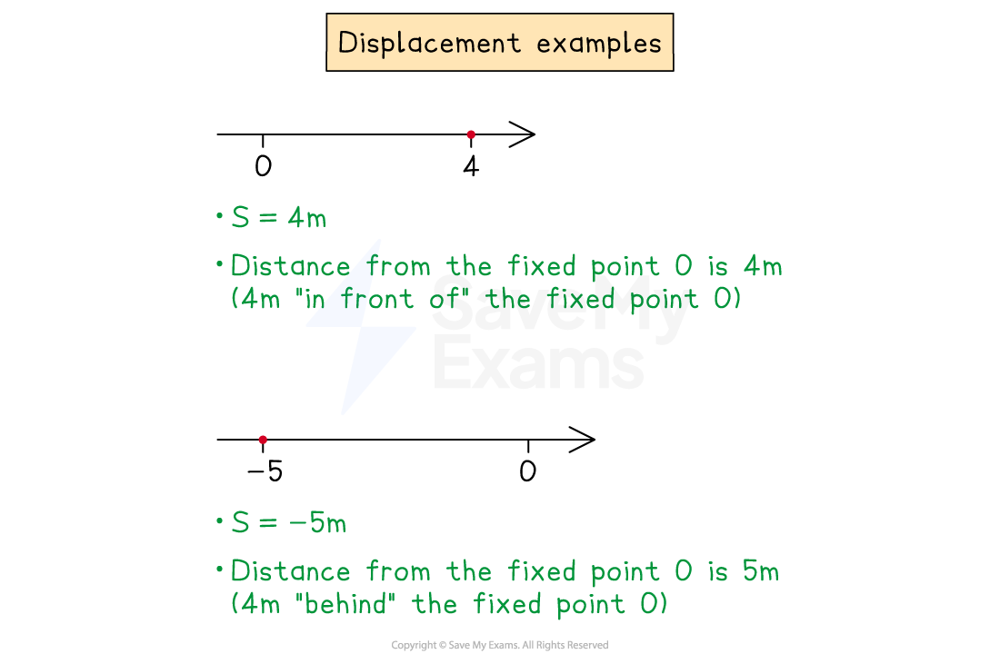
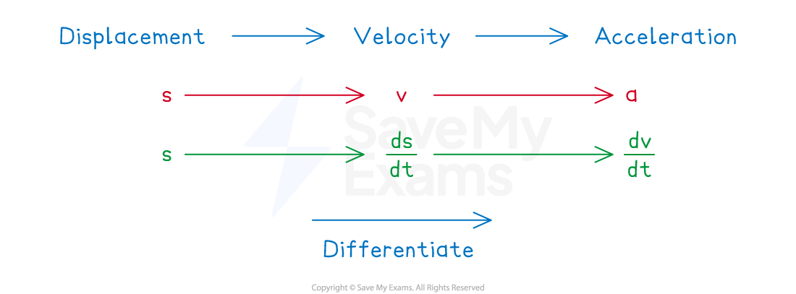

# Using Differentiation for Kinematics

## Kinematics

> **Spec point** — `spcpt_vYsrWKqpQDpSwnPj`

## Kinematics

### What does kinematics mean?

- **Kinematics **is the study of the **motion of an object**

  - It is a branch of Physics
- Objects are called **particles **

  - They are modelled as single moving **points**
- Over time, the particles move and

  - can be at different distances from a fixed **origin** (**displacement**)
  - can move with different speeds in different directions (v**elocity**)
  - can speed up or slow down (**acceleration**)

### What is displacement?

- The **displacement **of an object is **how far away **it is from a **fixed origin**

  - It can be **positive** (**in front** of the origin)
  - or **negative **(**behind **the origin)
- Do **not** confuse displacement with distance

  - **Distance** is **always positive!**
  - Displacement can have a $\pm$ sign
- Displacement is given the **letter **$s$ in kinematics

  - Do **not** confuse this letter for speed!
  - Displacement is measured in **metres**

### What is a displacement function?

- The **displacement** of an object, $s$ metres, can be written as a **function of time**, $t$ seconds

  - `s equals straight f open parentheses t close parentheses`
- **Substitute **a value of time in to **find its displacement **at that time

  - For example, $s=2t-t^{2}+1$
  
    - **Initially**, $t=0$ gives $s=2\times0-0^{2}+1=1$ (1 metre in front of the origin)
    - After 3 seconds, $t=3$ gives $s=2\times3-3^{2}+1=-2$ (2 metres behind the origin)

### What is the velocity and how do I find it?

- **Velocity **is the **speed and direction** of an object

  - It is **positive** if moving **forwards**
  - It is** negative** if moving **backwards**
  - Do **not** confuse velocity and speed
  
    - **Speed** is **always positive! **
- To find the **velocity** of an object, $v$ metres per second, **differentiate** its **displacement **function

  - $v=\frac{ds}{dt}$
- For example, if $s=t^{3}-4t^{2}+2t$ then $v=3t^{2}-8t+2$ (by differentiation)

  - The** initial** velocity ($t=0$) is $v=3\times0^{2}-8\times0+2=2$ ms-1
  - The velocity after 1 second ($t=1$) is $v=3\times1^{2}-8\times1+2=-3$ ms-1
  
    - Its speed is 3 ms-1
- If a **velocity **is **zero** at any point in time, it is said to be at **instantaneous rest**

  - It is **stationary** (not moving) at that instant in time
  
    - but not stationary all the time
  - To find the times at which the particle is at rest, set $v=0$ and **solve **to find $t$

### What is the acceleration and how do I find it?

- **Acceleration **is **rate** at which the **velocity changes**

  - It is **positive** if speeding up (when moving forwards)
  - It is** negative** if slowing down (when moving forwards)
  
    - A **negative** acceleration is also called a** deceleration**
    - The **magnitude of acceleration** is always** positive**
- To find the **acceleration **of an object, $a$ metres per second per second, **differentiate** its **velocity **function

  - $a=\frac{dv}{dt}$
- For example, if $v=3t^{2}-8t+2$ then $a=6t-8$

  - You can **substitute** times in to find accelerations
- It the acceleration is **always zero** then the particle moves at a **constant speed**

### How do I find the acceleration from the displacement?

- You **differentiate displacement** to get **velocity**, then **differentiate velocity** to get **acceleration**

  - So you differentiate displacement twice to get acceleration

> **Exam Hint**
> - Harder exam questions may jump back and forth between displacement, velocity and acceleration
> 
>   - so make sure you use the labels $s=...$, $v=...$ and $a=...$ to make your working clear

> **Worked Example**
> A particle moves along a straight line.
> 
> The displacement of the particle from a fixed point, *O*, on the line at time $t$ seconds is $s$ metres, where
> 
> $s=t^{3}-6t^{2}-3$
> 
> (a) Find the initial distance of the particle from *O*.
> 
> **Answer:**
> 
> > *Initial means *$t=0$
> *Substitute *$t=0$* into *$s$* to find the initial displacement*
> 
> `table row s equals cell 0 cubed minus 6 cross times 0 squared minus 3 end cell row blank equals cell negative 3 end cell end table`
> 
> > *Distance is always positive, so convert -3 into 3*
> 
> **Final answer:** **The particle is initially at a distance of 3 metres from ****O**
> 
> (b) Find an expression for the velocity, $v$ ms-1, at time $t$ seconds.
> 
> **Answer:**
> 
> > *To find the velocity, differentiate the displacement*
> 
> $v=\frac{ds}{dt}=3t^{2}-12t$
> 
> > *This is an expression for the velocity in terms of time, *$t$
> 
> **Final answer:** $v=3t^{2}-12t$** ms****-1**
> 
> (c) Find how long, after $t=0$, it takes for the particle to come to rest.
> 
> **Answer:**
> 
> > *The particle is at rest when *$v=0$
> *Set *$v=0$* and solve to find *$t$
> 
> `0 equals 3 t squared minus 12 t
> 0 equals t squared minus 4 t
> 0 equals t open parentheses t minus 4 close parentheses`
> 
> $t=0$* or *$t=4$
> 
> > *After *$t=0$* the next point of rest is *$t=4$
> 
> **Final answer:** **After **$t=0$**, it takes 4 seconds for the particle to come to rest**
> 
> (d) Find the time at which the particle is decelerating at 3 ms-2.
> 
> **Answer:**
> 
> A* deceleration of 3 means an acceleration of -3*
> *Differentiate the velocity function to find acceleration*
> 
> $a=\frac{dv}{dt}=6t-12$
> 
> > *Set *$a=-3$* and solve for *$t$
> 
> $6t-12=-3\,6t=9\,t=1.5$
> 
> **Final answer:** **The particle is decelerating at 3 ms****-2**** at 1.5 seconds**
