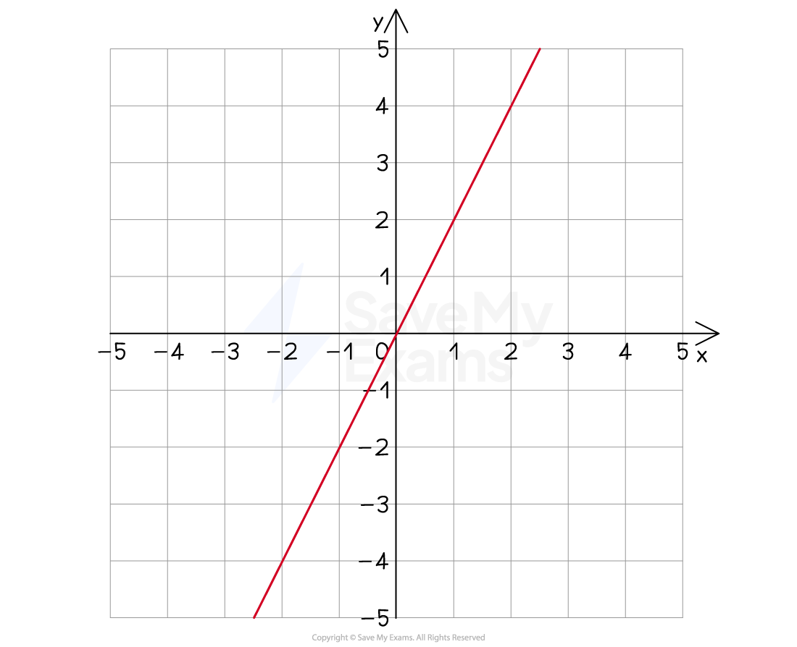

# Direct Proportion

## Direct Proportion

> **Spec point** — `spcpt_BktcXhHcVFw8R9Q2`

## Direct proportion

### What is direct proportion?

- **Proportion** is a way of talking about how two **variables** are related to each other
- **Direct** proportion means that as one variable goes **up** the other goes up by the same **factor**

  - The** ratio** between the two amounts will always stay the** same**
- The symbol $\propto$ means "proportional to"

  - E.g. *y *is directly proportional to *x*, *y*$\propto$*x*
- If *x *and *y* are directly proportional, then

  - *x *: *y *will always be the same
  - there will be some value, *k,* such that ***y *****= *****kx***
  - the graph relating *x* and *y* is a linear graph, with **gradient *****k***
- *k* is called the **constant of proportionality**

*Example of a graph showing direct proportion*

### How do I use direct proportion with powers and roots?

- Problems may involve a variable* *being **directly proportional** to a** power or root **of another variable
- For example

  - *y* is directly proportional to the **square of *****x ***
  
    - $y\proptox^{2}$
    - means that $y=kx^{2}$
  - *y* is directly proportional to the **square root of *****x***
  
    - $y\propto\sqrt{x}$
    - means that $y=k\sqrt{x}$
  - *y* is directly proportional to the **cube of *****x***
  
    - $y\proptox^{3}$
    - means that $y=kx^{3}$
  - Each of these would have a **different type of graph**, depending on the power or root

### How do I find the equation between two directly proportional variables?

- Direct proportion questions always have the same process:

  - **STEP 1**
  **Identify** the two variables and write down the **formula in terms of *****k***
  
    - E.g. ***y*** is **directly **proportional to ***x***
    - write down the formula $y=kx$
  - **STEP 2**
  **Find** ***k*** by substituting any given values **from the question** into your formula, then solving to get *k*
  
    - E.g. if you are told *y* = 6 when *x* = 2
    - then $6=k\times2$ giving $k=3$
  - **STEP 3**
  **Rewrite** the formula with the **known value of *****k ***from above (substitute it in)
  
    - $y=3x$
    - This is the **equation** relating the two variables
  - **STEP 4**
  **Use the equation **to answer other parts of the question
  
    - E.g. find *y* when *x* = 10
    - $y=3x$ gives $y=3\times10=30$

> **Exam Hint**
> - Some harder exam questions do not tell you to work out the equation
> 
>   - You are expected to do it on your own

> **Worked Example**
> It is known that $y$ is directly proportional to the square of $x$.
> 
> When $x=3$, $y=18$.
> 
> Find the value of $y$ when $x=4$.
> 
> **Answer:**
> 
> > *Identify the two variables*
> 
> $y,x^{2}$
> 
> > *We are told this is **direct** proportion*
> *Write down the formula involving **k*
> 
> $y=kx^{2}$
> 
> > *Find **k** by substituting in **y** = 18 when **x** = 3*
> *Then solve the equation for **k*
> 
> `table row 18 equals cell k open parentheses 3 close parentheses squared end cell row 18 equals cell 9 k end cell row cell 18 over 9 end cell equals k row 2 equals k end table`
> 
> > *Substitute this value of **k** back into the formula to get the full equation*
> 
> $y=2x^{2}$
> 
> > *Use this formula to find **y** when **x** = 4*
> 
> `table attributes columnalign right center left columnspacing 0px end attributes row y equals cell 2 cross times 4 squared end cell row y equals cell 2 cross times 16 end cell row y equals 32 end table`
> 
> $y=32$
