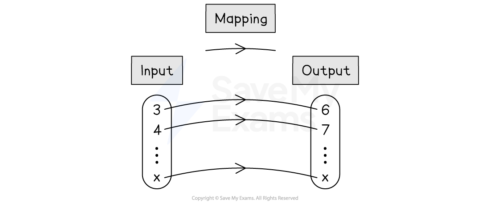

# Introduction to Functions

## Introduction to Functions

> **Spec point** — `spcpt_KSnrgNbPQV7FtyF5`

## Introduction to functions

### What is a function?

- A **function **is a combination of **one or more mathematical operations** that takes a **set of numbers** and** changes** them into **another set of numbers**
- The numbers being **put** **into the function** are often called the **inputs**
- The numbers **coming out of the function** are often called the** outputs**
- A function may be thought of as a mathematical “**machine**”

  - For example, for the function “double the number and add 1”, the two mathematical operations are "multiply by 2 (×2)" and "add 1 (+1)"
  
    - Putting 3 in to the function would give 2 × 3 + 1 = 7
    - Putting -4 in would give 2 × (-4) + 1 = -7
    - Putting $x$ in would give $2x+1$

### What is function notation?

- A function, f, with input $x$ can be written as `straight f open parentheses x close parentheses equals...` or $f:x\rightarrow...$

  - These two **different types of notation** mean exactly the same thing
  - Letters other than f can be used
  
    - The letters g, h and j are common but any letter can be used
    - Typically, a** new letter** will be used to define a **new function** in a question
- For example, the function with the rule “triple the number and subtract 4” would be written

  - $f(x)=3x--4$
- In such cases, "$x$" is the** input** and "`straight f open parentheses x close parentheses`" is the **output**
- Sometimes functions don’t have names like f and are just written as *y* = …

  - E.g. $y=3x--4$

### How does a function work?

- A function has an **input **$x$ and an **output **`straight f open parentheses x close parentheses`

  - If the input is 2, then the output is `straight f open parentheses 2 close parentheses`
  - If the input is $m$, then the output is `straight f open parentheses m close parentheses`
  - If the input is $t+5$, then the output is `straight f open parentheses t plus 5 close parentheses`
  
    - You cannot simplify this output any further
- If the** function is known**, the **output can be calculated**

  - For example, given the function $f(x)=2x+1$
  
    - $f(3)=2\times3+1=7$
    - $f(-4)=2\times(-4)+1=-7$
    - $f(a)=2a+1$

- If the **output is known**, an **equation **can be formed and solved to **find the input**

  - For example, given the function $f(x)=2x+1$
  
    - If $f(x)=15$, then form an equation by replacing `straight f open parentheses x close parentheses` with $2x+1$
    - $2x+1=15$
    - Solving this equation gives an input of 7
- Note that `straight f open parentheses x close parentheses equals 15` and `straight f open parentheses 15 close parentheses` are very different things:

  - `straight f open parentheses x close parentheses equals 15` means an input of $x$ gives an output of 15
  - `straight f open parentheses 15 close parentheses` means substitute the input 15 into the function

### What is a mapping diagram?

- A **mapping diagram** shows a **set of different inputs** going into the function to become a **set of different outputs**

  - Transforming inputs into outputs is called **mapping**
- For example, a mapping diagram for the function `straight f open parentheses x close parentheses equals x plus 3` where $x\geq3$ could be shown as:

> **Worked Example**
> A function is defined as `straight f open parentheses x close parentheses equals 3 x squared minus 2 x plus 1`.
> 
> (a) Find `straight f open parentheses 7 close parentheses`.
> 
> **Answer:**
> 
> > *The input is *$x=7$*, so substitute 7 into the expression everywhere you see an *$x$
> 
> `straight f open parentheses 7 close parentheses equals 3 open parentheses 7 close parentheses squared minus 2 open parentheses 7 close parentheses plus 1`*  *
> 
> > *Calculate*
> 
> `table row cell straight f open parentheses 7 close parentheses end cell equals cell 3 open parentheses 49 close parentheses minus 14 plus 1 end cell row blank equals cell 147 minus 14 plus 1 end cell end table`
> 
> $f(7)=134$
> 
> (b) Find `straight f open parentheses x plus 3 close parentheses`, giving your answer in the form $ax^{2}+bx+c$ where $a$, $b$ and $c$ are integers to be found.
> 
> **Answer:**
> 
> > *The input is *`open parentheses x plus 3 close parentheses`* so substitute *`space open parentheses x plus 3 close parentheses`* into the expression everywhere you see an *$x$
> *This is like replacing *$x$* with *`open parentheses x plus 3 close parentheses`
> 
> `straight f open parentheses x plus 3 close parentheses equals 3 open parentheses x plus 3 close parentheses squared minus 2 open parentheses x plus 3 close parentheses plus 1`
> 
> > *Expand the brackets and simplify*
> *Use that *`open parentheses x plus 3 close parentheses squared equals open parentheses x plus 3 close parentheses open parentheses x plus 3 close parentheses`
> *Be careful with negative signs*
> 
> `table row cell straight f open parentheses x plus 3 close parentheses end cell equals cell 3 open parentheses x squared plus 6 x plus 9 close parentheses minus 2 open parentheses x plus 3 close parentheses plus 1 end cell row blank equals cell 3 x squared plus 18 x plus 27 minus 2 x minus 6 plus 1 end cell row blank equals cell 3 x squared plus 16 x plus 22 end cell end table`
> 
> $f(x+3)=3x^{2}+16x+22$
> 
> **Final answer:** **(a = 3, b = 16, c = 22)**
> 
> A second function is defined by $g:x\rightarrow3x--4$.
> 
> (c) Find the value of $x$ for which $g:x\rightarrow-16$.
> 
> **Answer:**
> 
> > *This notation is not saying substitute 16 into the function (that would be *$g:16$*)*
> *It says that an input  *$x$* is substituted into *$g$* giving the output -16 (i.e. *`g open parentheses x close parentheses equals negative 16`*)*
> *To find the input, form an equation by replacing *$g:x$* with *$3x-4$
> 
> `table row cell 3 x minus 4 end cell equals cell negative 16 end cell end table`
> 
> > *Solve the equation (for example, by adding 4 to both sides, then dividing by 3)*
> 
> `table row cell 3 x minus 4 end cell equals cell negative 16 end cell row cell 3 x end cell equals cell negative 12 end cell row x equals cell negative 12 over 3 end cell end table`
> 
> $x=-4$
