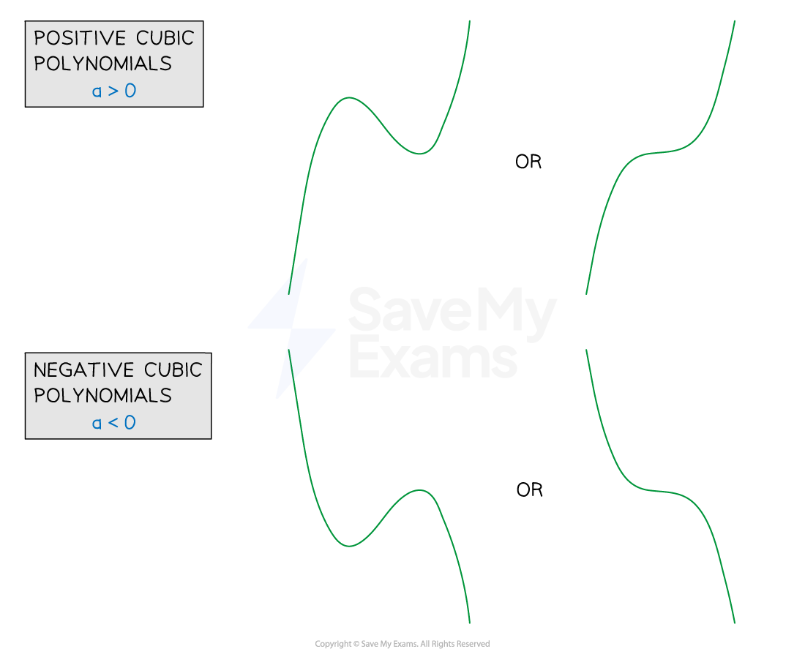
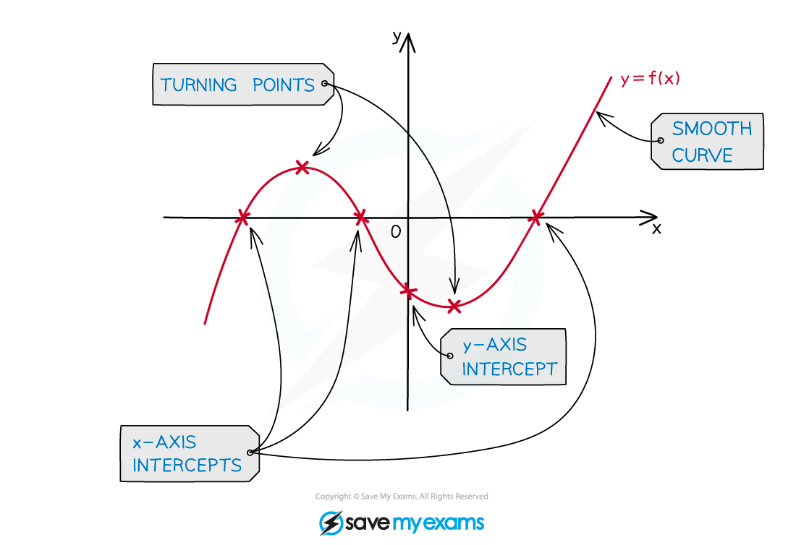

# Cubic Graphs

## Cubic Graphs

> **Spec point** — `spcpt_tyrnCXQW2hfdwnyq`

## Cubic Graphs

### What is a cubic?

- A **cubic** is a function of the form $ax^{3}+bx^{2}+cx+d$

  - $a,b,c$ and $d$ are constants
  - It is a *polynomial *of **degree** (order) 3
  
    - So $b,c$ and/or $d$ could be zero
    - but $a$ cannot be zero
- To sketch the graph of a cubic, the polynomial needs to be in **factorised form**

  - E.g.  `open parentheses 2 x minus 1 close parentheses open parentheses x plus 2 close parentheses open parentheses x minus 3 close parentheses` is the factorised form of $2x^{3}-3x^{2}-11x+6$
- Some cubics are **simple** to **factorise**

  - E.g.  `x cubed minus 4 x equals x open parentheses x squared minus 4 close parentheses equals x open parentheses x minus 2 close parentheses open parentheses x plus 2 close parentheses`
- For more complicated cubics you may be able to factorise them using the [factor theorem](https://www.savemyexams.com/igcse/maths/edexcel/b/16/revision-notes/algebra/the-factor-theorem-and-algebraic-division/the-factor-theorem/) and [algebraic division](https://www.savemyexams.com/igcse/maths/edexcel/b/16/revision-notes/algebra/the-factor-theorem-and-algebraic-division/algebraic-division/)
- You should also be able to **expand three brackets** to find the expanded form of a cubic

### What does the graph of a cubic look like?

- In general the graph of a cubic will take one of four forms

  - All are **smooth** curves

- The exact form of a particular cubic will depend on:

  - The number (and value) of **roots** ($x$-axis intercepts)
  - The $y$-axis intercept
  - The sign of the coefficient of the $x^{3}$ term ($a$)
  
    - If $a>0$ the graph is a **positive cubic** ('starts' in the bottom left, 'ends' in the top right)
    - If $a<0$ the graph is a **negative cubic** ('starts' in the top left, 'ends' in the bottom right)
  - The ***turning points***

- Cubics can have **two turning points**

  - a maximum point and a minimum point
- However, note that the graphs of $y=x^{3}$ and $y=-x^{3}$:

  - Do not have a maximum or minimum (no turning points)
  - Only cross the $x$-axis once, at $x=0$

### How do I sketch the graph of a cubic?

- **STEP 1**
Find the** **$y$**-axis intercept** by setting $x=0$
- **STEP 2**
Find the $x$-axis intercepts (**roots**) by setting $y=0$

  - In factorised form, this can be done by **inspection**
  
    - A cubic of the form `y equals open parentheses x minus p close parentheses open parentheses x minus q close parentheses open parentheses x minus r close parentheses` has roots at $p,q$ and $r$
    - E.g. `y equals open parentheses x minus 2 close parentheses open parentheses x minus 3 close parentheses open parentheses x plus 5 close parentheses` has roots at 2, 3, and -5
  - Any **repeated roots** will mean the graph **touches** the $x$-axis
  
    - The graph does **not cross** the $x$-axis
    - E.g. `open parentheses x minus 2 close parentheses squared open parentheses x plus 1 close parentheses`* ***touches*** *the $x$-axis at $x=2$, and **intersects*** *the $x$-axis at $x=-1$
- **STEP 3**
Consider the **shape **of the graph

  - Is it a **positive cubic** or a **negative cubic**?
  - Where does the graph 'start' and 'end'?
- **STEP 4**
Consider where any **turning points** should go
- **STEP 5**
**Sketch **the graph with a **smooth curve**
**Label **points where the graph** intercepts** the $x$ and $y$ axes

> **Worked Example**
> Sketch the graph of `y equals open parentheses 2 x minus 1 close parentheses open parentheses x minus 3 close parentheses squared`.
> 
> **Answer:**
> 
> > *STEP 1*
> *Find the *$y$*-axis intercept by substituting in *$x=0$
> 
> `y equals open parentheses negative 1 close parentheses open parentheses negative 3 close parentheses squared equals negative 9`
> 
> > *STEP 2*
> *Find the *$x$*-axis intercepts by solving *$y=0$
> *Either bracket can be equal to zero*
> 
> `table row cell open parentheses 2 x minus 1 close parentheses end cell equals cell 0 space end cell row cell space x end cell equals cell 1 half end cell end table`
> 
> `table row cell open parentheses x minus 3 close parentheses squared end cell equals 0 row x equals 3 end table`
> *(repeated solution, as there are two *`open parentheses x minus 3 close parentheses`* brackets*
> 
> > *STEP 3*
> *Consider the shape, and the 'start' and 'end' points:*
> 
> > `a greater than 0 space open parentheses a equals 2 close parentheses`* so it is a positive cubic*
> $x=3$* is a repeated root so the graph will **touch **the *$x$*-axis at this point (but not cross it)*
> 
> > *STEP 4*
> *Consider the turning points*
> 
> > *One turning point (minimum) will need to be where the curve touches the *$x$*-axis*
> *The other (maximum) will need to be between the two roots *$x=\frac{1}{2}$* and *$x=3$
> 
> > *STEP 5*
> *Sketch a smooth curve with labelled intercepts*
> 
> 
