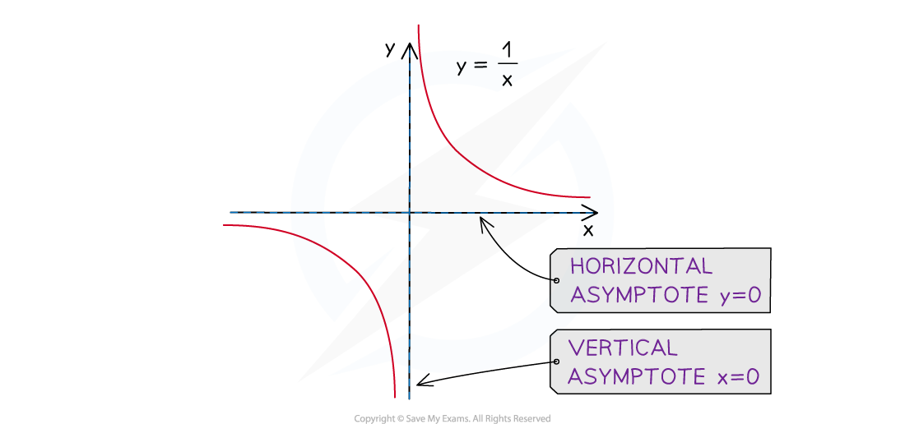
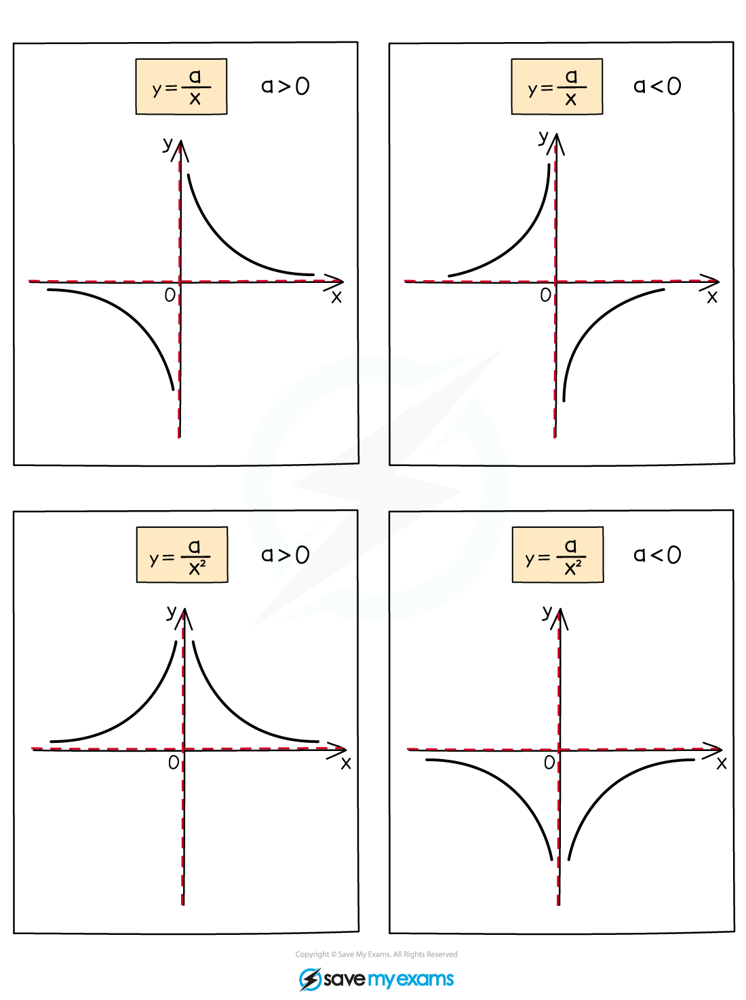

# Reciprocal Graphs

## Reciprocal Graphs

> **Spec point** — `spcpt_TvHwnSVsSstxssKh`

## Reciprocal Graphs

### What is a reciprocal graph?

- A **reciprocal** graph is of the form $y=\frac{a}{x}$ or $y=\frac{a}{x^{2}}$

  - These graphs do **not **have any** *****y*****-intercepts**
  - and** **do** not **have any** roots**
  - This means that the curves **do not cross** either the ***x-***** or *****y*****-axes**
- The two basic reciprocal graphs have $a=1$ 

  - I.e. $y=\frac{1}{x}$ or $y=\frac{1}{x^{2}}$

### What are the asymptotes on a reciprocal graph?

- An **asymptote** is a line on a graph that a curve becomes closer and closer to but never touches

  - These may be** horizontal or vertical** lines
- A reciprocal graph has **two asymptotes**

  - A **horizontal** asymptote along the *x*-axis (with** equation** $y=0$)
  
    - This is the **limiting value** of *y* when the value of *x *gets very large (either positive or negative)
  - A **vertical** asymptote along the *y*-axis (with **equation** $x=0$)
  
    - This shows the **problem** of trying to **divide by zero**

### What if a is not equal to 1?

- You also need to recognise graphs of $y=\frac{a}{x}$ and $y=\frac{a}{x^{2}}$when $a\neq1$

  - In the graphs below the **asymptotes** are shown by dashed lines

- The **sign** of **a** shows where the curves are located
- The **size** of **a** shows how steep the curves are 

  - The closer **a** is to 0 the more **L-shaped** the curves are

### What if a constant is added to the equation?

- The reciprocal graphs, $y=\frac{a}{x}+b$ and $y=\frac{a}{x^{2}}+b$(where $a$ and $b$ are both constants)

  - are the **same shapes** as $y=\frac{a}{x}$ or $y=\frac{a}{x^{2}}$
  - but are **shifted upwards** by $b$ units
  
    - $y=\frac{1}{x}+2$ would be $y=\frac{1}{x}$ shifted **up** by 2 units
    - $y=\frac{4}{x^{2}}-3$ would be $y=\frac{4}{x^{2}}$ shifted **down** by 3 units
  - This means the **horizontal asymptote** also **shifts up** by $b$ units,
  
    - The **equation** of the horizontal asymptote is $y=b$
    - $y=\frac{5}{x}+6$ would have a horizontal asymptote at $y=6$
    - $y=\frac{1}{x^{2}}-7$ would have a horizontal asymptote at $y=-7$
  - The** vertical asymptote** remains along the ***y*****-axis**
  
    - The **equation **of the vertical asymptote is $x=0$
    - $y=\frac{3}{x}+9$ and $y=\frac{6}{x^{2}}-5$ would both have vertical asymptotes at $x=0$

> **Worked Example**
> Sketch the graph of $y=\frac{2}{x}-3$.
> 
> **Answer:**
> 
> > *The graph of *$y=\frac{2}{x}-3$
> 
> - *will have the same basic shape as *$y=\frac{1}{x}$
> 
>   - *(For a sketch, you don't need to worry abut the effect of the '2')*
> - *but shifted down by 3 units because of the -3*
> 
>   - *(This means it will have an asymptote at *$y=-3$*)*
> 
> > *It can be useful to sketch the asymptote first, to give you a 'guideline' for the rest of the sketch*
> 
> 
