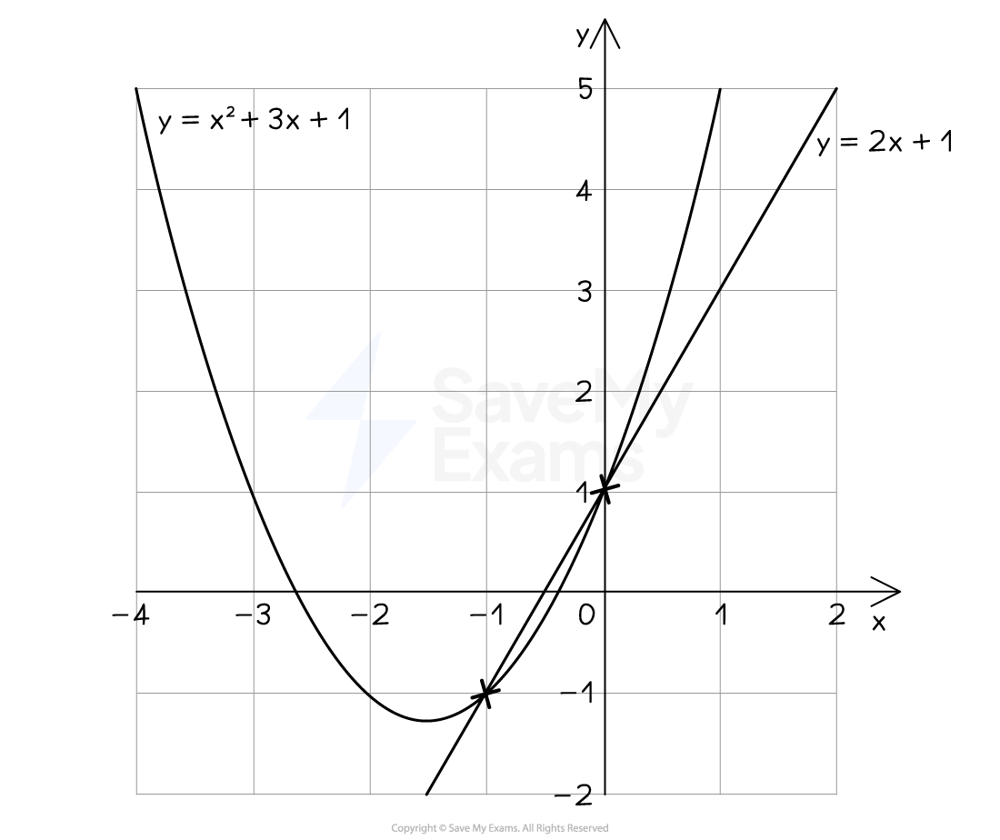
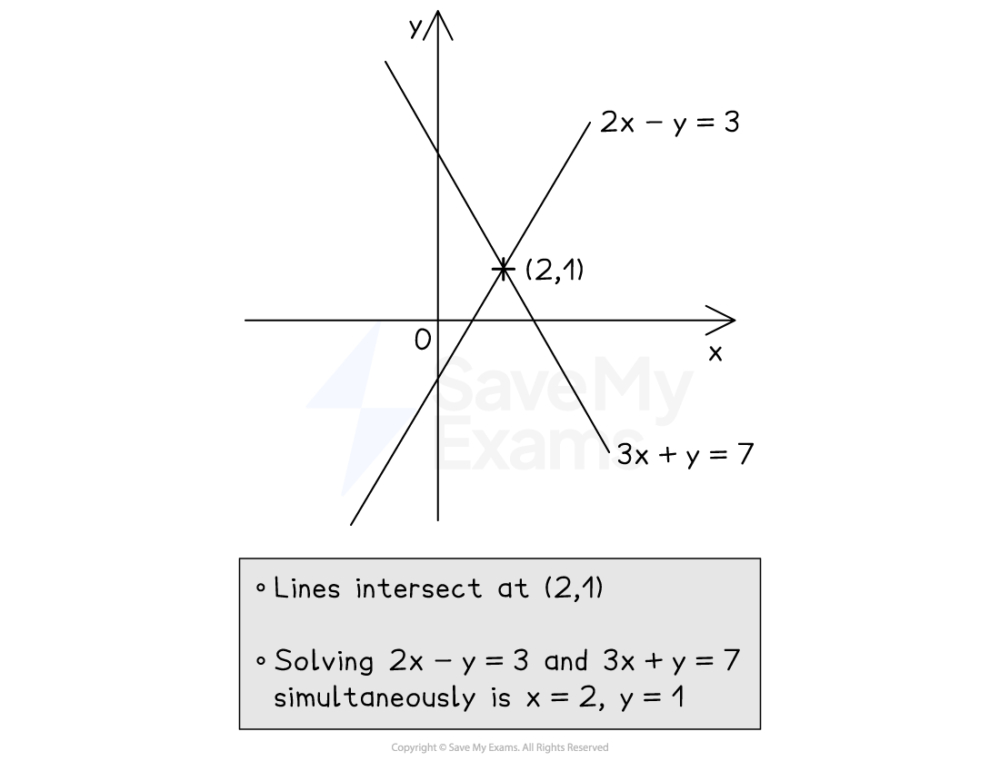

# Solving Equations from Graphs

## Solving Equations Using Graphs

> **Spec point** — `spcpt_sHCB9WZbDMyTFqCP`

## Solving equations using graphs

### How do I find the coordinates of points of intersection?

- Plot** two graphs** on the** same **set of **axes**

  - The **points** **of intersection** are where the two lines **meet**
- For example, plot* y*  = *x*2 + 3*x* + 1 and *y* = 2*x* + 1 on the same axes

  - They meet twice, as shown
  - The **coordinates** of** intersection** are (-1, -1) and (0, 1)

### How do I solve simultaneous equations graphically?

- The *x* and *y ***solutions** to **simultaneous equations** are the *x *and *y ***coordinates** of the **point of intersection**
- For example, to solve 2*x *- *y *= 3 and 3*x* + *y* = 7 simultaneously

  - **Rearrange** them into the form ***y***** = *****mx***** + *****c***
  
    - *y* = 2*x* - 3 and *y* = -3*x* + 7
  - Use a** table of values** to plot each line
  - Find the **point of intersection**, (2, 1)
  - The** solutions **are therefore *x* = 2 and *y *= 1

### How do I use graphs to solve equations?

- This is easiest explained through an example
- You can use the** graph** of $y=x^{2}-4x-2$ to **solve** the following **equations**

  - $x^{2}-4x-2=0$
  
    - The **solutions** are the two** *****x*****-intercepts**
    - This is where the curve cuts the *x*-axis (also called **roots**)
  - $x^{2}-4x-2=5$
  
    - The **solutions **are the two** *****x*****-coordinates** where the curve** intersects** the **horizontal line** $y=5$
  - $x^{2}-4x-2=x+1$
  
    - The **solutions** are the two** *****x*****-coordinates** where the curve **intersects **the **straight line** $y=x+1$
    - The straight line must be **plotted** on the same axes first
- To solve a** different** equation like $x^{2}-4x+3=1$, if you are **already given** the graph of an equation, e.g. $y=x^{2}-4x-2$

  - **add / subtract terms** to both sides to get "given graph = ..."
  
    - For example, subtract 5 from both sides
    
      - $x^{2}-4x-2=-4$
      - You can now draw on the horizontal line $y=-4$ and find the *x*-coordinates of the points of intersection

> **Exam Hint**
> When solving equations in *x*, only give ***x-*****coordinates** as final answers.
> 
> Include the *y*-coordinates if solving simultaneous equations.

> **Worked Example**
> Use the graph of $y=10-8x^{2}$ shown to estimate the solutions of each equation given below.
> 
> 
> 
> (a) $10-8x^{2}=0$
> 
> **Answer:**
> 
> > *The function equals zero, so the **x**-intercepts of its graph are the solutions*
> *Read off the values where the curve cuts the **x**-axis*
> *Use a suitable level of accuracy (no more than 2 decimal places from the scale of this graph)*
> 
> *-1.12 and 1.12 *
> 
> > *These are the two solutions to the equation*
> 
> **Final answer:** **x ****= -1.12 and ****x**** = 1.12**
> 
> > *A range of solutions are accepted, such as "between 1.1 and 1.2"*
> *Solutions must be ± of each other (due to the symmetry of quadratics)*
> 
> (b) $10-8x^{2}=8$
> 
> **Answer:**
> 
> > *The function equals 8, so draw the horizontal line **y** = 8*
> *Find the **x**-coordinates where this cuts the graph  *
> 
> *-0.5 and 0.5 *
> 
> > *These are the two solutions to the original equation*
> 
> **Final answer:** **x**** = -0.5 and ****x**** = 0.5**

> **Worked Example**
> The graph of $y=x^{3}+x^{2}-3x-1$ is shown below.
> 
> Use the graph to estimate the solutions of the equation $x^{3}+x^{2}-4x=0$.
> 
> Give your answers to 1 decimal place.
> 
> 
> 
> **Answer:**
> 
> > *We are given a different equation to the one plotted so we must rearrange it to *$\mathrm{graph}=mx+c$*, in this case *$x^{3}+x^{2}-3x-1=mx+c$
> 
> `table attributes columnalign right center left columnspacing 0px end attributes row cell x cubed plus x squared minus 4 x end cell equals 0 end table`
> 
> `table row blank blank cell plus x minus 1 space space space space space space space space space space space space space space space space space space space space space space space space plus x minus 1 end cell end table`
> 
> `table attributes columnalign right center left columnspacing 0px end attributes row cell x cubed plus x squared minus 3 x plus 1 end cell equals cell x minus 1 end cell end table`
> 
> > *Now plot *$y=x-1$* on the same axes*
> 
> 
> 
> > *The solutions are the *$x$*-coordinates of where the curve and the straight line intersect*
> 
> $x=-2.6,x=0,x=1.6$
